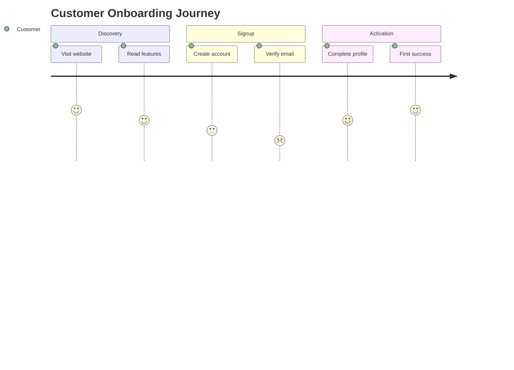

# MAS - Mermaid Abstract Syntax Specification

[](https://creativecommons.org/licenses/by/4.0/)
[](CHANGELOG.md)
[](CONTRIBUTING.md)

**The formal specification for AI-native diagram generation using Mermaid syntax.**

MAS enables AI agents, architects, and product teams to create executable architecture diagrams covering **UX**, **Business Operations**, and **Technical Architecture** - all in one unified language.

---

## Why MAS?

| For Humans | For AI Agents |
|------------|---------------|
| Renders beautiful diagrams | Formal EBNF grammar |
| Embeds in GitHub/Confluence | Parseable AST |
| Exports to PNG/PDF | Validation rules |
| Stakeholder-ready | Code generation ready |

**Mermaid is the ONLY language that is both visual AND structured.** MAS formalizes it for production use.

---

## Quick Start

### 1. Choose Your Diagram Type

| Your Goal | Diagram Type | Spec |
|-----------|--------------|------|
| Map user emotions | User Journey | [v2.5](spec/v2.5/MAS-UXDiagrams-v2.5.md) |
| Document screen flow | User Flow | [v2.5](spec/v2.5/MAS-UXDiagrams-v2.5.md) |
| Model business process | Swimlane | [v2.5](spec/v2.5/MAS-BusinessOperations-v2.5.md) |
| Show decision logic | Decision Tree | [v2.5](spec/v2.5/MAS-BusinessOperations-v2.5.md) |
| API interactions | Sequence | [v2.0](spec/v2.0/MAS-DiagramTypes-v2.0.md) |
| System architecture | Topology | [v2.0](spec/v2.0/MAS-DiagramTypes-v2.0.md) |
| Requirements traceability | Bridge | [v3.0](spec/v3.0/MAS-v3.0-INDEX.md) |

### 2. Generate Your Diagram



### 3. Validate Against MAS

MAS provides formal validation rules to ensure your diagrams are:
- Syntactically correct
- Semantically meaningful
- Accessible (WCAG 2.1)
- Business-aligned (BPMN 2.0)

---

## Specification Versions

| Version | Focus | Status | Quick Start |
|---------|-------|--------|-------------|
| **v3.0** | Spec-Driven Development | Draft | [Index](spec/v3.0/MAS-v3.0-INDEX.md) |
| **v2.6** | ASCII Wireframes | Stable | [Quick Start](spec/v2.6/MAS-v2.6-QuickStart.md) |
| **v2.5** | UX & Business Diagrams | Stable | [Quick Start](spec/v2.5/MAS-v2.5-QuickStart.md) |
| **v2.0** | Core Technical | Stable | [Index](spec/v2.0/MAS-v2.0-INDEX.md) |

---

## Documentation Structure

```
mas-spec/
├── spec/
│   ├── v3.0/          # Bridge Layer, Spec-Driven
│   ├── v2.6/          # ASCII Wireframes
│   ├── v2.5/          # UX & Business Diagrams
│   ├── v2.0/          # Core Technical
│   └── v1.0/          # Legacy (deprecated)
├── architecture/      # Service architecture docs
├── appendix/          # Design system, roadmap
└── rfcs/              # Enhancement proposals
```

---

## Diagram Coverage

### UX Diagrams (v2.5)
- User Journey - Emotional flow with satisfaction scores
- User Flow - Screen navigation with decisions
- Wireframe Flow - Component-level design handoff
- Accessibility Flow - WCAG compliance paths

### Business Diagrams (v2.5)
- Business Process - BPMN 2.0 compatible workflows
- Decision Tree - Rule-based logic
- Swimlane - Cross-team handoffs
- Value Stream - Lean process optimization

### Technical Diagrams (v2.0)
- Sequence - API interactions
- Class - Domain models
- State - Lifecycle management
- ER - Database schema
- Flowchart/Topology - System architecture

### Bridge Diagrams (v3.0)
- Traceability - Requirements to code
- C4 Integration - Multi-level zoom
- Alignment - Business-API mapping

---

## Industry Alignment

MAS aligns with established standards:

| Standard | MAS Support |
|----------|-------------|
| **Mermaid.js** | Native syntax |
| **BPMN 2.0** | Business process compatibility |
| **WCAG 2.1** | Accessibility compliance |
| **C4 Model** | Architecture zoom levels |
| **EARS** | Requirements notation |
| **RFC 2119** | Requirement keywords |

---

## Contributing

We welcome contributions! See [CONTRIBUTING.md](CONTRIBUTING.md) for guidelines.

- **Report bugs**: [Open an issue](https://github.com/WiiLearn/mas-spec/issues)
- **Suggest features**: [Start a discussion](https://github.com/WiiLearn/mas-spec/discussions)
- **Submit changes**: [Create a pull request](https://github.com/WiiLearn/mas-spec/pulls)

For significant changes, please follow the [SEP process](CONTRIBUTING.md#sep-process).

---

## License

- **Specification documents**: [CC BY 4.0](https://creativecommons.org/licenses/by/4.0/)
- **Code examples**: [Apache 2.0](https://www.apache.org/licenses/LICENSE-2.0)

See [LICENSE](LICENSE) for details.

---

## Community

- **GitHub Discussions**: Questions and ideas
- **GitHub Issues**: Bug reports
- **Security**: security@wiilearn.com

---

## Acknowledgments

MAS builds on the excellent work of:
- [Mermaid.js](https://mermaid.js.org/) - The diagram rendering engine
- [BPMN 2.0](https://www.omg.org/spec/BPMN/2.0/) - Business process standard
- [C4 Model](https://c4model.com/) - Architecture visualization

---

**MAS - One Language, All Diagrams**

*From User Journey to System Architecture, MAS speaks your entire product lifecycle.*
