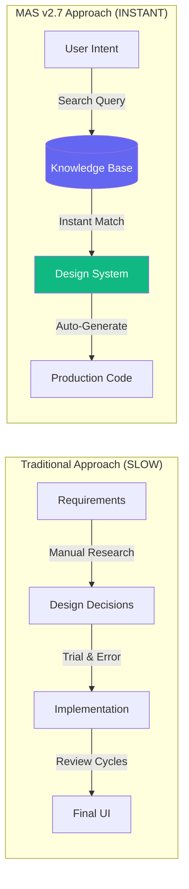
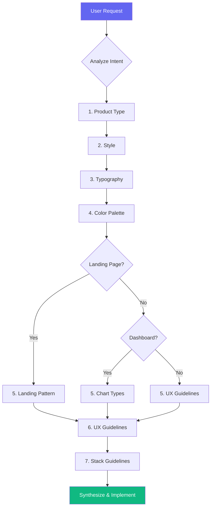
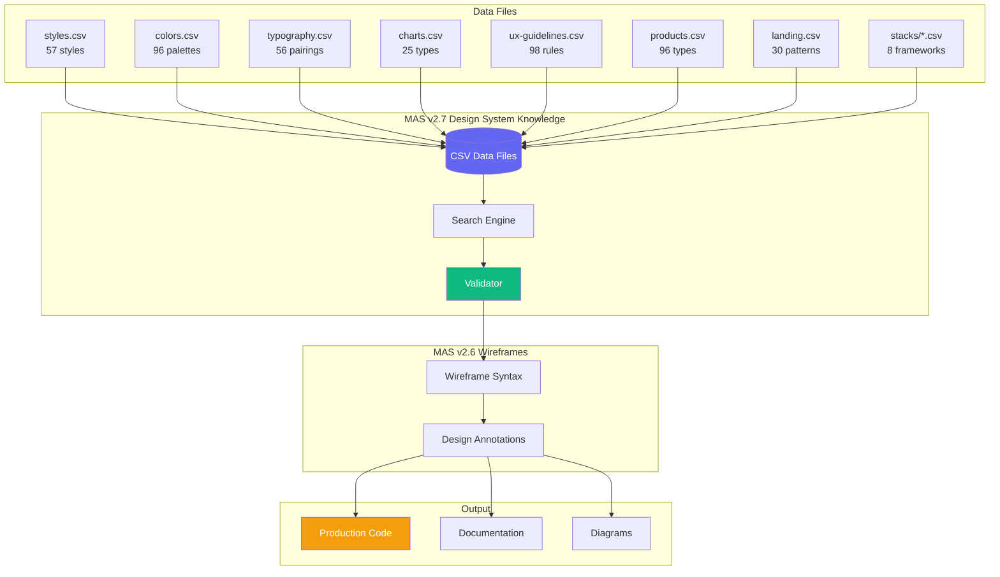
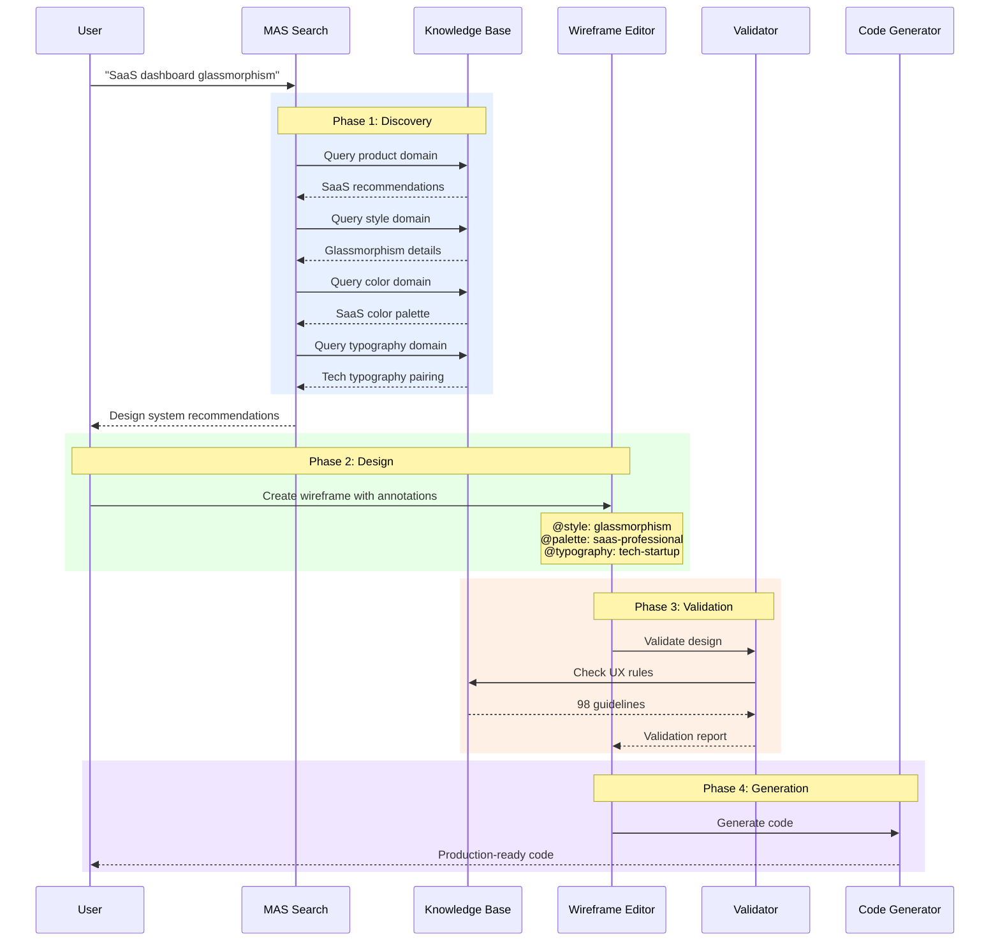

# MAS v2.7 Appendix: Design System Knowledge Implementation Data

**Status:** Reference Implementation  
**Version:** 2.7.0  
**Date:** 2025-12-03  
**Parent:** [MAS v2.7 Design System Knowledge](./MAS-DesignSystemKnowledge-v2.7.md)  
**Source:** UI UX Pro Max Design Intelligence Database

---

## The Disruption: From Spec to Implementation



**Value Proposition:**
- **57 UI Styles** → Instant style recommendations
- **96 Color Palettes** → Industry-specific colors in seconds
- **56 Typography Pairings** → Google Fonts ready to use
- **98 UX Guidelines** → Automated quality validation
- **8 Stack Guidelines** → Framework-specific best practices

---

## 1. Style Catalog (57 Styles)

### 1.1 Style Schema

```yaml
Style:
  id: integer                    # Unique identifier
  name: string                   # Style name (e.g., "Glassmorphism")
  category: enum                 # General | Landing Page | BI/Analytics
  keywords: string[]             # Search keywords
  primary_colors: string[]       # Primary color palette
  secondary_colors: string[]     # Secondary/accent colors
  effects: string[]              # Visual effects (blur, shadow, etc.)
  best_for: string[]             # Recommended use cases
  do_not_use_for: string[]       # Anti-patterns
  light_mode: boolean            # Light mode support
  dark_mode: boolean             # Dark mode support
  performance: enum              # Excellent | Good | Moderate | Poor
  accessibility: enum            # WCAG AAA | WCAG AA | Limited
  mobile_friendly: boolean       # Mobile optimization
  conversion_focused: boolean    # Conversion optimization
  framework_compatibility: object # Framework scores (Tailwind, MUI, etc.)
  era_origin: string             # Design era (2020s Modern, 1980s Retro)
  complexity: enum               # Low | Medium | High
```

### 1.2 Featured Styles Reference

| ID | Style | Keywords | Best For | Performance | Accessibility |
|----|-------|----------|----------|-------------|---------------|
| 1 | Minimalism & Swiss | clean, simple, spacious, functional | Enterprise, SaaS, dashboards | ⚡ Excellent | ✓ WCAG AAA |
| 2 | Neumorphism | soft UI, embossed, debossed | Health/wellness, meditation | ⚡ Good | ⚠ Low contrast |
| 3 | Glassmorphism | frosted glass, transparent, blur | Modern SaaS, financial dashboards | ⚠ Good | ⚠ Ensure 4.5:1 |
| 4 | Brutalism | raw, stark, high contrast | Design portfolios, tech blogs | ⚡ Excellent | ✓ WCAG AAA |
| 7 | Dark Mode (OLED) | dark theme, low light, OLED | Coding platforms, entertainment | ⚡ Excellent | ✓ WCAG AAA |
| 8 | Accessible & Ethical | high contrast, WCAG compliant | Government, healthcare, education | ⚡ Excellent | ✓ WCAG AAA |
| 38 | Neubrutalism | bold borders, black outlines, Gen Z | Startups, creative agencies | ⚡ Excellent | ✓ WCAG AAA |
| 39 | Bento Box Grid | modular cards, Apple-style | Dashboards, product pages | ⚡ Excellent | ✓ WCAG AA |

### 1.3 Style Implementation Example

```wireframe
@title: SaaS Dashboard
@style: glassmorphism
@style-effects: blur, transparency, gradient-border
@style-colors: primary=#6366F1, secondary=#8B5CF6, accent=#10B981

# CSS Implementation
backdrop-filter: blur(15px);
background: rgba(255, 255, 255, 0.15);
border: 1px solid rgba(255, 255, 255, 0.2);
border-radius: 16px;
```

---

## 2. Color Palette Catalog (96 Palettes)

### 2.1 Color Schema

```yaml
ColorPalette:
  id: integer                    # Unique identifier
  product_type: string           # Product category
  keywords: string[]             # Search keywords
  primary: hex                   # Primary brand color
  secondary: hex                 # Secondary color
  cta: hex                       # Call-to-action color
  background: hex                # Page background
  text: hex                      # Body text color
  border: hex                    # Border/divider color
  notes: string                  # Usage notes
```

### 2.2 Industry Color Palettes

| ID | Industry | Primary | Secondary | CTA | Background | Text | Notes |
|----|----------|---------|-----------|-----|------------|------|-------|
| 1 | SaaS (General) | #2563EB | #3B82F6 | #F97316 | #F8FAFC | #1E293B | Trust blue + accent contrast |
| 9 | Healthcare | #0891B2 | #22D3EE | #059669 | #ECFEFF | #164E63 | Calm blue + health green |
| 15 | Fintech/Crypto | #F59E0B | #FBBF24 | #8B5CF6 | #0F172A | #F8FAFC | Dark tech + vibrant accents |
| 34 | Beauty/Spa | #10B981 | #34D399 | #8B5CF6 | #ECFDF5 | #064E3B | Soft pastels + gold accents |
| 35 | Luxury/Premium | #1C1917 | #44403C | #CA8A04 | #FAFAF9 | #0C0A09 | Black + Gold + minimal |
| 86 | Cybersecurity | #00FF41 | #0D0D0D | #00FF41 | #000000 | #E0E0E0 | Matrix Green + Terminal |

### 2.3 Color Implementation Example

```wireframe
@palette: saas-professional
@color-primary: #2563EB
@color-secondary: #3B82F6
@color-cta: #F97316
@color-background: #F8FAFC
@color-text: #1E293B
@color-border: #E2E8F0

# Tailwind Config
colors: {
  primary: '#2563EB',
  secondary: '#3B82F6',
  cta: '#F97316',
  background: '#F8FAFC',
  text: '#1E293B',
  border: '#E2E8F0'
}
```

---

## 3. Typography Catalog (56 Pairings)

### 3.1 Typography Schema

```yaml
Typography:
  id: integer                    # Unique identifier
  name: string                   # Pairing name
  category: string               # Serif+Sans, Sans+Sans, etc.
  heading_font: string           # Display/heading font
  body_font: string              # Body text font
  keywords: string[]             # Mood/style keywords
  best_for: string[]             # Recommended use cases
  google_fonts_url: string       # Google Fonts share URL
  css_import: string             # CSS @import statement
  tailwind_config: string        # Tailwind fontFamily config
  notes: string                  # Usage notes
```

### 3.2 Featured Typography Pairings

| ID | Name | Heading | Body | Keywords | Best For |
|----|------|---------|------|----------|----------|
| 1 | Classic Elegant | Playfair Display | Inter | elegant, luxury, sophisticated | Luxury brands, fashion, spa |
| 2 | Modern Professional | Poppins | Open Sans | modern, professional, clean | SaaS, corporate, startups |
| 3 | Tech Startup | Space Grotesk | DM Sans | tech, startup, innovative | Tech companies, AI products |
| 5 | Minimal Swiss | Inter | Inter | minimal, clean, functional | Dashboards, admin panels |
| 9 | Developer Mono | JetBrains Mono | IBM Plex Sans | code, developer, technical | Developer tools, documentation |
| 13 | Friendly SaaS | Plus Jakarta Sans | Plus Jakarta Sans | friendly, modern, approachable | SaaS products, web apps |

### 3.3 Typography Implementation Example

```wireframe
@typography: tech-startup
@font-heading: Space Grotesk
@font-body: DM Sans
@font-import: https://fonts.googleapis.com/css2?family=DM+Sans:wght@400;500;700&family=Space+Grotesk:wght@400;500;600;700&display=swap

# CSS Import
@import url('https://fonts.googleapis.com/css2?family=DM+Sans:wght@400;500;700&family=Space+Grotesk:wght@400;500;600;700&display=swap');

# Tailwind Config
fontFamily: {
  heading: ['Space Grotesk', 'sans-serif'],
  body: ['DM Sans', 'sans-serif']
}
```

---

## 4. Chart Type Catalog (25 Types)

### 4.1 Chart Schema

```yaml
ChartType:
  id: integer                    # Unique identifier
  data_type: string              # Data type description
  keywords: string[]             # Search keywords
  best_chart: string             # Primary recommendation
  secondary_options: string[]    # Alternative charts
  color_guidance: string         # Color recommendations
  performance: enum              # Excellent | Good | Moderate | Poor
  accessibility_notes: string    # A11y considerations
  library_recommendation: string[] # Recommended libraries
  interactive_level: string      # Interaction capabilities
```

### 4.2 Chart Recommendations

| ID | Data Type | Best Chart | Libraries | Performance | A11y |
|----|-----------|------------|-----------|-------------|------|
| 1 | Trend Over Time | Line Chart | Chart.js, Recharts | ⚡ Excellent | ✓ Good |
| 2 | Compare Categories | Bar Chart | Chart.js, D3.js | ⚡ Excellent | ✓ Good |
| 3 | Part-to-Whole | Pie/Donut | Chart.js, Recharts | ⚡ Good | ⚠ Limited |
| 5 | Heatmap/Intensity | Heat Map | D3.js, Plotly | ⚡ Excellent | ⚠ Colorblind |
| 7 | Funnel/Flow | Funnel Chart | D3.js, Custom SVG | ⚡ Good | ✓ Good |
| 15 | Stock/Trading | Candlestick | TradingView, ApexCharts | ⚡ Good | ⚠ Moderate |

### 4.3 Chart Implementation Example

```wireframe
@chart-type: line
@chart-library: recharts
@chart-use-case: trend-over-time

# Color Guidance
Primary: #0080FF
Multiple series: use distinct colors
Fill: 20% opacity

# Accessibility
✓ Clear line patterns for colorblind users
✓ Add pattern overlays for distinction
```

---

## 5. UX Guidelines Catalog (98 Rules)

### 5.1 UX Rule Schema

```yaml
UXRule:
  id: integer                    # Unique identifier
  category: string               # Rule category
  issue: string                  # Issue name
  platform: string               # Web | Mobile | All
  description: string            # Rule description
  do: string                     # Correct approach
  dont: string                   # What to avoid
  code_good: string              # Good code example
  code_bad: string               # Bad code example
  severity: enum                 # High | Medium | Low
```

### 5.2 Critical UX Rules (High Severity)

| ID | Category | Issue | Do | Don't |
|----|----------|-------|----|----- |
| 1 | Navigation | Smooth Scroll | `scroll-behavior: smooth` | Jump without transition |
| 4 | Navigation | Back Button | Preserve navigation history | Break browser back button |
| 7 | Animation | Excessive Motion | Animate 1-2 key elements max | Animate everything |
| 9 | Animation | Reduced Motion | Check `prefers-reduced-motion` | Ignore motion settings |
| 10 | Animation | Loading States | Show skeleton/spinner | Leave UI frozen |
| 15 | Layout | Z-Index Management | Use z-index scale (10,20,30,50) | Use `z-[9999]` |
| 19 | Layout | Content Jumping | Reserve space for async content | Let images push layout |
| 22 | Touch | Touch Target Size | Minimum 44x44px | Tiny clickable areas |
| 28 | Interaction | Focus States | Visible focus rings | Remove outline without replacement |
| 36 | Accessibility | Color Contrast | Minimum 4.5:1 ratio | Low contrast text |

### 5.3 UX Rule Implementation Example

```wireframe
@ux-rule: no-emoji-icons
@ux-category: icons
@ux-severity: warning

# Do
Use SVG icons (Heroicons, Lucide, Simple Icons)
<HeroIcon name="settings" className="w-6 h-6" />

# Don't
Use emojis like 🎨 🚀 ⚙️ as UI icons
<span>🚀 Launch</span>
```

---

## 6. Stack Guidelines Catalog (8 Stacks)

### 6.1 Stack Schema

```yaml
StackGuideline:
  id: integer                    # Unique identifier
  category: string               # Guideline category
  guideline: string              # Guideline name
  description: string            # Detailed description
  do: string                     # Correct approach
  dont: string                   # What to avoid
  code_good: string              # Good code example
  code_bad: string               # Bad code example
  severity: enum                 # High | Medium | Low
  docs_url: string               # Documentation URL
```

### 6.2 Stack Overview

| Stack | Focus Areas | Key Guidelines |
|-------|-------------|----------------|
| `html-tailwind` | Utilities, responsive, a11y | Animation, z-index, layout, forms |
| `react` | State, hooks, performance | useState, useEffect, memoization |
| `nextjs` | SSR, routing, images, API | App Router, Server Components, Image |
| `vue` | Composition API, Pinia | Reactivity, composables, Pinia stores |
| `svelte` | Runes, stores, SvelteKit | $state, $derived, load functions |
| `swiftui` | Views, State, Navigation | @State, @Binding, NavigationStack |
| `react-native` | Components, Navigation | FlatList, React Navigation, Expo |
| `flutter` | Widgets, State, Layout | StatelessWidget, Provider, Column/Row |

### 6.3 React Guidelines (Top 10)

| ID | Category | Guideline | Severity |
|----|----------|-----------|----------|
| 4 | State | Avoid unnecessary state - derive values | High |
| 6 | Effects | Clean up effects - return cleanup function | High |
| 7 | Effects | Specify dependencies correctly | High |
| 8 | Effects | Avoid unnecessary effects | High |
| 10 | Rendering | Use keys properly - stable unique keys | High |
| 25 | Events | Pass event handlers not call results | High |
| 29 | Hooks | Follow rules of hooks - top level only | High |
| 39 | ErrorHandling | Use error boundaries | High |
| 43 | Accessibility | Use semantic HTML | High |
| 47 | TypeScript | Type component props | High |

### 6.4 Tailwind Guidelines (Top 10)

| ID | Category | Guideline | Severity |
|----|----------|-----------|----------|
| 2 | Animation | Limit bounce animations | High |
| 6 | Z-Index | Fixed elements z-index | High |
| 14 | Images | Lazy loading | High |
| 15 | Images | Responsive images | High |
| 26 | Forms | Focus states - always show | High |
| 31 | Responsive | Breakpoint testing | High |
| 34 | Buttons | Touch targets - min 44px | High |
| 35 | Buttons | Loading states | High |
| 36 | Buttons | Icon buttons - aria-label | High |
| 40 | Accessibility | Screen reader text | High |

### 6.5 Next.js Guidelines (Top 10)

| ID | Category | Guideline | Severity |
|----|----------|-----------|----------|
| 6 | Routing | Handle errors with error.tsx | High |
| 7 | Rendering | Use Server Components by default | High |
| 8 | Rendering | Mark Client Components explicitly | High |
| 9 | Rendering | Push Client Components down | High |
| 12 | DataFetching | Fetch data in Server Components | High |
| 13 | DataFetching | Configure caching explicitly (v15+) | High |
| 17 | Images | Use next/image for optimization | High |
| 18 | Images | Provide width and height | High |
| 42 | Link | Use next/link for navigation | High |
| 50 | Security | Sanitize user input | High |

---

## 7. Product Type Recommendations (96 Types)

### 7.1 Product Schema

```yaml
ProductType:
  id: integer                    # Unique identifier
  name: string                   # Product type name
  keywords: string[]             # Search keywords
  primary_style: string          # Primary style recommendation
  secondary_styles: string[]     # Alternative styles
  landing_pattern: string        # Landing page pattern
  dashboard_style: string        # Dashboard style (if applicable)
  color_focus: string            # Color palette focus
  key_considerations: string     # Important design notes
```

### 7.2 Product Type Recommendations

| ID | Product Type | Primary Style | Landing Pattern | Color Focus |
|----|--------------|---------------|-----------------|-------------|
| 1 | SaaS (General) | Glassmorphism + Flat | Hero + Features + CTA | Trust blue + accent |
| 9 | Healthcare App | Neumorphism + Accessible | Social Proof-Focused | Calm blue + health green |
| 15 | Fintech/Crypto | Glassmorphism + Dark Mode | Conversion-Optimized | Dark tech + vibrant |
| 19 | AI/Chatbot Platform | AI-Native UI + Minimalism | Interactive Product Demo | Neutral + AI Purple |
| 34 | Beauty/Spa | Soft UI + Neumorphism | Hero-Centric + Social Proof | Soft pastels + gold |
| 86 | Cybersecurity | Cyberpunk UI + Dark Mode | Trust & Authority | Matrix Green + Black |

---

## 8. Landing Page Patterns (30 Patterns)

### 8.1 Landing Schema

```yaml
LandingPattern:
  id: integer                    # Unique identifier
  name: string                   # Pattern name
  keywords: string[]             # Search keywords
  section_order: string[]        # Page sections in order
  primary_cta_placement: string  # CTA placement strategy
  color_strategy: string         # Color recommendations
  recommended_effects: string    # Animation/effect recommendations
  conversion_optimization: string # Conversion tips
```

### 8.2 Landing Page Patterns

| ID | Pattern | Section Order | CTA Placement | Conversion Focus |
|----|---------|---------------|---------------|------------------|
| 1 | Hero + Features + CTA | Hero → Value prop → Features → CTA | Hero (sticky) + Bottom | Deep CTA, contrasting color |
| 2 | Hero + Testimonials | Hero → Problem → Solution → Testimonials | Post-testimonials | Social proof before CTA |
| 4 | Minimal Single Column | Hero → Description → Bullets → CTA | Center, large button | Single CTA focus |
| 5 | Funnel (3-Step) | Hero → Step 1 → Step 2 → Step 3 | Each step + Final | Progressive disclosure |
| 9 | Video-First Hero | Video background → Features → Benefits | Overlay on video | 86% higher engagement |
| 28 | Bento Grid Showcase | Hero → Bento Grid → Details → CTA | Floating or bottom | Scannable value props |

---

## 9. Search Interface Implementation

### 9.1 Query Syntax

```bash
# Domain search
python3 search.py "<keywords>" --domain <domain> [-n <max_results>]

# Stack search
python3 search.py "<keywords>" --stack <stack>

# Available domains
product | style | typography | color | landing | chart | ux | prompt

# Available stacks
html-tailwind | react | nextjs | vue | svelte | swiftui | react-native | flutter
```

### 9.2 Search Examples

```bash
# Find styles for SaaS dashboard
python3 search.py "saas dashboard modern" --domain style

# Find color palette for healthcare
python3 search.py "healthcare trust calm" --domain color

# Find typography for luxury brand
python3 search.py "luxury elegant premium" --domain typography

# Find UX rules for accessibility
python3 search.py "accessibility contrast focus" --domain ux

# Find React state management patterns
python3 search.py "state management hooks" --stack react

# Find Next.js image optimization
python3 search.py "image optimization" --stack nextjs
```

### 9.3 Recommended Search Order



---

## 10. Validation Checklist

### 10.1 Pre-Delivery Checklist

```wireframe
@checklist: pre-delivery

# Visual Quality
[ ] Style annotations match design intent
[ ] Color palette has all semantic roles (primary, secondary, cta, bg, text, border)
[ ] Typography includes heading and body fonts
[ ] No emoji icons (use SVG: Heroicons, Lucide)
[ ] Hover states don't cause layout shift
[ ] Brand logos verified from Simple Icons

# Interaction
[ ] All clickable elements have cursor-pointer
[ ] Hover states provide visual feedback
[ ] Transitions are 150-300ms
[ ] Focus states visible for keyboard navigation
[ ] Loading states show feedback

# Light/Dark Mode
[ ] Text contrast meets 4.5:1 minimum
[ ] Glass elements visible in light mode
[ ] Borders visible in both modes
[ ] Test both modes before delivery

# Layout
[ ] Floating elements have edge spacing
[ ] No content hidden behind fixed navbars
[ ] Responsive at 320px, 768px, 1024px, 1440px
[ ] No horizontal scroll on mobile
[ ] Container max-width consistent

# Accessibility
[ ] All images have alt text
[ ] Form inputs have labels
[ ] Color is not only indicator
[ ] prefers-reduced-motion respected
[ ] Touch targets minimum 44x44px
[ ] ARIA labels on icon buttons
```

---

## 11. Integration Architecture



---

## 12. Quick Reference Cards

### 12.1 Style Quick Reference

| Style | Use For | Effects | Performance |
|-------|---------|---------|-------------|
| Minimalism | Enterprise, SaaS | Clean, whitespace | ⚡ Excellent |
| Glassmorphism | Modern SaaS, Dashboards | Blur, transparency | ⚠ Good |
| Neubrutalism | Gen Z, Startups | Bold borders, shadows | ⚡ Excellent |
| Dark Mode | Dev tools, Entertainment | OLED optimized | ⚡ Excellent |
| Bento Grid | Dashboards, Features | Modular cards | ⚡ Excellent |

### 12.2 Color Quick Reference

| Industry | Primary | CTA | Background |
|----------|---------|-----|------------|
| SaaS | #2563EB | #F97316 | #F8FAFC |
| Healthcare | #0891B2 | #059669 | #ECFEFF |
| Fintech | #F59E0B | #8B5CF6 | #0F172A |
| Beauty | #10B981 | #8B5CF6 | #ECFDF5 |
| Luxury | #1C1917 | #CA8A04 | #FAFAF9 |

### 12.3 Typography Quick Reference

| Mood | Heading | Body | Import |
|------|---------|------|--------|
| Elegant | Playfair Display | Inter | `@import url('...')` |
| Professional | Poppins | Open Sans | `@import url('...')` |
| Tech | Space Grotesk | DM Sans | `@import url('...')` |
| Minimal | Inter | Inter | `@import url('...')` |
| Developer | JetBrains Mono | IBM Plex Sans | `@import url('...')` |

---

## 13. Version History

| Version | Date | Changes |
|---------|------|---------|
| 2.7.0 | 2025-12-03 | Initial release with full data catalog |

---

**End of MAS v2.7 Appendix: Design System Knowledge Implementation Data**


---

## 14. AI Prompt Keywords (Copy-Paste Ready)

### 14.1 Style Prompts

| Style | AI Prompt Keywords |
|-------|-------------------|
| **Minimalism** | "Design a minimalist landing page. Use: white space, geometric layouts, sans-serif fonts, high contrast, grid-based structure, essential elements only. Avoid shadows and gradients. Focus on clarity and functionality." |
| **Glassmorphism** | "Design a glassmorphic interface with frosted glass effect. Use backdrop blur (10-20px), translucent overlays (rgba 10-30% opacity), vibrant background colors, subtle borders, light source reflection, layered depth." |
| **Neubrutalism** | "Design a neubrutalist interface. Use: high contrast, hard black borders (3px+), bright pop colors, no blur, sharp corners, bold typography, hard shadows (offset 4px 4px), raw aesthetic but functional." |
| **Dark Mode (OLED)** | "Create an OLED-optimized dark interface with deep black (#000000), dark grey (#121212), midnight blue accents. Use minimal glow effects, vibrant neon accents (green, blue, gold, purple), high contrast text." |
| **Bento Grid** | "Design a Bento Grid layout. Use: modular grid system, rounded corners (16-24px), different card sizes (1x1, 2x1, 2x2), card-based hierarchy, soft backgrounds (#F5F5F7), subtle borders, Apple-style aesthetic." |

### 14.2 CSS Technical Keywords

| Style | CSS Implementation |
|-------|-------------------|
| **Minimalism** | `display: grid, gap: 2rem, font-family: sans-serif, color: #000, max-width: 1200px, no box-shadow` |
| **Glassmorphism** | `backdrop-filter: blur(15px), background: rgba(255,255,255,0.15), border: 1px solid rgba(255,255,255,0.2)` |
| **Neubrutalism** | `border: 3px solid black, box-shadow: 5px 5px 0px black, colors: #FFDB58 #FF6B6B #4ECDC4` |
| **Dark Mode** | `background: #000000, color: #FFFFFF, text-shadow: 0 0 10px neon-color, color-scheme: dark` |
| **Bento Grid** | `display: grid, grid-template-columns: repeat(auto-fit, minmax(...)), gap: 1rem, border-radius: 20px` |

### 14.3 Implementation Checklist by Style

| Style | Checklist |
|-------|-----------|
| **Minimalism** | ☐ Grid-based layout, ☐ Typography hierarchy clear, ☐ No decorations, ☐ WCAG AAA contrast, ☐ Mobile responsive |
| **Glassmorphism** | ☐ Backdrop-filter blur 10-20px, ☐ Translucent white 15-30%, ☐ Subtle border 1px, ☐ Vibrant background, ☐ Text contrast 4.5:1 |
| **Neubrutalism** | ☐ Hard borders 2-4px, ☐ Hard offset shadows, ☐ High saturation colors, ☐ Bold typography, ☐ No blurs/gradients |
| **Dark Mode** | ☐ Deep black #000000, ☐ Vibrant neon accents, ☐ Text contrast 7:1+, ☐ Minimal glow, ☐ No white backgrounds |
| **Bento Grid** | ☐ CSS Grid layout, ☐ Rounded corners 16-24px, ☐ Varied card spans, ☐ Responsive re-flow, ☐ Apple-like aesthetic |

---

## 15. Design System Variables

### 15.1 CSS Custom Properties Template

```css
/* MAS v2.7 Design System Variables */

:root {
  /* Spacing Scale */
  --spacing-xs: 0.25rem;   /* 4px */
  --spacing-sm: 0.5rem;    /* 8px */
  --spacing-md: 1rem;      /* 16px */
  --spacing-lg: 1.5rem;    /* 24px */
  --spacing-xl: 2rem;      /* 32px */
  --spacing-2xl: 3rem;     /* 48px */
  
  /* Border Radius */
  --radius-none: 0px;
  --radius-sm: 4px;
  --radius-md: 8px;
  --radius-lg: 12px;
  --radius-xl: 16px;
  --radius-2xl: 24px;
  --radius-full: 9999px;
  
  /* Shadows */
  --shadow-sm: 0 1px 2px rgba(0,0,0,0.05);
  --shadow-md: 0 4px 6px rgba(0,0,0,0.1);
  --shadow-lg: 0 10px 15px rgba(0,0,0,0.1);
  --shadow-xl: 0 20px 25px rgba(0,0,0,0.15);
  
  /* Transitions */
  --transition-fast: 150ms ease;
  --transition-normal: 200ms ease;
  --transition-slow: 300ms ease;
  
  /* Z-Index Scale */
  --z-dropdown: 10;
  --z-sticky: 20;
  --z-fixed: 30;
  --z-modal-backdrop: 40;
  --z-modal: 50;
  --z-popover: 60;
  --z-tooltip: 70;
}

/* Style-Specific Variables */

/* Glassmorphism */
.glass {
  --glass-blur: 15px;
  --glass-opacity: 0.15;
  --glass-border: rgba(255,255,255,0.2);
}

/* Neubrutalism */
.neubrutalist {
  --neu-border-width: 3px;
  --neu-shadow-offset: 4px;
  --neu-shadow-color: #000000;
}

/* Dark Mode */
.dark {
  --bg-primary: #000000;
  --bg-secondary: #121212;
  --text-primary: #FFFFFF;
  --text-secondary: #E0E0E0;
}
```

### 15.2 Tailwind Config Template

```javascript
// tailwind.config.js - MAS v2.7 Design System

module.exports = {
  theme: {
    extend: {
      colors: {
        // Semantic Colors (customize per project)
        primary: '#2563EB',
        secondary: '#3B82F6',
        cta: '#F97316',
        background: '#F8FAFC',
        text: '#1E293B',
        border: '#E2E8F0',
        
        // Status Colors
        success: '#22C55E',
        warning: '#F59E0B',
        error: '#EF4444',
        info: '#3B82F6',
      },
      fontFamily: {
        heading: ['Space Grotesk', 'sans-serif'],
        body: ['DM Sans', 'sans-serif'],
        mono: ['JetBrains Mono', 'monospace'],
      },
      borderRadius: {
        'glass': '16px',
        'card': '12px',
        'button': '8px',
      },
      boxShadow: {
        'glass': '0 8px 32px rgba(0,0,0,0.1)',
        'card': '0 4px 6px rgba(0,0,0,0.05)',
        'neu': '4px 4px 0px #000000',
      },
      backdropBlur: {
        'glass': '15px',
      },
    },
  },
  plugins: [
    require('@tailwindcss/forms'),
    require('@tailwindcss/typography'),
  ],
}
```

---

## 16. Workflow Integration

### 16.1 Complete Design Workflow



### 16.2 Time Comparison

```mermaid
gantt
    title Design System Implementation Time
    dateFormat HH:mm
    axisFormat %H:%M
    
    section Traditional
    Research styles     :trad1, 00:00, 2h
    Choose colors       :trad2, after trad1, 1h
    Select typography   :trad3, after trad2, 1h
    Create wireframes   :trad4, after trad3, 4h
    Review & iterate    :trad5, after trad4, 2h
    
    section MAS v2.7
    Search & discover   :mas1, 00:00, 5m
    Apply annotations   :mas2, after mas1, 10m
    Validate            :mas3, after mas2, 2m
    Generate code       :mas4, after mas3, 3m
```



**Result:** 10 hours → 20 minutes = **97% time reduction**

---

## 17. Error Recovery

### 17.1 Common Issues & Solutions

| Issue | Cause | Solution |
|-------|-------|----------|
| Style not found | Typo in style name | Check style catalog, use exact name |
| Color contrast fail | Low contrast ratio | Use darker text or lighter background |
| Typography not loading | Invalid Google Fonts URL | Verify URL in typography catalog |
| UX validation warning | Anti-pattern detected | Follow "Do" recommendation in UX rule |
| Stack guideline error | Framework mismatch | Ensure stack matches project framework |

### 17.2 Fallback Defaults

```yaml
# Default values when not specified
style: minimalism
palette: saas-professional
typography: modern-professional
stack: html-tailwind
landing: hero-features-cta
```

---

## 18. References

- [UI UX Pro Max Repository](https://github.com/example/ui-ux-pro-max)
- [MAS v2.7 Design System Knowledge Spec](./MAS-DesignSystemKnowledge-v2.7.md)
- [MAS v2.6 ASCII Wireframe Spec](./MAS-ASCIIWireframe-v2.6.md)
- [MAS Vision: Disruption](./MAS-VISION-Disruption.md)
- [Google Fonts](https://fonts.google.com/)
- [Tailwind CSS](https://tailwindcss.com/)
- [WCAG 2.1 Guidelines](https://www.w3.org/TR/WCAG21/)

---

**Version:** 2.7.0 | **Status:** Reference Implementation | **Last Updated:** 2025-12-03

**The Disruption:** From weeks of design research to seconds of intelligent search.

**MAS v2.7 = Design Intelligence at Your Fingertips**
