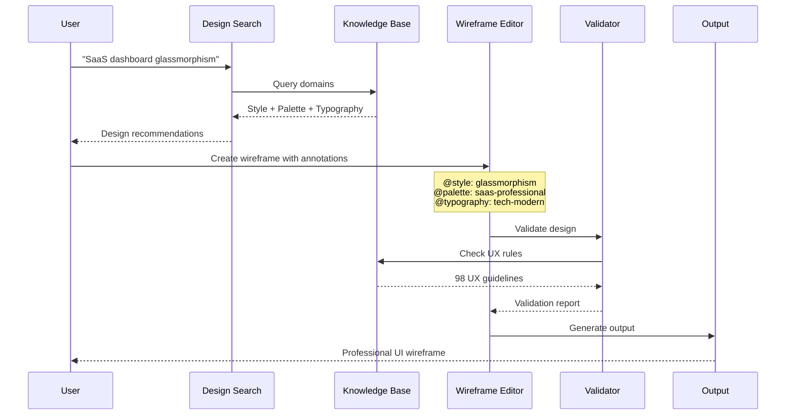
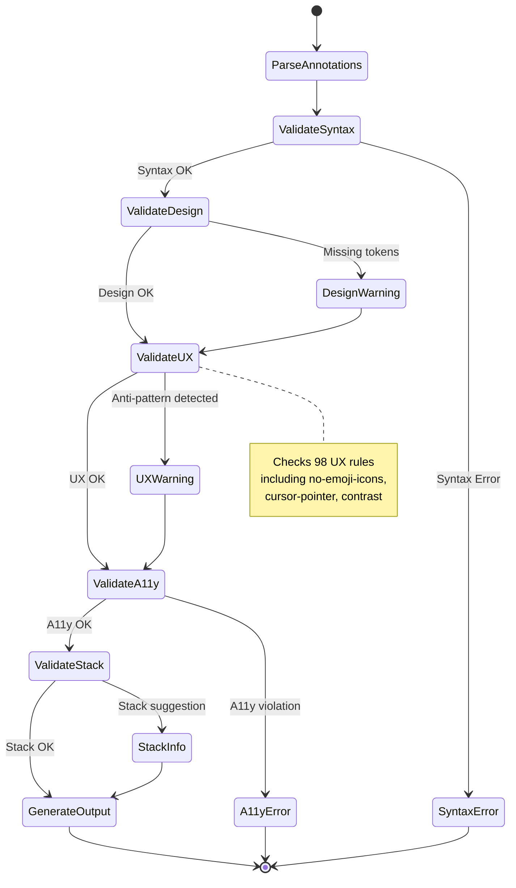

# MAS v2.7 Part 11: Design System Knowledge Specification

**Status:** Draft Specification  
**Version:** 2.7.0  
**Date:** 2025-12-03  
**Parent:** [MAS v2.7 Index](./MAS-v2.7-INDEX.md)  
**Derived From:** UI UX Pro Max Design Intelligence Database

---

## 1. Introduction

### 1.1 Purpose

This specification defines the Design System Knowledge Layer for MAS v2.7. It provides a formal schema for searchable design intelligence that enables AI-assisted UI/UX generation with:

- **57 UI Styles** - Glassmorphism, Minimalism, Brutalism, Neumorphism, etc.
- **95 Color Palettes** - Industry-specific palettes (SaaS, Healthcare, Fintech, etc.)
- **56 Typography Pairings** - Curated font combinations with Google Fonts
- **24 Chart Types** - Dashboard and analytics recommendations
- **98 UX Guidelines** - Best practices, anti-patterns, accessibility rules
- **8 Stack Guidelines** - Framework-specific implementation patterns

### 1.2 Background

MAS v2.6 Part 10 (ASCII Wireframe) defines HOW to create wireframes but lacks design intelligence for WHAT styles, colors, and patterns to use. This specification bridges that gap by integrating searchable design knowledge into the MAS ecosystem.

**Inspiration Sources:**
- **UI UX Pro Max** - Design intelligence database for AI coding assistants
- **Design Tokens** - W3C Design Tokens Community Group specification
- **Material Design** - Google's design system documentation patterns

### 1.3 Scope

This specification covers:
- Design token grammar extensions
- Domain definitions (8 searchable domains)
- Style, color, typography, and UX rule schemas
- Stack-specific implementation guidelines
- Validation rules for design quality
- Integration with MAS v2.6 wireframes

### 1.4 User Value

| User | Problem | Solution |
|------|---------|----------|
| Developer | "I don't know which colors work for SaaS" | Search `@domain: color` with `saas` keyword |
| Designer | "How do I avoid common UX mistakes?" | Validate against `@ux-rule` anti-patterns |
| Team Lead | "Our React code needs consistency" | Apply `@stack: react` guidelines |
| Product Owner | "We need professional UI fast" | Use `@style: glassmorphism` with full design system |

---

## 2. Formal Grammar (EBNF Extension)

```ebnf
(* MAS v2.7 Design System Knowledge Grammar *)
(* Extends MAS v2.6 ASCII Wireframe Grammar *)

(* Design System Annotations *)
design_annotation = style_annotation | palette_annotation | typography_annotation
                  | chart_annotation | ux_annotation | stack_annotation
                  | product_annotation | landing_annotation ;

(* Style Domain *)
style_annotation  = "@style:" style_name NEWLINE
                  | "@style-effects:" effect_list NEWLINE
                  | "@style-colors:" color_map NEWLINE
                  | "@style-frameworks:" framework_list NEWLINE ;

style_name        = "glassmorphism" | "claymorphism" | "minimalism" | "brutalism"
                  | "neumorphism" | "bento-grid" | "dark-mode" | "gradient"
                  | "retro" | "cyberpunk" | "organic" | "corporate"
                  | identifier ;  (* extensible *)

effect_list       = effect { "," effect } ;
effect            = "blur" | "transparency" | "gradient-border" | "shadow"
                  | "glow" | "noise" | "grain" | identifier ;

(* Color Palette Domain *)
palette_annotation = "@palette:" palette_name NEWLINE
                   | "@color-primary:" hex_color NEWLINE
                   | "@color-secondary:" hex_color NEWLINE
                   | "@color-cta:" hex_color NEWLINE
                   | "@color-background:" hex_color NEWLINE
                   | "@color-text:" hex_color NEWLINE
                   | "@color-border:" hex_color NEWLINE
                   | "@color-muted:" hex_color NEWLINE ;

palette_name      = industry_palette | mood_palette | identifier ;
industry_palette  = "saas" | "ecommerce" | "healthcare" | "fintech" | "beauty"
                  | "education" | "gaming" | "travel" | "food" | "fitness" ;
mood_palette      = "professional" | "playful" | "elegant" | "bold" | "calm"
                  | "energetic" | "luxurious" | "minimal" ;

hex_color         = "#" hex_digit hex_digit hex_digit hex_digit hex_digit hex_digit ;
hex_digit         = "0".."9" | "A".."F" | "a".."f" ;

(* Typography Domain *)
typography_annotation = "@typography:" typography_name NEWLINE
                      | "@font-heading:" font_name NEWLINE
                      | "@font-body:" font_name NEWLINE
                      | "@font-mono:" font_name NEWLINE
                      | "@font-import:" url NEWLINE ;

typography_name   = "elegant-modern" | "playful-friendly" | "professional-clean"
                  | "bold-statement" | "minimal-swiss" | "tech-modern"
                  | identifier ;

font_name         = { letter | digit | " " | "-" } ;

(* Chart Domain *)
chart_annotation  = "@chart-type:" chart_type NEWLINE
                  | "@chart-library:" library_name NEWLINE
                  | "@chart-use-case:" use_case NEWLINE ;

chart_type        = "line" | "bar" | "pie" | "donut" | "area" | "scatter"
                  | "heatmap" | "treemap" | "funnel" | "gauge" | "radar"
                  | "sankey" | "timeline" | "gantt" | "candlestick" ;

(* UX Rules Domain *)
ux_annotation     = "@ux-rule:" rule_id NEWLINE
                  | "@ux-category:" category NEWLINE
                  | "@ux-severity:" severity NEWLINE ;

rule_id           = "no-emoji-icons" | "cursor-pointer-interactive"
                  | "contrast-4.5-minimum" | "stable-hover-states"
                  | "consistent-icon-sizing" | "smooth-transitions"
                  | "floating-navbar-spacing" | "responsive-breakpoints"
                  | "prefers-reduced-motion" | identifier ;

category          = "icons" | "interaction" | "contrast" | "layout"
                  | "accessibility" | "animation" | "typography" | "color" ;

severity          = "error" | "warning" | "info" ;

(* Stack Guidelines Domain *)
stack_annotation  = "@stack:" stack_name NEWLINE
                  | "@stack-patterns:" pattern_list NEWLINE
                  | "@stack-a11y:" a11y_list NEWLINE
                  | "@stack-performance:" perf_list NEWLINE ;

stack_name        = "html-tailwind" | "react" | "nextjs" | "vue" | "svelte"
                  | "swiftui" | "react-native" | "flutter" ;

pattern_list      = pattern { "," pattern } ;
pattern           = identifier ;

(* Product Domain *)
product_annotation = "@product-type:" product_type NEWLINE
                   | "@industry:" industry NEWLINE
                   | "@recommended-style:" style_name NEWLINE ;

product_type      = "saas" | "ecommerce" | "portfolio" | "dashboard"
                  | "landing-page" | "blog" | "marketplace" | "social"
                  | "productivity" | "analytics" ;

(* Landing Page Domain *)
landing_annotation = "@landing-structure:" structure_type NEWLINE
                   | "@landing-sections:" section_list NEWLINE
                   | "@cta-strategy:" cta_strategy NEWLINE ;

structure_type    = "hero-centric" | "feature-focused" | "testimonial-driven"
                  | "pricing-first" | "social-proof" | "story-telling" ;

section_list      = section { "," section } ;
section           = "hero" | "features" | "testimonials" | "pricing"
                  | "faq" | "cta" | "footer" | "stats" | "team" ;

cta_strategy      = "single-cta" | "dual-cta" | "progressive-cta" | "sticky-cta" ;
```

---

## 3. Domain Definitions

### 3.1 Style Domain

**Purpose:** Define visual style systems with effects, colors, and framework recommendations.

**Schema:**
```yaml
Style:
  name: string          # e.g., "glassmorphism"
  description: string   # Human-readable description
  effects: string[]     # Visual effects used
  colors:
    primary: hex        # Main brand color
    secondary: hex      # Supporting color
    accent: hex         # Highlight color
  frameworks: string[]  # Recommended CSS frameworks
  use_cases: string[]   # Best suited product types
  anti_patterns: string[] # What to avoid
```

**Example:**
```wireframe
@style: glassmorphism
@style-effects: blur, transparency, gradient-border
@style-colors: primary=#6366F1, secondary=#8B5CF6, accent=#10B981
@style-frameworks: tailwind, css-backdrop-filter
```

### 3.2 Color Palette Domain

**Purpose:** Industry-specific color palettes with semantic color roles.

**Schema:**
```yaml
ColorPalette:
  name: string          # e.g., "saas-professional"
  industry: string      # Target industry
  mood: string          # Emotional tone
  colors:
    primary: hex        # Main brand color
    secondary: hex      # Supporting color
    cta: hex            # Call-to-action color
    background: hex     # Page background
    text: hex           # Body text color
    border: hex         # Border/divider color
    muted: hex          # Secondary text color
  contrast_ratio: float # WCAG contrast compliance
```

**Example:**
```wireframe
@palette: healthcare-trust
@color-primary: #0EA5E9
@color-secondary: #06B6D4
@color-cta: #10B981
@color-background: #F8FAFC
@color-text: #0F172A
@color-border: #E2E8F0
@color-muted: #64748B
```

### 3.3 Typography Domain

**Purpose:** Curated font pairings with Google Fonts integration.

**Schema:**
```yaml
Typography:
  name: string          # e.g., "elegant-modern"
  heading_font: string  # Display/heading font
  body_font: string     # Body text font
  mono_font: string     # Code/monospace font
  import_url: string    # Google Fonts import URL
  scale: object         # Font size scale
  weights: int[]        # Available font weights
  use_cases: string[]   # Best suited contexts
```

**Example:**
```wireframe
@typography: elegant-modern
@font-heading: Playfair Display
@font-body: Inter
@font-mono: JetBrains Mono
@font-import: https://fonts.googleapis.com/css2?family=Playfair+Display:wght@400;700&family=Inter:wght@400;500;600&display=swap
```

### 3.4 Chart Domain

**Purpose:** Chart type recommendations for data visualization.

**Schema:**
```yaml
ChartType:
  name: string          # e.g., "line"
  use_cases: string[]   # When to use this chart
  data_types: string[]  # Suitable data types
  libraries: string[]   # Recommended libraries
  accessibility: object # A11y considerations
  anti_patterns: string[] # When NOT to use
```

**Example:**
```wireframe
@chart-type: line
@chart-library: recharts, chart.js
@chart-use-case: trend-over-time, time-series
```

### 3.5 UX Rules Domain

**Purpose:** Best practices and anti-patterns for professional UI.

**Schema:**
```yaml
UXRule:
  id: string            # e.g., "no-emoji-icons"
  category: string      # Rule category
  severity: string      # error | warning | info
  description: string   # What the rule checks
  do: string            # Correct approach
  dont: string          # What to avoid
  rationale: string     # Why this matters
  wcag_reference: string # WCAG guideline if applicable
```

**Example:**
```wireframe
@ux-rule: no-emoji-icons
@ux-category: icons
@ux-severity: warning
# Do: Use SVG icons (Heroicons, Lucide, Simple Icons)
# Don't: Use emojis like 🎨 🚀 ⚙️ as UI icons
```

### 3.6 Stack Guidelines Domain

**Purpose:** Framework-specific implementation patterns.

**Schema:**
```yaml
StackGuideline:
  name: string          # e.g., "react"
  patterns: string[]    # Recommended patterns
  state_management: string[] # State solutions
  styling: string[]     # CSS approaches
  accessibility: string[] # A11y patterns
  performance: string[] # Performance tips
  anti_patterns: string[] # What to avoid
```

**Example:**
```wireframe
@stack: react
@stack-patterns: hooks, component-composition, custom-hooks
@stack-a11y: aria-labels, focus-management, keyboard-navigation
@stack-performance: memo, lazy-loading, code-splitting
```

### 3.7 Product Domain

**Purpose:** Product type to design system mapping.

**Schema:**
```yaml
ProductType:
  name: string          # e.g., "saas"
  recommended_styles: string[] # Best matching styles
  recommended_palettes: string[] # Best matching colors
  key_pages: string[]   # Essential pages
  ux_priorities: string[] # UX focus areas
```

### 3.8 Landing Page Domain

**Purpose:** Landing page structure and CTA strategies.

**Schema:**
```yaml
LandingStructure:
  name: string          # e.g., "hero-centric"
  sections: string[]    # Page sections in order
  cta_strategy: string  # CTA placement approach
  conversion_focus: string # Primary conversion goal
```

---

## 4. Validation Rules

### 4.1 Design Quality Validation

| Rule ID | Description | Severity |
|---------|-------------|----------|
| DES-001 | Style must be from defined catalog or custom | WARNING |
| DES-002 | Color palette must have all semantic roles | ERROR |
| DES-003 | Typography must include heading and body fonts | ERROR |
| DES-004 | Contrast ratio must meet WCAG 2.1 AA (4.5:1) | ERROR |
| DES-005 | Font import URL must be valid | WARNING |

### 4.2 UX Anti-Pattern Validation

| Rule ID | Description | Severity |
|---------|-------------|----------|
| UX-001 | No emoji icons in UI elements | WARNING |
| UX-002 | Interactive elements must have cursor-pointer | WARNING |
| UX-003 | Hover states must not cause layout shift | ERROR |
| UX-004 | Light mode text contrast minimum 4.5:1 | ERROR |
| UX-005 | Glass/transparent elements visible in light mode | WARNING |
| UX-006 | Borders visible in both light/dark modes | WARNING |
| UX-007 | Floating navbar must have edge spacing | WARNING |
| UX-008 | Transitions must be 150-300ms | INFO |
| UX-009 | Responsive at 320px, 768px, 1024px, 1440px | WARNING |
| UX-010 | No horizontal scroll on mobile | ERROR |

### 4.3 Accessibility Validation (Extended)

| Rule ID | Description | Severity |
|---------|-------------|----------|
| A11Y-005 | All images must have alt text | ERROR |
| A11Y-006 | Form inputs must have labels | ERROR |
| A11Y-007 | Color must not be only indicator | WARNING |
| A11Y-008 | prefers-reduced-motion must be respected | WARNING |
| A11Y-009 | Focus states must be visible | ERROR |
| A11Y-010 | Keyboard navigation must work | ERROR |

### 4.4 Stack-Specific Validation

| Rule ID | Description | Severity |
|---------|-------------|----------|
| STK-001 | React: Use hooks over class components | INFO |
| STK-002 | Next.js: Use Image component for images | WARNING |
| STK-003 | Tailwind: Use consistent spacing scale | INFO |
| STK-004 | Vue: Use Composition API | INFO |
| STK-005 | Flutter: Use const constructors | INFO |

---

## 5. Integration with MAS v2.6 Wireframes

### 5.1 Wireframe with Design System

```wireframe
@title: SaaS Dashboard
@screen: DashboardPage
@actor: Authenticated User

# Design System Annotations
@style: glassmorphism
@palette: saas-professional
@typography: tech-modern
@stack: react

# Wireframe Content
+------------------------------------------+
|  @type: header                           |
|  Logo   {* Dashboard | Analytics | Settings } |
|  [<search>] [<notifications>] [<user>]   |
+------------------------------------------+

@type: content
{^"Key Metrics"
  @chart-type: line
  [img:Revenue Chart]
  
  { Total Users | Active Users | Revenue }
  { 12,450      | 8,230        | $45,200 }
^}

{^"Recent Activity"
  @ux-rule: cursor-pointer-interactive
  [View All Activity]
^}
```

### 5.2 Design Token References

```wireframe
@design-system: example-ds
@palette: saas-professional

[Submit]
@token-background: color.primary
@token-text: color.white
@token-radius: radius.md
@token-shadow: shadow.sm
```

---

## 6. Search Interface

### 6.1 Query Syntax

```bash
# Search by domain
search "<keyword>" --domain <domain>

# Search with stack filter
search "<keyword>" --stack <stack>

# Search with multiple keywords
search "healthcare dashboard analytics" --domain product

# Search with result limit
search "<keyword>" --domain style -n 5
```

### 6.2 Domain Search Examples

```bash
# Find styles for SaaS
search "saas professional" --domain style

# Find color palettes for healthcare
search "healthcare trust" --domain color

# Find typography for elegant luxury
search "elegant luxury" --domain typography

# Find UX rules for accessibility
search "accessibility contrast" --domain ux

# Find React patterns
search "state management" --stack react
```

---

## 7. Pre-Delivery Checklist

### 7.1 Visual Quality
- [ ] Style annotations match design intent
- [ ] Color palette has all semantic roles
- [ ] Typography includes heading and body fonts
- [ ] No emoji icons (use SVG)
- [ ] Hover states don't cause layout shift

### 7.2 Interaction
- [ ] All clickable elements have cursor-pointer
- [ ] Hover states provide visual feedback
- [ ] Transitions are 150-300ms
- [ ] Focus states visible for keyboard navigation

### 7.3 Light/Dark Mode
- [ ] Text contrast meets 4.5:1 minimum
- [ ] Glass elements visible in light mode
- [ ] Borders visible in both modes

### 7.4 Layout
- [ ] Floating elements have edge spacing
- [ ] No content hidden behind fixed navbars
- [ ] Responsive at all breakpoints
- [ ] No horizontal scroll on mobile

### 7.5 Accessibility
- [ ] All images have alt text
- [ ] Form inputs have labels
- [ ] Color is not only indicator
- [ ] prefers-reduced-motion respected

---

## 8. Conformance Classes

### Class 1: Minimal Conformance
- Parse design system annotations
- Validate basic syntax
- Support at least 3 domains

### Class 2: Standard Conformance (Recommended)
- All 8 domains supported
- UX anti-pattern validation
- Accessibility validation
- Stack-specific guidelines

### Class 3: Full Conformance (Enterprise)
- Complete design token integration
- Custom style/palette definitions
- Design system export (Figma, Sketch)
- CI/CD validation integration

---

## 9. Examples

### 9.1 Complete SaaS Landing Page

```wireframe
@title: SaaS Landing Page
@screen: LandingPage
@actor: Visitor

# Design System
@style: glassmorphism
@palette: saas-professional
@typography: tech-modern
@landing-structure: hero-centric
@cta-strategy: dual-cta
@stack: nextjs

# Header
@type: header
+------------------------------------------+
|  Logo   {* Features | Pricing | About }  |
|  [[Login]]  [Get Started]                |
+------------------------------------------+

# Hero Section
@type: hero
@landing-sections: hero
+------------------------------------------+
|  Build faster with AI                    |
|  ================================        |
|  The collaborative workspace where       |
|  humans and AI work together.            |
|                                          |
|  [[Watch Demo]]  [Start Free Trial]      |
+------------------------------------------+

# Features Section
@type: content
@landing-sections: features
{^"Why Choose Us"
  { [img:Feature 1] | [img:Feature 2] | [img:Feature 3] }
  { AI-Powered     | Real-time Sync  | Team Collab     }
^}

# CTA Section
@type: cta
@cta-strategy: single-cta
+------------------------------------------+
|  Ready to get started?                   |
|  [Start Your Free Trial]                 |
+------------------------------------------+
```

### 9.2 Healthcare Dashboard

```wireframe
@title: Healthcare Analytics
@screen: AnalyticsDashboard
@actor: Healthcare Admin

# Design System
@style: minimalism
@palette: healthcare-trust
@typography: professional-clean
@stack: react

# Sidebar
@type: sidebar
| [img:Logo]        |
| ================= |
| [<dashboard>] Dashboard |
| [<patients>] Patients   |
| [<analytics>] Analytics |
| [<settings>] Settings   |

# Main Content
@type: content
{^"Patient Overview"
  @chart-type: line
  @chart-library: recharts
  [img:Patient Trends Chart]
^}

{^"Key Metrics"
  { Total Patients | Active Cases | Recovery Rate }
  { 1,234          | 89           | 94.2%         }
^}
```

---

## 10. References

- [UI UX Pro Max](https://github.com/example/ui-ux-pro-max) - Design intelligence database
- [MAS v2.6 ASCII Wireframe](./MAS-ASCIIWireframe-v2.6.md) - Wireframe syntax
- [W3C Design Tokens](https://design-tokens.github.io/community-group/) - Token specification
- [WCAG 2.1](https://www.w3.org/TR/WCAG21/) - Accessibility guidelines
- [Material Design](https://material.io/design) - Design system patterns

---

**Version:** 2.7.0 | **Status:** Draft Specification | **Last Updated:** 2025-12-03


---

## Appendix A: Architecture Diagrams

### A.1 MAS v2.7 Design System Knowledge Architecture

```mermaid
graph TB
    subgraph "MAS v2.7 Design System Knowledge Layer"
        direction TB
        DSK[Design System<br/>Knowledge Base]
        
        subgraph "8 Searchable Domains"
            ST[57 UI Styles]
            CP[95 Color Palettes]
            TY[56 Typography Pairings]
            CH[24 Chart Types]
            UX[98 UX Guidelines]
            SK[8 Stack Guidelines]
            PR[Product Types]
            LP[Landing Structures]
        end
        
        DSK --> ST
        DSK --> CP
        DSK --> TY
        DSK --> CH
        DSK --> UX
        DSK --> SK
        DSK --> PR
        DSK --> LP
    end
    
    subgraph "MAS v2.6 Wireframe Layer"
        WF[Wireframe Syntax]
        AN[Design Annotations]
        WG[Widget Vocabulary]
        LY[Layout Containers]
        
        WF --> AN
        WF --> WG
        WF --> LY
    end
    
    subgraph "MAS Compiler"
        VAL[Validator]
        GEN[Generator]
        OUT[Output]
        
        VAL --> GEN
        GEN --> OUT
    end
    
    %% Integration flows
    ST -->|@style| AN
    CP -->|@palette| AN
    TY -->|@typography| AN
    CH -->|@chart-type| AN
    SK -->|@stack| AN
    
    UX -->|validates| VAL
    AN -->|input| VAL
    
    style DSK fill:#6366F1,color:#fff
    style VAL fill:#10B981,color:#fff
    style OUT fill:#F59E0B,color:#fff
```

### A.2 Design Intelligence Workflow



### A.3 Domain Relationship Map

```mermaid
erDiagram
    PRODUCT_TYPE ||--o{ STYLE : "recommends"
    PRODUCT_TYPE ||--o{ COLOR_PALETTE : "recommends"
    STYLE ||--o{ EFFECT : "uses"
    STYLE ||--o{ FRAMEWORK : "supports"
    COLOR_PALETTE ||--|| INDUSTRY : "targets"
    TYPOGRAPHY ||--o{ FONT : "includes"
    STACK ||--o{ PATTERN : "defines"
    STACK ||--o{ A11Y_RULE : "requires"
    UX_RULE ||--|| CATEGORY : "belongs_to"
    LANDING_STRUCTURE ||--o{ SECTION : "contains"
    
    PRODUCT_TYPE {
        string name PK
        string[] recommended_styles
        string[] key_pages
    }
    
    STYLE {
        string name PK
        string[] effects
        string[] frameworks
    }
    
    COLOR_PALETTE {
        string name PK
        string industry
        hex primary
        hex secondary
        hex cta
    }
    
    TYPOGRAPHY {
        string name PK
        string heading_font
        string body_font
        string import_url
    }
    
    UX_RULE {
        string id PK
        string category
        string severity
        string description
    }
    
    STACK {
        string name PK
        string[] patterns
        string[] a11y_rules
    }
```

### A.4 Validation Pipeline



---

## Appendix B: Quick Reference Card

### B.1 Annotation Cheat Sheet

| Annotation | Domain | Example |
|------------|--------|---------|
| `@style:` | Style | `@style: glassmorphism` |
| `@style-effects:` | Style | `@style-effects: blur, transparency` |
| `@palette:` | Color | `@palette: saas-professional` |
| `@color-primary:` | Color | `@color-primary: #6366F1` |
| `@typography:` | Typography | `@typography: elegant-modern` |
| `@font-heading:` | Typography | `@font-heading: Playfair Display` |
| `@chart-type:` | Chart | `@chart-type: line` |
| `@ux-rule:` | UX | `@ux-rule: no-emoji-icons` |
| `@stack:` | Stack | `@stack: react` |
| `@product-type:` | Product | `@product-type: saas` |
| `@landing-structure:` | Landing | `@landing-structure: hero-centric` |

### B.2 Common Style Names

| Style | Best For | Key Effects |
|-------|----------|-------------|
| `glassmorphism` | Modern SaaS, Dashboards | blur, transparency |
| `minimalism` | Professional, Corporate | whitespace, typography |
| `brutalism` | Creative, Portfolio | bold colors, raw shapes |
| `neumorphism` | Soft UI, Settings | soft shadows, emboss |
| `bento-grid` | Dashboards, Features | grid layout, cards |
| `dark-mode` | Developer tools, Media | dark backgrounds |

### B.3 Industry Palettes

| Industry | Primary | Secondary | CTA |
|----------|---------|-----------|-----|
| `saas` | #6366F1 | #8B5CF6 | #10B981 |
| `healthcare` | #0EA5E9 | #06B6D4 | #10B981 |
| `fintech` | #1E40AF | #3B82F6 | #F59E0B |
| `ecommerce` | #DC2626 | #F97316 | #10B981 |
| `beauty` | #EC4899 | #F472B6 | #8B5CF6 |

### B.4 Stack Quick Reference

| Stack | Key Patterns | A11y Focus |
|-------|--------------|------------|
| `html-tailwind` | utilities, responsive | semantic HTML |
| `react` | hooks, composition | aria-labels |
| `nextjs` | SSR, Image component | focus management |
| `vue` | Composition API | v-focus directive |
| `svelte` | runes, stores | use:action |

---

**End of MAS v2.7 Part 11: Design System Knowledge Specification**
