# MAS Compiler Service: Architecture & System Design

**Service Mission**: Transform natural language and structured inputs into MAS v2.0-compliant Mermaid diagrams at scale

---

## 🏗️ High-Level Architecture

### System Context (C4 Level 1)

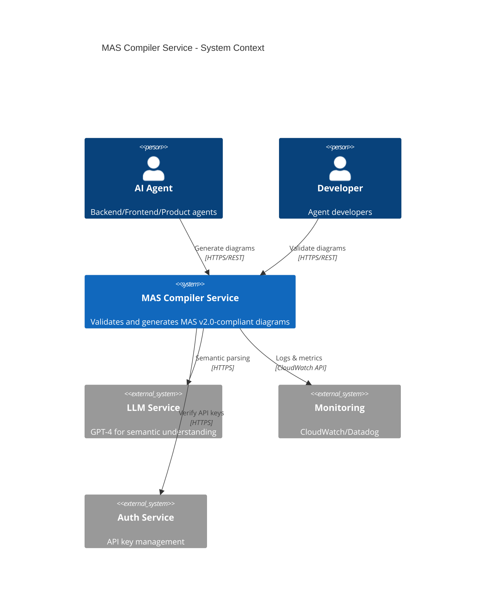

---

## 🔧 Container Architecture (C4 Level 2)

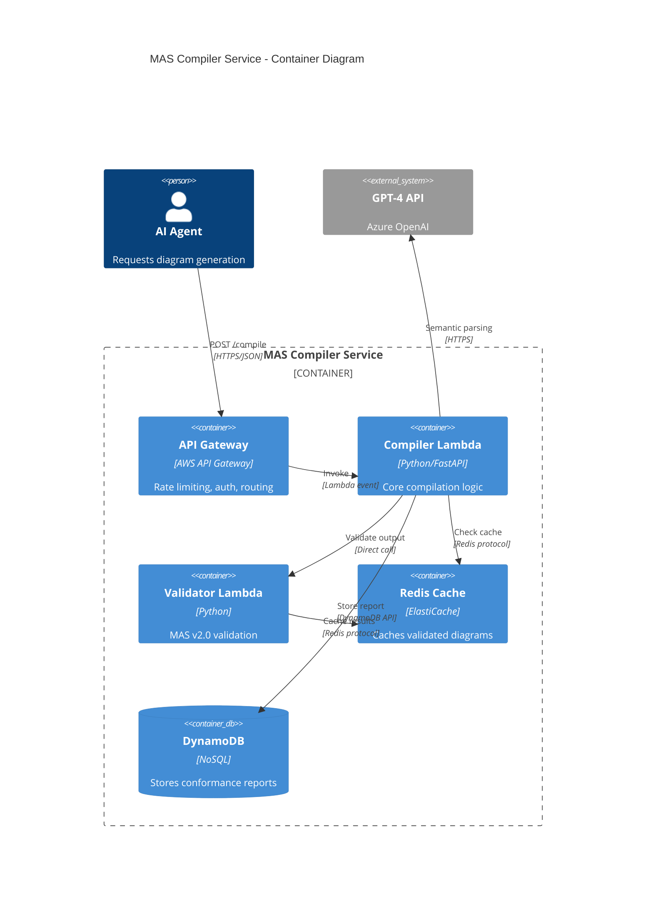

---

## ⚙️ Component Architecture (C4 Level 3)

### Compiler Lambda Components

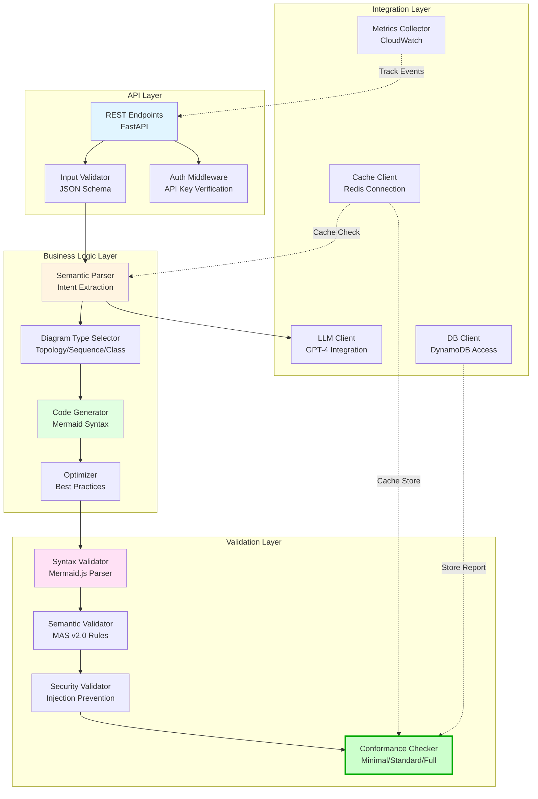

---

## 🔄 Data Flow Architecture

### Request Processing Pipeline

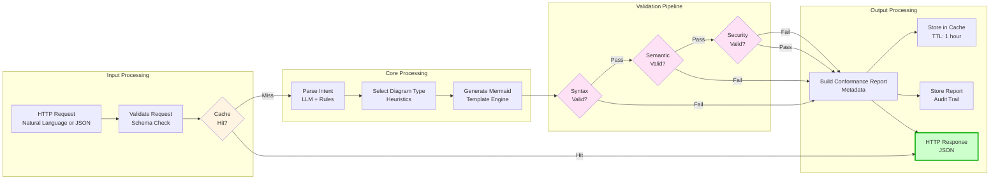

---

## 🎯 API Endpoint Architecture

### REST API Design

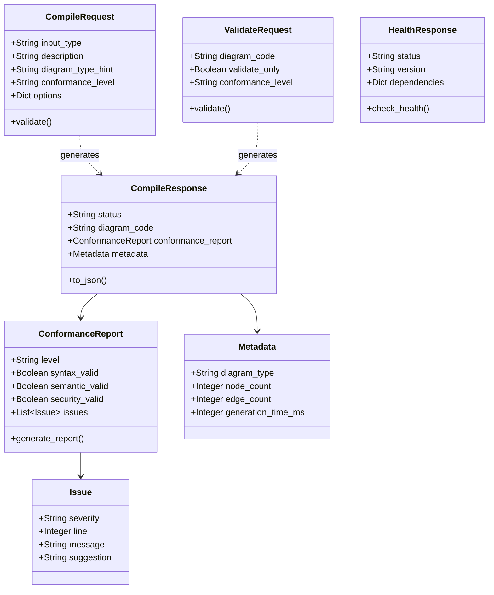

### API Endpoints

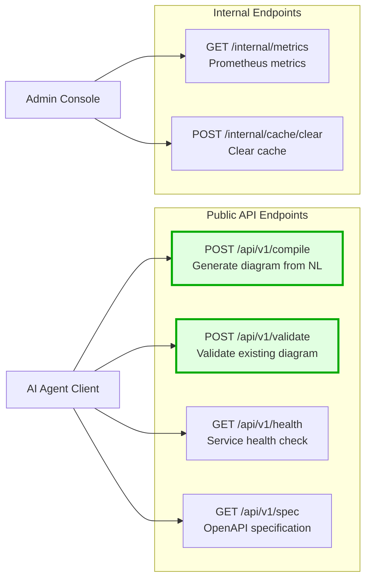

---

## 🔐 Security Architecture

### Multi-Layer Security Design

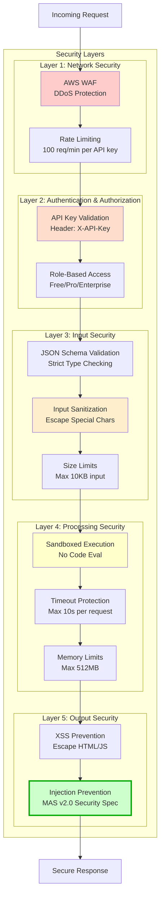

---

## 📊 Scalability Architecture

### Auto-Scaling Strategy

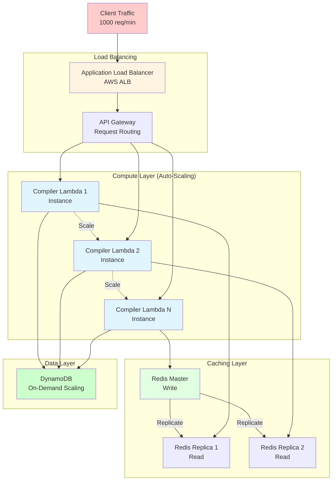

### Scaling Metrics

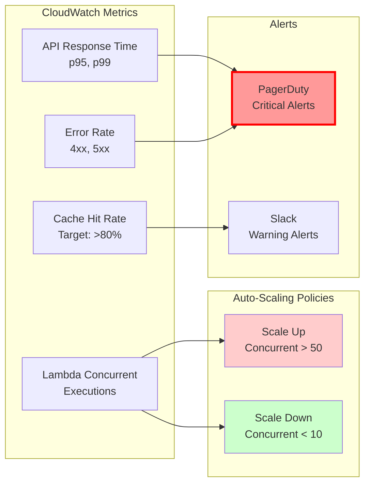

---

## 🗄️ Data Model

### DynamoDB Schema

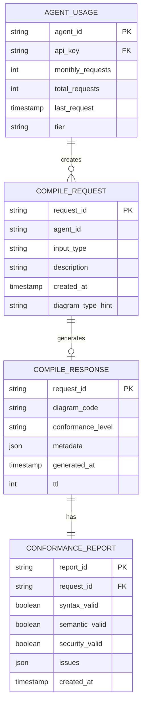

---

## 🚀 Deployment Architecture

### Multi-Environment Strategy

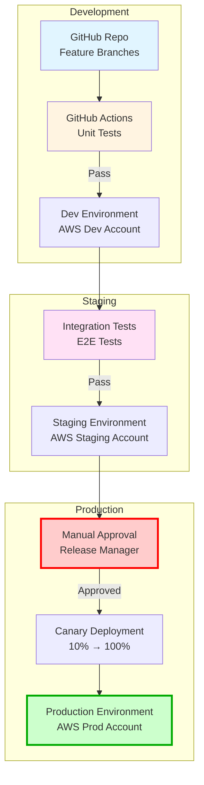

---

## 📈 Monitoring & Observability

### Observability Stack

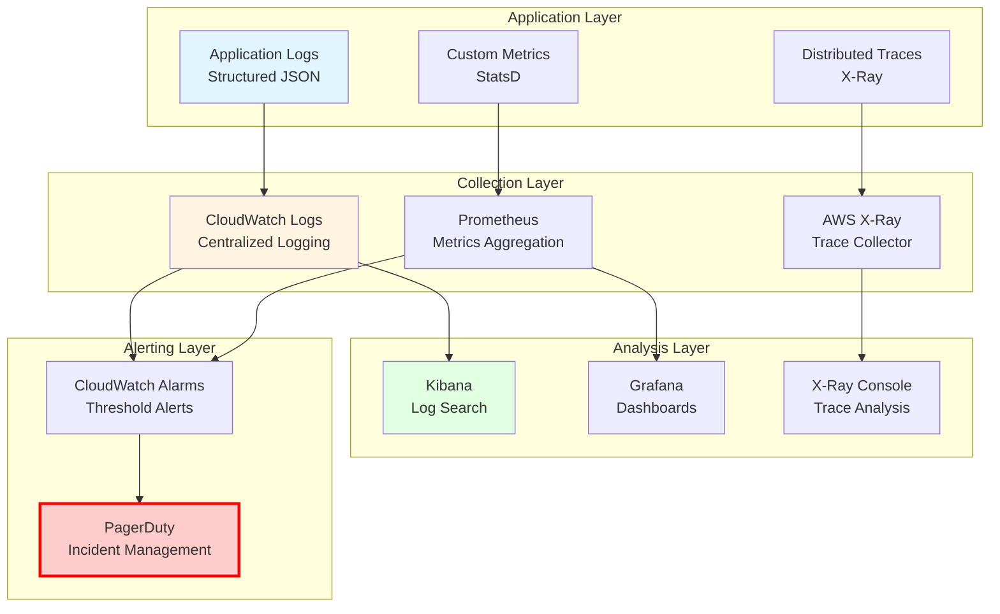

---

## 🔄 Disaster Recovery

### Backup & Recovery Strategy

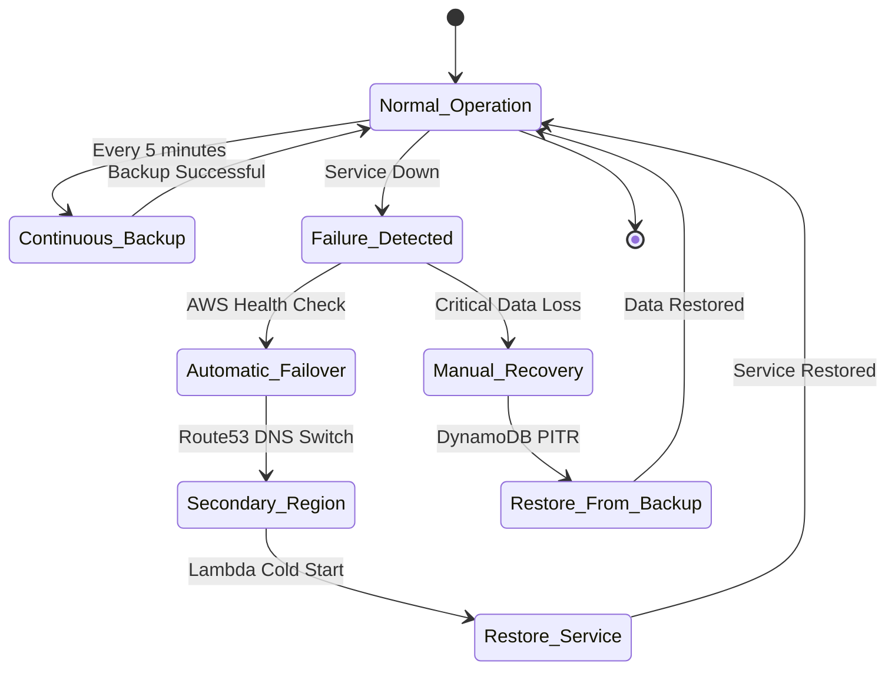

**Recovery Targets**:
- **RTO** (Recovery Time Objective): < 5 minutes
- **RPO** (Recovery Point Objective): < 5 minutes
- **Availability**: 99.9% (43 minutes downtime/month max)

---

## 💰 Cost Optimization

### Cost Breakdown (Monthly at 1M Requests)

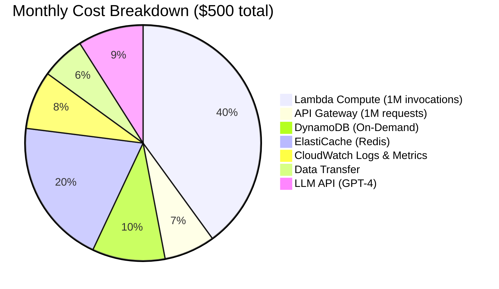

**Cost Optimization Strategies**:
- ✅ Cache frequently requested diagrams (Redis)
- ✅ Use Lambda reserved concurrency to control costs
- ✅ Implement request batching for LLM calls
- ✅ Archive old conformance reports to S3 Glacier
- ✅ Use DynamoDB on-demand pricing for variable load

---

## 🎯 Performance Targets

| Metric | Target | Measurement |
|--------|--------|-------------|
| **Response Time (p95)** | < 2 seconds | CloudWatch metrics |
| **Response Time (p99)** | < 5 seconds | CloudWatch metrics |
| **Throughput** | 100 concurrent requests | Load testing |
| **Cache Hit Rate** | > 80% | Redis metrics |
| **Error Rate** | < 0.1% | CloudWatch alarms |
| **Lambda Cold Start** | < 500ms | X-Ray traces |

---

## 📝 Technology Stack

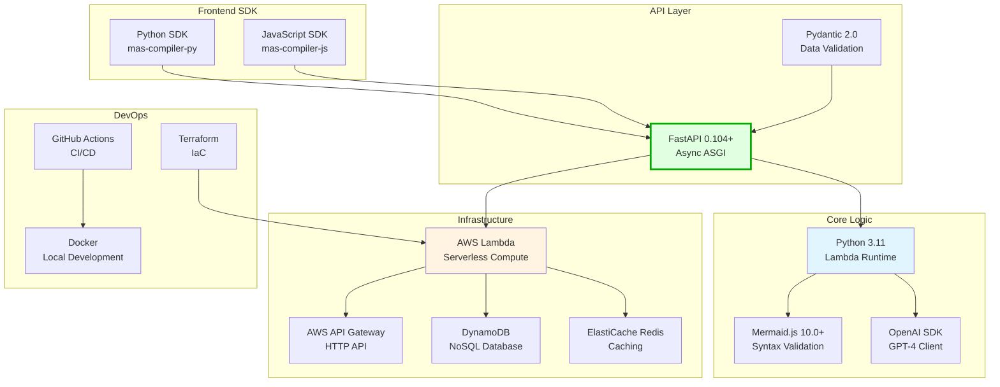

---

*Created by: Alex Chen (Mermaid Guru)*  
*MAS v2.0 Specification Compliant*  
*Last Updated: 2025-11-27*
