# MAS Compiler Integration Patterns: AI Agent Workflows

**Integration Vision**: Seamless MAS adoption across all AI agent types with zero friction

---

## 🎯 Integration Architecture Overview


---

## 🔌 Integration Pattern 1: Direct REST API

### Use Case: Simple, One-Off Diagram Generation

```mermaid
sequenceDiagram
    autonumber
    participant Agent as Any AI Agent
    participant API as MAS Compiler API
    participant Docs as Documentation System
    
    Agent->>API: POST /api/v1/compile<br/>{"description": "Create auth flow"}
    API-->>Agent: {"diagram_code": "sequenceDiagram..."}
    
    Agent->>Agent: Parse response JSON
    Agent->>Docs: Insert diagram into README.md
    
    Note over Agent,Docs: Pattern: Request → Parse → Integrate
```



**When to Use**:
- ✅ One-time diagram generation
- ✅ Simple integration without dependencies
- ✅ Testing or prototyping
- ✅ Serverless functions (AWS Lambda, Cloudflare Workers)

**Implementation Example**:
```python
import requests

def generate_diagram(description: str) -> str:
    """Generate MAS-compliant diagram from description."""
    response = requests.post(
        "https://api.example.com/mas/v1/compile",
        headers={
            "Content-Type": "application/json",
            "X-API-Key": "your-api-key"
        },
        json={
            "input_type": "natural_language",
            "description": description,
            "conformance_level": "standard"
        }
    )
    
    if response.status_code == 200:
        return response.json()["diagram_code"]
    else:
        raise Exception(f"Error: {response.json()}")

# Usage
diagram = generate_diagram("Create login flow with JWT auth")
print(diagram)
```

---

## 📦 Integration Pattern 2: Python SDK

### Use Case: Backend Agents with Type Safety


**When to Use**:
- ✅ Backend Architect agents (Python-based)
- ✅ Automated documentation pipelines
- ✅ CI/CD integrations
- ✅ Need type safety and validation
- ✅ Batch processing multiple diagrams

**Implementation Example**:
```python
from mas_compiler import MASCompilerClient, CompileRequest, DiagramType

# Initialize client
client = MASCompilerClient(api_key="your-api-key")

# Simple generation
async def generate_sequence_diagram():
    request = CompileRequest(
        input_type="natural_language",
        description="Create API authentication flow with OAuth2",
        diagram_type_hint=DiagramType.SEQUENCE,
        conformance_level="standard"
    )
    
    result = await client.compile(request)
    
    if result.status == "success":
        # Type-safe access to response
        print(f"Diagram Type: {result.metadata.diagram_type}")
        print(f"Conformance: {result.conformance_report.level}")
        
        # Save to file
        with open("docs/diagrams/auth-flow.mmd", "w") as f:
            f.write(result.diagram_code)
        
        return result.diagram_code
    else:
        # Handle errors with detailed error report
        for issue in result.conformance_report.issues:
            print(f"[{issue.severity}] Line {issue.line}: {issue.message}")
            print(f"Suggestion: {issue.suggestion}")

# Batch processing
async def generate_all_diagrams():
    descriptions = [
        "User login flow",
        "Database schema for user management",
        "Microservices topology"
    ]
    
    # Parallel processing with asyncio
    tasks = [client.compile(CompileRequest(description=desc)) 
             for desc in descriptions]
    
    results = await asyncio.gather(*tasks)
    
    return results

# Validation workflow
async def validate_existing_diagrams():
    """Pre-commit hook: Validate all .mmd files"""
    for diagram_file in Path("docs/diagrams").glob("*.mmd"):
        code = diagram_file.read_text()
        
        result = await client.validate(code)
        
        if not result.conformance_report.syntax_valid:
            print(f"❌ {diagram_file}: Validation failed")
            for issue in result.conformance_report.issues:
                print(f"  Line {issue.line}: {issue.message}")
        else:
            print(f"✅ {diagram_file}: Valid")
```

---

## 🌐 Integration Pattern 3: JavaScript SDK

### Use Case: Frontend Agents & Next.js Apps


**When to Use**:
- ✅ Frontend Architect agents (TypeScript/JavaScript)
- ✅ Next.js documentation sites
- ✅ Interactive diagram editors
- ✅ Real-time collaboration tools
- ✅ Browser-based agents

**Implementation Example**:
```typescript
import { MASCompilerClient, CompileRequest, DiagramType } from 'mas-compiler-js';

// Initialize client
const client = new MASCompilerClient({
  apiKey: process.env.MAS_API_KEY,
  cache: true, // Enable IndexedDB caching
});

// Next.js: Static Site Generation
export async function generateStaticParams() {
  const client = new MASCompilerClient({ apiKey: process.env.MAS_API_KEY });
  
  const diagrams = [
    { slug: 'auth-flow', description: 'User authentication with JWT' },
    { slug: 'component-tree', description: 'React component hierarchy' },
  ];
  
  const results = await Promise.all(
    diagrams.map(async ({ slug, description }) => {
      const result = await client.compile({
        input_type: 'natural_language',
        description,
        diagram_type_hint: DiagramType.SEQUENCE,
      });
      
      return { slug, diagram: result.diagram_code };
    })
  );
  
  return results.map(({ slug }) => ({ slug }));
}

// React Component: Interactive Diagram Generator
export function DiagramGenerator() {
  const [description, setDescription] = useState('');
  const [diagram, setDiagram] = useState<string | null>(null);
  const [loading, setLoading] = useState(false);
  
  const handleGenerate = async () => {
    setLoading(true);
    
    try {
      const result = await client.compile({
        input_type: 'natural_language',
        description,
        conformance_level: 'standard',
      });
      
      if (result.status === 'success') {
        setDiagram(result.diagram_code);
        
        // Show conformance report
        console.log('Conformance:', result.conformance_report.level);
        console.log('Nodes:', result.metadata.node_count);
      }
    } catch (error) {
      console.error('Generation failed:', error);
    } finally {
      setLoading(false);
    }
  };
  
  return (
    <div>
      <textarea 
        value={description}
        onChange={(e) => setDescription(e.target.value)}
        placeholder="Describe your diagram..."
      />
      <button onClick={handleGenerate} disabled={loading}>
        {loading ? 'Generating...' : 'Generate Diagram'}
      </button>
      
      {diagram && (
        <MermaidRenderer code={diagram} />
      )}
    </div>
  );
}
```

---

## 🔗 Integration Pattern 4: MCP Server Protocol

### Use Case: IDE Extensions & Agent Frameworks


**When to Use**:
- ✅ IDE extensions (VSCode, Cursor, Windsurf)
- ✅ Agent frameworks (LangChain, LlamaIndex)
- ✅ Multi-agent systems
- ✅ Tool-calling LLMs (GPT-4, Claude)
- ✅ Need standard protocol for agent communication

**MCP Server Configuration**:
```json
{
  "mcpServers": {
    "mas-compiler": {
      "command": "npx",
      "args": ["-y", "@mas/mcp-server"],
      "env": {
        "MAS_API_KEY": "your-api-key"
      }
    }
  }
}
```

**Tool Usage Example**:
```python
# LangChain integration
from langchain.agents import initialize_agent, Tool
from langchain.llms import OpenAI
from mcp_client import MCPClient

# Initialize MCP client
mcp = MCPClient(server="mas-compiler")

# Define MCP tool
compile_tool = Tool(
    name="compile_diagram",
    description="Generate MAS v2.0-compliant Mermaid diagrams from natural language",
    func=lambda desc: mcp.call_tool("compile_diagram", {"description": desc})
)

# Create agent with MAS Compiler tool
llm = OpenAI(temperature=0)
agent = initialize_agent(
    tools=[compile_tool],
    llm=llm,
    agent="zero-shot-react-description",
)

# Agent automatically uses MAS Compiler when needed
response = agent.run("Create a sequence diagram showing OAuth2 login flow")
print(response)  # Agent generates and returns diagram
```

---

## 🤖 Integration Pattern 5: Agent-to-Agent Collaboration

### Use Case: Multi-Agent Documentation Pipelines


**Collaboration Benefits**:
- ✅ **Consistency**: All agents use same MAS compiler → Uniform diagram style
- ✅ **Synchronization**: Diagrams reflect current architecture, not outdated docs
- ✅ **Traceability**: All diagrams link back to original requirements
- ✅ **Efficiency**: 90% faster than manual diagram creation

---

## 🔄 Integration Pattern 6: CI/CD Pipeline Integration

### Use Case: Automated Documentation Updates


**GitHub Actions Workflow Example**:
```yaml
name: Update Architecture Diagrams

on:
  push:
    branches: [main]
    paths:
      - 'src/**'
      - 'api/**'

jobs:
  update-diagrams:
    runs-on: ubuntu-latest
    steps:
      - uses: actions/checkout@v3
      
      - name: Setup Python
        uses: actions/setup-python@v4
        with:
          python-version: '3.11'
      
      - name: Install MAS Compiler SDK
        run: pip install mas-compiler-py
      
      - name: Generate Diagrams
        env:
          MAS_API_KEY: ${{ secrets.MAS_API_KEY }}
        run: |
          python scripts/generate_diagrams.py
      
      - name: Validate Diagrams
        run: |
          python scripts/validate_diagrams.py
      
      - name: Commit Changes
        uses: stefanzweifel/git-auto-commit-action@v4
        with:
          commit_message: "docs: Update architecture diagrams [auto-generated]"
          file_pattern: "docs/diagrams/*.mmd"
      
      - name: Comment PR with Diagrams
        uses: actions/github-script@v6
        with:
          script: |
            const diagrams = require('./docs/diagrams/index.json');
            const comment = diagrams.map(d => 
              `### ${d.title}\n\`\`\`mermaid\n${d.code}\n\`\`\``
            ).join('\n\n');
            
            github.rest.issues.createComment({
              issue_number: context.issue.number,
              owner: context.repo.owner,
              repo: context.repo.repo,
              body: comment
            });
```

---

## 📊 Integration Metrics & Monitoring

### Monitoring Agent Integration Health


**Key Metrics to Track**:

| Metric | Target | Alert Threshold |
|--------|--------|-----------------|
| **API Success Rate** | >95% | <90% |
| **Agent Adoption** | 70% in 3 months | <50% at month 2 |
| **Average Latency** | <2s p95 | >5s p95 |
| **Conformance Rate** | >90% Standard | <80% |
| **Cache Hit Rate** | >80% | <60% |

---

## 🚀 Integration Best Practices

### Design Principles for Agent Integration

```mermaid
mindmap
    root((MAS Integration<br/>Best Practices))
        Fail-Fast Validation
            Validate input immediately
            Return errors early
            Provide actionable feedback
        Idempotent Operations
            Same input → Same output
            No side effects
            Safe to retry
        Progressive Enhancement
            Start with basic diagrams
            Add complexity incrementally
            Optimize later
        Observability First
            Log all requests
            Track performance metrics
            Monitor error patterns
        Security by Default
            API key authentication
            Rate limiting per agent
            Input sanitization
        Cache Aggressively
            Cache validated diagrams
            TTL based on volatility
            Invalidate on spec updates
```



---

## 🎯 Integration Success Stories

### Example: Backend Architect Agent Adoption

**Before MAS Compiler**:
- Manual diagram creation: 2-3 hours per diagram
- Frequent syntax errors
- Diagrams quickly become outdated
- Inconsistent styles across team

**After MAS Compiler**:
- Automated generation: 2 seconds per diagram
- 99.9% valid on first attempt
- Diagrams auto-update with code changes
- Uniform MAS v2.0 compliance

**Results**:
- ⚡ 99.9% time reduction (3 hours → 2 seconds)
- ✅ 95% error reduction
- 📈 100% diagram-code synchronization
- 💰 $50K annual savings per team

---

*Created by: Alex Chen (Mermaid Guru)*  
*MAS v2.0 Specification Compliant*  
*Last Updated: 2025-11-27*
