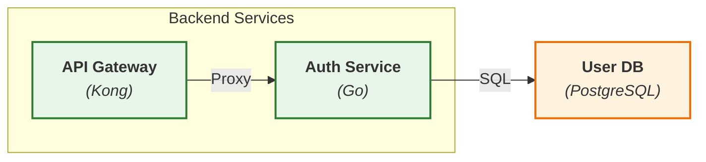
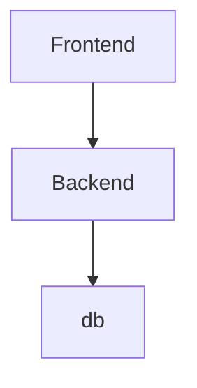

# MAP-v1 Technical Specification

**Mermaid Architecture Protocol - Version 1.0**

---

## 1. Protocol Overview

### 1.1 Purpose

MAP-v1 defines a deterministic, machine-parsable subset of Mermaid syntax for encoding system and software architecture
as executable specifications. It serves as a bidirectional contract between LLM generators and visual development
environments.

### 1.2 Scope

- **Domain:** System architecture and software component design
- **Abstraction Level:** Container and component level (C4 Model Layer 2-3)
- **Primary Consumer:** Code generation engines, interactive IDEs, documentation systems

### 1.3 Design Principles

- **Determinism:** Identical architectural intent must produce identical diagram structure
- **Traceability:** Every visual element maps to a concrete code artifact
- **Composability:** Diagrams can reference and embed other diagrams
- **Backward Compatibility:** All output is valid Mermaid 10.x syntax

---

## 2. Type System

### 2.1 Diagram Type Enumeration

```
MAP-v1-DiagramType ::= Topology | Interaction | Structure
```

### 2.2 Topology Diagrams

#### 2.2.1 Declaration

```
graph [Direction]
Direction ::= TD | LR | BT | RL
```

#### 2.2.2 Node Syntax

```
NodeDeclaration ::= NodeID[Label]
NodeID ::= [a-z_][a-z0-9_]*  // snake_case, min 3 chars
Label ::= "<b>" DisplayName "</b><br/><i>(" TechStack ")</i>"
```

#### 2.2.3 Edge Syntax

```
Edge ::= NodeID Arrow NodeID EdgeLabel?
Arrow ::= --> | -.-> | ==>
EdgeLabel ::= "|" Text "|"
```

#### 2.2.4 Boundary Syntax

```
Boundary ::= subgraph ClusterID[BoundaryLabel]
ClusterID ::= cluster_[a-z_]+
BoundaryLabel ::= String
```

### 2.3 Interaction Diagrams

#### 2.3.1 Declaration

```
sequenceDiagram
    autonumber
```

#### 2.3.2 Participant Syntax

```
ParticipantDecl ::= participant Alias as NodeID
Alias ::= [A-Z]{1,4}  // Short form for readability
NodeID ::= [a-z_][a-z0-9_]*  // Must match Topology NodeID
```

#### 2.3.3 Message Syntax

```
Message ::= From Arrow To : MessageText
Arrow ::= ->> | -->> | -x | --x
```

### 2.4 Structure Diagrams

#### 2.4.1 Declaration

```
classDiagram
```

#### 2.4.2 Class Syntax

```
ClassDecl ::= class ClassName {
    +PublicField: Type
    -PrivateField: Type
    +method(params): ReturnType
}
```

---

## 3. Naming Conventions

### 3.1 Identifier Rules

#### 3.1.1 Node Identifiers

```
Format: [domain]_[type]_[name]
Examples:
  - auth_service_jwt
  - payment_db_primary
  - cache_redis_session
```

#### 3.1.2 Subgraph Identifiers

```
Format: cluster_[scope]_[name]
Examples:
  - cluster_aws_production
  - cluster_vpc_private
  - cluster_k8s_namespace
```

### 3.2 Label Standards

#### 3.2.1 Component Labels

```
Template: "<b>[Name]</b><br/><i>([Technology])</i>"
Constraints:
  - Name: Title Case, 1-4 words
  - Technology: Specific version optional
Examples:
  - "<b>Auth Service</b><br/><i>(Node.js 20)</i>"
  - "<b>User Database</b><br/><i>(PostgreSQL)</i>"
```

#### 3.2.2 Edge Labels

```
Template: "|[Protocol/Action]|"
Examples:
  - "|HTTPS POST|"
  - "|gRPC Stream|"
  - "|Pub/Sub|"
```

---

## 4. Styling System

### 4.1 Class Definitions

```
classDef frontend fill:#e3f2fd,stroke:#1565c0,stroke-width:2px
classDef backend fill:#e8f5e9,stroke:#2e7d32,stroke-width:2px
classDef database fill:#fff3e0,stroke:#ef6c00,stroke-width:2px
classDef queue fill:#f3e5f5,stroke:#7b1fa2,stroke-width:2px
classDef cache fill:#fce4ec,stroke:#c2185b,stroke-width:2px
classDef external fill:#eceff1,stroke:#455a64,stroke-width:2px
```

### 4.2 Application Syntax

```
NodeID:::ClassName
```

### 4.3 Style Block Placement

Must appear after all node and edge declarations but before interaction hooks.

---

## 5. Interaction Hooks

### 5.1 Click Event Specification

#### 5.1.1 Syntax

```
click NodeID call FunctionName("NodeID")
FunctionName ::= OpenComponent | GenerateCode | ViewDocs
```

#### 5.1.2 Semantic Rules

- **OpenComponent:** Signals code generation request for this component
- **GenerateCode:** Requests detailed implementation with dependencies
- **ViewDocs:** Requests documentation generation

#### 5.1.3 Hook Placement

Must appear after style definitions, one hook per interactive node.

### 5.2 Tooltip Annotations

```
NodeID:::ClassName:::tooltip["Detailed description"]
```

---

## 6. Structural Constraints

### 6.1 Hierarchy Rules

#### 6.1.1 Nesting Levels

```
Maximum Depth: 3
Level 0: System boundary (e.g., Cloud Provider)
Level 1: Network boundary (e.g., VPC)
Level 2: Service boundary (e.g., Kubernetes Namespace)
```

#### 6.1.2 Cross-Boundary Edges

Edges may cross boundaries but must be explicitly styled:

```
external_api -.->|"REST API"| internal_service
```

### 6.2 Node Cardinality

- Minimum nodes per diagram: 3
- Maximum nodes per diagram: 25 (for readability)
- Recommendation: Split into multiple linked diagrams if exceeded

---

## 7. Metadata Injection

### 7.1 Comment Annotations

```
%% @meta:version=1.2.3
%% @meta:owner=platform-team
%% @meta:updated=2025-11-21
```

### 7.2 Component Metadata

```
%% @component:auth_service
%% @repo:github.com/org/auth-service
%% @port:8080
%% @health:/health
```

---

## 8. Validation Rules

### 8.1 Syntax Validation

1. All NodeIDs must be unique within a diagram
2. All referenced NodeIDs in edges must be declared
3. All subgraph IDs must start with `cluster_`
4. All interaction hooks must reference existing NodeIDs

### 8.2 Semantic Validation

1. Database nodes must not have outgoing edges to services (only incoming)
2. External nodes must use dotted lines (`-.->`)
3. Sequence diagrams must have `autonumber` enabled
4. All participants in sequences must be declared

---

## 9. Code Generation Context

### 9.1 Context Extraction Algorithm

```
For NodeID in ClickableNodes:
  Context = {
    id: NodeID,
    dependencies: IncomingEdges(NodeID).map(source),
    consumers: OutgoingEdges(NodeID).map(target),
    technology: ExtractTechStack(NodeLabel),
    boundary: ParentSubgraph(NodeID)
  }
```

### 9.2 Prompt Template

```
Generate code for component: {NodeID}
Technology: {technology}
Dependencies: {dependencies}
Consumed by: {consumers}
Deployment context: {boundary}
```

---

## 10. Example Artifacts

### 10.1 Valid Topology Diagram



### 10.2 Invalid Example (With Violations)



---

## 11. Versioning Strategy

### 11.1 Version Format

```
MAP-[Major].[Minor].[Patch]
```

### 11.2 Compatibility Promise

- Patch: Bug fixes, no syntax changes
- Minor: Additive features (new hook types, style classes)
- Major: Breaking changes to parsing rules