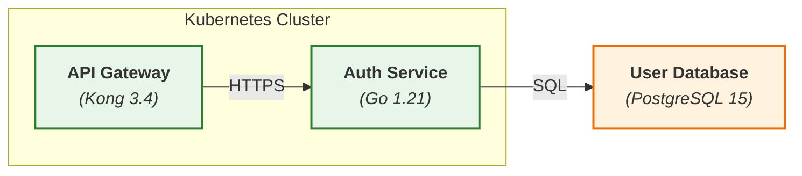
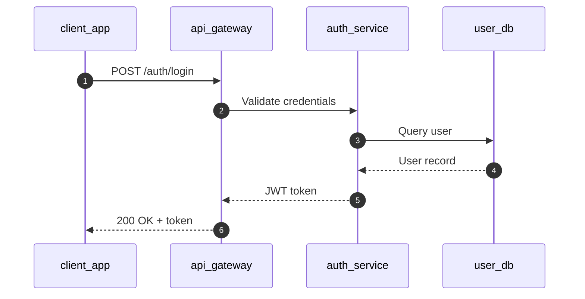
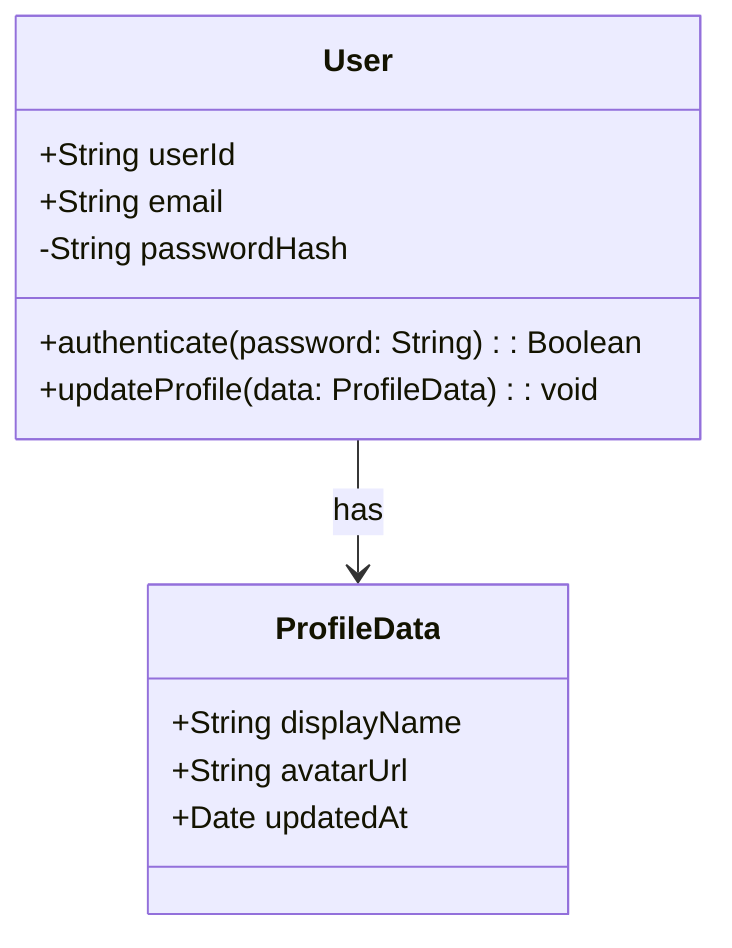

# MAS Part 1: Core Specification v2.0

**Status:** Draft Specification  
**Version:** 2.0.0  
**Date:** 2025-11-21  
**Part:** 1 of 7

---

## Abstract

This document defines the core Mermaid Abstract Syntax (MAS) protocol, including formal grammar (EBNF), type system, base diagram types, conformance requirements, and security considerations. It establishes the foundation upon which all other MAS specifications build.

**Keywords:** formal grammar, EBNF, type system, conformance, RFC 2119

---

## Status of This Document

This is a draft specification. It may be updated, replaced, or obsoleted at any time. It is inappropriate to cite this document as other than "work in progress."

Please send feedback via GitHub Issues or Discussions (see [Index](./MAS-v2.0-INDEX.md) for links).

---

## Table of Contents

1. [Introduction](#1-introduction)
2. [Conformance Requirements](#2-conformance-requirements)
3. [Terminology](#3-terminology)
4. [Formal Grammar](#4-formal-grammar)
5. [Core Type System](#5-core-type-system)
6. [Base Diagram Types](#6-base-diagram-types)
7. [Versioning & Compatibility](#7-versioning--compatibility)
8. [Security Considerations](#8-security-considerations)
9. [References](#9-references)
10. [Appendices](#appendices)

---

## 1. Introduction

### 1.1 Purpose

The Mermaid Abstract Syntax (MAS) protocol enables **architecture-as-code** by providing a standardized, machine-parsable subset of Mermaid syntax optimized for:

- **LLM Code Generation:** Clear semantic contracts for AI agents
- **Bidirectional Translation:** Code ↔ Diagram synchronization
- **Tool Interoperability:** Consistent behavior across implementations
- **Validation & Security:** Formal verification and sandboxing

### 1.2 Scope

**In Scope:**
- Formal syntax specification (EBNF grammar)
- Core diagram types (topology, interaction, structure)
- Semantic validation rules
- Extension mechanism

**Out of Scope:**
- Rendering/styling implementation details (Mermaid.js specific)
- UI/UX interaction patterns
- Specific LLM model requirements

### 1.3 Audience

- **Primary:** Parser implementers, validation tool developers
- **Secondary:** LLM application builders, diagram tool vendors
- **Tertiary:** Solution architects, technical writers

### 1.4 Design Goals

1. **Determinism:** Same architectural intent → Same diagram structure
2. **Parsability:** Unambiguous grammar for machine consumption
3. **Extensibility:** Forward-compatible extension points
4. **Security:** Input validation and execution sandboxing
5. **Backward Compatibility:** v1.0 diagrams remain valid

---

## 2. Conformance Requirements

### 2.1 Notational Conventions

The key words "**<em class="rfc2119">MUST</em>**", "**<em class="rfc2119">MUST NOT</em>**", "**<em class="rfc2119">REQUIRED</em>**", "**<em class="rfc2119">SHALL</em>**", "**<em class="rfc2119">SHALL NOT</em>**", "**<em class="rfc2119">SHOULD</em>**", "**<em class="rfc2119">SHOULD NOT</em>**", "**<em class="rfc2119">RECOMMENDED</em>**", "**<em class="rfc2119">MAY</em>**", and "**<em class="rfc2119">OPTIONAL</em>**" in this document are to be interpreted as described in [RFC2119].

### 2.2 Conformance Classes

Implementations <em class="rfc2119">MUST</em> declare conformance to one of three classes:

**Minimal Conformance:**
- <em class="rfc2119">MUST</em> parse formal grammar (Section 4)
- <em class="rfc2119">MUST</em> validate syntax (Section 5)
- <em class="rfc2119">MUST</em> support at least one base diagram type (Section 6)

**Standard Conformance:**
- <em class="rfc2119">MUST</em> meet Minimal Conformance
- <em class="rfc2119">MUST</em> support all base diagram types (Section 6)
- <em class="rfc2119">MUST</em> implement security validation (Section 8)

**Full Conformance:**
- <em class="rfc2119">MUST</em> meet Standard Conformance
- <em class="rfc2119">MUST</em> support extension mechanism (Part 4)
- <em class="rfc2119">MUST</em> pass conformance test suite (Part 6)

---

## 3. Terminology

### 3.1 Definitions

**Diagram:** A complete MAS document containing nodes, edges, and optional metadata.

**Node:** An atomic visual element representing a component, system, or entity.

**Edge:** A directional or bidirectional relationship between two nodes.

**Boundary:** A visual grouping of nodes representing architectural boundaries (network, security, organizational).

**Interaction Hook:** An annotation enabling interactive behavior (clicks, tooltips, code generation triggers).

**Extension:** A protocol-defined mechanism to add custom node types, edge types, or validation rules.

### 3.2 Acronyms

- **MAS:** Mermaid Abstract Syntax
- **EBNF:** Extended Backus-Naur Form
- **AST:** Abstract Syntax Tree
- **LLM:** Large Language Model
- **C4:** Context, Containers, Components, Code (architectural model)

---

## 4. Formal Grammar

### 4.1 Notation Conventions

Following GraphQL specification pattern:

- **Lexical tokens** use `::` (double colon)
- **Syntax rules** use `:` (single colon)
- **Terminal strings** in `"quotes"`
- **Non-terminals** in PascalCase
- **Character ranges** use `[a-z]`
- **Optional** elements in `[]`
- **Repetition** (zero or more) in `{}`
- **Alternation** uses `|`

### 4.2 Lexical Tokens

#### 4.2.1 WhiteSpace

```ebnf
WhiteSpace ::
  = U+0009 (Horizontal Tab)
  | U+0020 (Space)
```

#### 4.2.2 LineTerminator

```ebnf
LineTerminator ::
  = U+000A (Line Feed)
  | U+000D (Carriage Return)
  | U+000D U+000A (CRLF)
```

#### 4.2.3 Comment

```ebnf
Comment ::
  = "%%" CommentContent LineTerminator

CommentContent ::
  = { AnyCharacter except LineTerminator }
```

#### 4.2.4 Identifier

```ebnf
Identifier ::
  = Letter { Letter | Digit | "_" }

Letter ::
  = [a-z] | [A-Z]

Digit ::
  = [0-9]

NodeIdentifier ::
  = [a-z] [a-z0-9_]{ [a-z0-9_] }  % Minimum 3 characters, snake_case

SubgraphIdentifier ::
  = "cluster_" [a-z_]+
```

#### 4.2.5 StringLiteral

```ebnf
StringLiteral ::
  = "\"" { StringCharacter } "\""

StringCharacter ::
  = EscapeSequence
  | AnyCharacter except ( "\"" | "\\" | LineTerminator )

EscapeSequence ::
  = "\\" ( "\"" | "\\" | "/" | "b" | "f" | "n" | "r" | "t" )
```

### 4.3 Syntax Rules

#### 4.3.1 Document

```ebnf
Document :
  = DiagramDeclaration
    NodeDeclarations
    EdgeDeclarations
    [ StyleDefinitions ]
    [ InteractionHooks ]
    [ MetadataAnnotations ]

DiagramDeclaration :
  = TopologyDiagram | InteractionDiagram | StructureDiagram
```

#### 4.3.2 Topology Diagrams

```ebnf
TopologyDiagram :
  = "graph" Direction

Direction :
  = "TD" | "TB" | "BT" | "LR" | "RL"

NodeDeclarations :
  = { NodeDeclaration | BoundaryDeclaration }

NodeDeclaration :
  = NodeIdentifier NodeShape

NodeShape :
  = "[" Label "]"        % Rectangle
  | "([" Label "])"      % Stadium
  | "[[" Label "]]"      % Subroutine
  | "{" Label "}"        % Rhombus
  | "{{" Label "}}"      % Hexagon
  | ">" Label "]"        % Asymmetric
  | "(" Label ")"        % Circle
  | "((" Label "))"      % Double Circle

Label :
  = "\"" ComponentName "<br/>" TechnologyStack "\""

ComponentName :
  = "<b>" DisplayName "</b>"

DisplayName :
  = { Letter | WhiteSpace }  % Title Case, 1-4 words

TechnologyStack :
  = "<i>(" TechName [ TechVersion ] ")</i>"

TechName :
  = { Letter | WhiteSpace | Digit | "/" }

TechVersion :
  = Digit { Digit | "." }

EdgeDeclarations :
  = { EdgeDeclaration }

EdgeDeclaration :
  = NodeIdentifier Arrow NodeIdentifier [ EdgeLabel ]

Arrow :
  = "-->"         % Solid line
  | "-.->

"        % Dotted line
  | "==>"         % Thick line

EdgeLabel :
  = "|" LabelText "|"

LabelText :
  = { Letter | WhiteSpace | Digit | "/" | ":" }

BoundaryDeclaration :
  = "subgraph" SubgraphIdentifier "[" BoundaryLabel "]"
    NodeDeclarations
    "end"

BoundaryLabel :
  = StringLiteral
```

#### 4.3.3 Interaction Diagrams

```ebnf
InteractionDiagram :
  = "sequenceDiagram"
    "autonumber"
    ParticipantDeclarations
    MessageDeclarations

ParticipantDeclarations :
  = { ParticipantDeclaration }

ParticipantDeclaration :
  = "participant" Alias "as" NodeIdentifier

Alias :
  = [A-Z] { [A-Z] }  % 1-4 uppercase letters

MessageDeclarations :
  = { MessageDeclaration }

MessageDeclaration :
  = Participant MessageArrow Participant ":" MessageText

MessageArrow :
  = "->>"         % Solid arrow
  | "-->>"        % Dotted arrow
  | "-x"          % Synchronous error
  | "--x"         % Asynchronous error

MessageText :
  = { Letter | WhiteSpace | Digit | Punctuation }

Punctuation :
  = "." | "," | "!" | "?" | ":" | ";" | "-" | "(" | ")"
```

#### 4.3.4 Structure Diagrams

```ebnf
StructureDiagram :
  = "classDiagram"
    ClassDeclarations
    RelationshipDeclarations

ClassDeclarations :
  = { ClassDeclaration }

ClassDeclaration :
  = "class" ClassName "{"
    { FieldDeclaration | MethodDeclaration }
    "}"

ClassName :
  = [A-Z] { Letter | Digit }  % PascalCase

FieldDeclaration :
  = Visibility FieldName ":" TypeName

MethodDeclaration :
  = Visibility MethodName "(" [ ParameterList ] ")" ":" ReturnType

Visibility :
  = "+" | "-" | "#" | "~"  % public, private, protected, package

FieldName :
  = [a-z] { Letter | Digit }  % camelCase

MethodName :
  = [a-z] { Letter | Digit }  % camelCase

TypeName :
  = ClassName | PrimitiveType

PrimitiveType :
  = "string" | "number" | "boolean" | "void" | "any"

ParameterList :
  = Parameter { "," Parameter }

Parameter :
  = ParameterName ":" TypeName

ReturnType :
  = TypeName

RelationshipDeclarations :
  = { RelationshipDeclaration }

RelationshipDeclaration :
  = ClassName RelationshipType ClassName

RelationshipType :
  = "<|--"        % Inheritance
  | "*--"         % Composition
  | "o--"         % Aggregation
  | "-->"         % Association
  | "--"          % Link (solid)
  | ".."          % Dependency (dashed)
```

#### 4.3.5 Style Definitions

```ebnf
StyleDefinitions :
  = { StyleClassDefinition | StyleApplication }

StyleClassDefinition :
  = "classDef" StyleClassName StyleProperties

StyleClassName :
  = [a-z] { [a-z] }  % lowercase

StyleProperties :
  = CSSProperty { "," CSSProperty }

CSSProperty :
  = PropertyName ":" PropertyValue

PropertyName :
  = "fill" | "stroke" | "stroke-width" | "color" | "font-size"

PropertyValue :
  = ColorValue | SizeValue | StringLiteral

ColorValue :
  = "#" HexDigit { HexDigit }  % #RGB, #RRGGBB, #RRGGBBAA

HexDigit :
  = [0-9] | [a-f] | [A-F]

SizeValue :
  = Digit { Digit } [ "px" | "pt" | "em" | "rem" ]

StyleApplication :
  = NodeIdentifier ":::" StyleClassName
```

#### 4.3.6 Interaction Hooks

```ebnf
InteractionHooks :
  = { InteractionHook }

InteractionHook :
  = "click" NodeIdentifier "call" HookFunction "(" StringLiteral ")"

HookFunction :
  = "OpenComponent" | "GenerateCode" | "ViewDocs" | CustomFunction

CustomFunction :
  = Identifier  % User-defined via extension
```

#### 4.3.7 Metadata Annotations

```ebnf
MetadataAnnotations :
  = { MetadataAnnotation }

MetadataAnnotation :
  = "%% @" MetadataKey "=" MetadataValue

MetadataKey :
  = "version" | "owner" | "updated" | "component" | "repo" | "port" | "health"

MetadataValue :
  = StringLiteral | Identifier
```

---

## 5. Core Type System

### 5.1 Diagram Types

```typescript
enum DiagramType {
  TOPOLOGY = "topology",        // graph [TD|LR|...]
  INTERACTION = "interaction",  // sequenceDiagram
  STRUCTURE = "structure"       // classDiagram
}
```

### 5.2 Node Types

```typescript
interface Node {
  id: NodeIdentifier;              // Required, unique, snake_case
  label: ComponentLabel;           // Required, HTML formatted
  shape: NodeShape;                // Required
  styleClass?: StyleClassName;     // Optional
  boundary?: SubgraphIdentifier;   // Optional, parent boundary
  metadata?: Record<string, string>; // Optional, from annotations
}

interface ComponentLabel {
  displayName: string;    // Title Case, 1-4 words
  technology: string;     // Technology stack
  version?: string;       // Optional version
}

enum NodeShape {
  RECTANGLE = "rectangle",
  STADIUM = "stadium",
  SUBROUTINE = "subroutine",
  RHOMBUS = "rhombus",
  HEXAGON = "hexagon",
  ASYMMETRIC = "asymmetric",
  CIRCLE = "circle",
  DOUBLE_CIRCLE = "doubleCircle"
}
```

### 5.3 Edge Types

```typescript
interface Edge {
  source: NodeIdentifier;     // Required, must exist
  target: NodeIdentifier;     // Required, must exist
  arrowType: ArrowType;       // Required
  label?: string;             // Optional
  metadata?: Record<string, string>;
}

enum ArrowType {
  SOLID = "solid",       // -->
  DOTTED = "dotted",     // -.->
  THICK = "thick"        // ==>
}
```

### 5.4 Boundary Types

```typescript
interface Boundary {
  id: SubgraphIdentifier;     // Required, starts with "cluster_"
  label: string;              // Required
  nodes: Node[];              // Required, minimum 1
  parentBoundary?: SubgraphIdentifier; // Optional, for nesting
  depth: number;              // Required, 0-2 (max 3 levels)
}
```

---

## 6. Base Diagram Types

### 6.1 Topology Diagrams

**Purpose:** Represent system architecture, component relationships, and deployment topology.

**Conformance:**
- <em class="rfc2119">MUST</em> declare direction (`graph TD|LR|BT|RL`)
- <em class="rfc2119">MUST</em> have at least 3 nodes
- <em class="rfc2119">SHOULD</em> not exceed 25 nodes (readability)
- <em class="rfc2119">MUST</em> validate all edge references
- <em class="rfc2119">MAY</em> nest boundaries up to 3 levels

**Example:**



### 6.2 Interaction Diagrams

**Purpose:** Represent message flows, API interactions, and temporal sequences.

**Conformance:**
- <em class="rfc2119">MUST</em> declare `sequenceDiagram` with `autonumber`
- <em class="rfc2119">MUST</em> declare all participants before first message
- <em class="rfc2119">MUST</em> use aliases (1-4 uppercase letters)
- <em class="rfc2119">SHOULD</em> include descriptive message text

**Example:**



### 6.3 Structure Diagrams

**Purpose:** Represent class hierarchies, data models, and type relationships.

**Conformance:**
- <em class="rfc2119">MUST</em> declare `classDiagram`
- <em class="rfc2119">MUST</em> use PascalCase for class names
- <em class="rfc2119">MUST</em> use camelCase for field/method names
- <em class="rfc2119">MUST</em> declare visibility (`+`, `-`, `#`, `~`)

**Example:**



---

## 7. Versioning & Compatibility

### 7.1 Version Format

**Specification Versioning:**
```
MAS-[MAJOR].[MINOR].[PATCH]
```

- **MAJOR:** Breaking grammar changes
- **MINOR:** Additive features (new diagram types, hooks)
- **PATCH:** Clarifications, typo fixes, non-breaking refinements

**Protocol Versioning** (for runtime negotiation):
```
YYYY-MM-DD
```

Example: `2025-11-21` (revision date)

### 7.2 Backward Compatibility

<em class="rfc2119">MUST</em> maintain backward compatibility within same MAJOR version:
- MAS 2.x parsers <em class="rfc2119">MUST</em> accept MAS 1.x documents
- Deprecated features <em class="rfc2119">MUST</em> emit warnings (not errors)
- New features <em class="rfc2119">MUST</em> be additive

### 7.3 Forward Compatibility

Unknown elements <em class="rfc2119">MUST</em> be handled gracefully:
- Unknown node types → default to rectangle
- Unknown annotations → ignore with warning
- Unknown extensions → skip if not critical

### 7.4 Deprecation Policy

Features marked deprecated:
- <em class="rfc2119">MUST</em> remain functional for 1 MAJOR version
- <em class="rfc2119">MUST</em> emit deprecation warnings
- <em class="rfc2119">SHOULD</em> document migration path

---

## 8. Security Considerations

### 8.1 Threat Model

**Attack Vectors:**
1. **Code Injection:** Malicious JavaScript in labels/tooltips
2. **Denial of Service:** Deeply nested boundaries, circular references
3. **Information Disclosure:** Metadata leaking sensitive data
4. **Cross-Site Scripting:** Unsanitized HTML in rendering

### 8.2 Input Validation

**<em class="rfc2119">REQUIRED</em> Validations:**

1. **HTML Sanitization:**
   - <em class="rfc2119">MUST</em> whitelist allowed HTML tags: `<b>`, `<i>`, `<br/>`
   - <em class="rfc2119">MUST</em> strip `<script>`, `<iframe>`, event handlers
   - <em class="rfc2119">MUST</em> escape user-provided text

2. **Depth Limiting:**
   - <em class="rfc2119">MUST</em> reject boundaries nested > 3 levels
   - <em class="rfc2119">SHOULD</em> warn if > 25 nodes per diagram

3. **Identifier Validation:**
   - <em class="rfc2119">MUST</em> reject identifiers with non-ASCII characters
   - <em class="rfc2119">MUST</em> enforce minimum length (3 characters)
   - <em class="rfc2119">MUST</em> validate snake_case/camelCase/PascalCase

4. **Reference Validation:**
   - <em class="rfc2119">MUST</em> reject edges referencing non-existent nodes
   - <em class="rfc2119">MUST</em> detect circular subgraph inclusions

### 8.3 Execution Sandboxing

Interactive hooks (clicks, tooltips):
- <em class="rfc2119">MUST</em> execute in isolated context
- <em class="rfc2119">MUST NOT</em> access parent window/DOM
- <em class="rfc2119">MUST</em> require explicit user consent for code generation

### 8.4 Metadata Privacy

Metadata annotations:
- <em class="rfc2119">SHOULD NOT</em> include PII, credentials, secrets
- <em class="rfc2119">MUST</em> support redaction in public documentation
- <em class="rfc2119">MAY</em> require authentication for sensitive diagrams

---

## 9. References

### 9.1 Normative References

**[RFC2119]** S. Bradner. "Key words for use in RFCs to Indicate Requirement Levels." RFC 2119, March 1997.  
https://datatracker.ietf.org/doc/html/rfc2119

**[EBNF]** ISO/IEC 14977:1996. "Information technology — Syntactic metalanguage — Extended BNF."

**[Mermaid]** "Mermaid - Diagramming and charting tool." Version 10.x+.  
https://mermaid.js.org/

### 9.2 Informative References

**[GraphQL]** "GraphQL Specification." October 2021.  
https://spec.graphql.org/October2021/

**[OpenAPI]** "OpenAPI Specification v3.1." 2024.  
https://spec.openapis.org/oas/v3.1.1.html

**[ProtoBuf]** "Protocol Buffers Edition 2024 Language Specification."  
https://protobuf.dev/reference/protobuf/edition-2024-spec/

**[MCP]** "Model Context Protocol Specification." 2025-06-18.  
https://modelcontextprotocol.io/specification/

**[C4Model]** "C4 Model for Software Architecture."  
https://c4model.com/

---

## Appendices

### Appendix A: Notation Conventions

Following GraphQL specification pattern (Section A.1):

**Context-Free Grammar:**
- Non-terminals: PascalCase
- Terminals: lowercase or "quoted"
- Production rules: `: =`
- Alternatives: `|`
- Optional: `[]`
- Repetition (0+): `{}`
- Grouping: `()`

**Lexical vs. Syntactical:**
- Lexical (tokens): `::`
- Syntactical (rules): `:`

### Appendix B: Grammar Summary

Complete EBNF grammar consolidated from Section 4:

```ebnf
(* Core Productions *)
Document : = DiagramDeclaration NodeDeclarations EdgeDeclarations
             [ StyleDefinitions ] [ InteractionHooks ] [ MetadataAnnotations ]

(* Identifiers *)
NodeIdentifier :: = [a-z] [a-z0-9_] { [a-z0-9_] }
SubgraphIdentifier :: = "cluster_" [a-z_]+

(* Diagrams *)
DiagramDeclaration : = TopologyDiagram | InteractionDiagram | StructureDiagram
TopologyDiagram : = "graph" Direction
InteractionDiagram : = "sequenceDiagram" "autonumber" ParticipantDeclarations MessageDeclarations
StructureDiagram : = "classDiagram" ClassDeclarations RelationshipDeclarations

(* See Section 4 for complete grammar *)
```

### Appendix C: Migration from v1.0

**Breaking Changes:** None (v2.0 is additive)

**New Features:**
- Formal EBNF grammar
- Extended metadata annotations
- Custom interaction hooks
- Enhanced security validation

**Deprecated Features:** None

**Migration Steps:**
1. Validate existing v1.0 diagrams against v2.0 parser
2. Add `%% @version=2.0.0` annotation
3. Optionally enhance with new metadata keys
4. Review security validation warnings

---

**Copyright © 2025 MAS Contributors. Licensed under CC BY 4.0.**

**Next:** [Part 2: Diagram Types](./MAS-DiagramTypes-v2.0.md)
