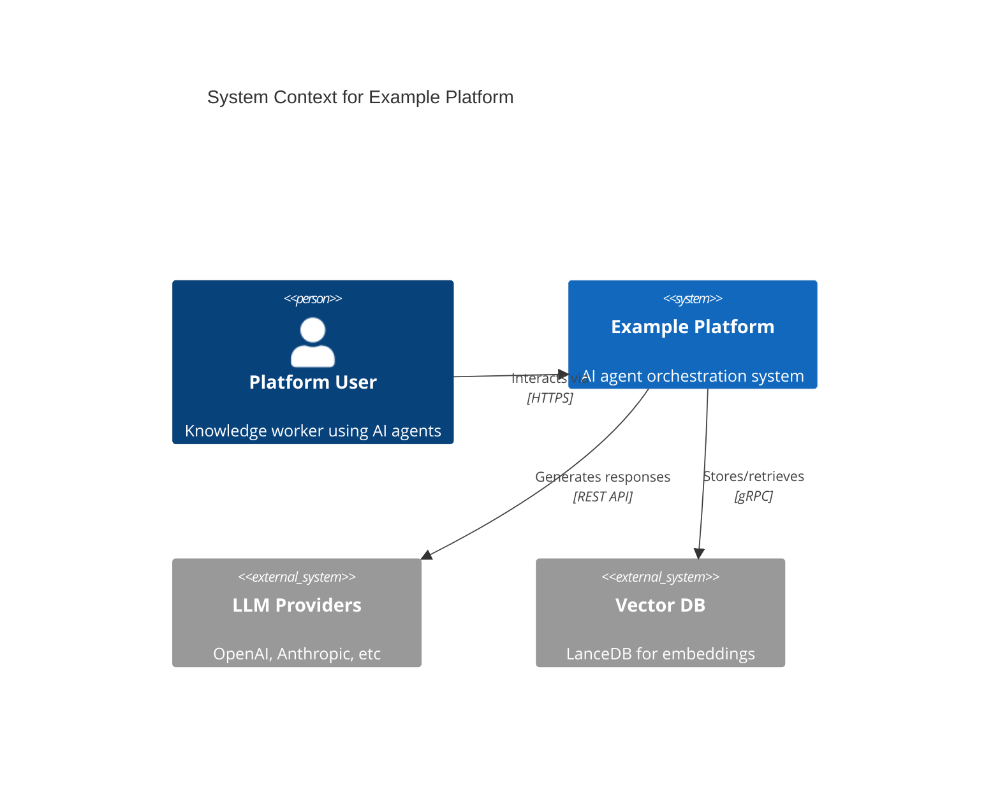
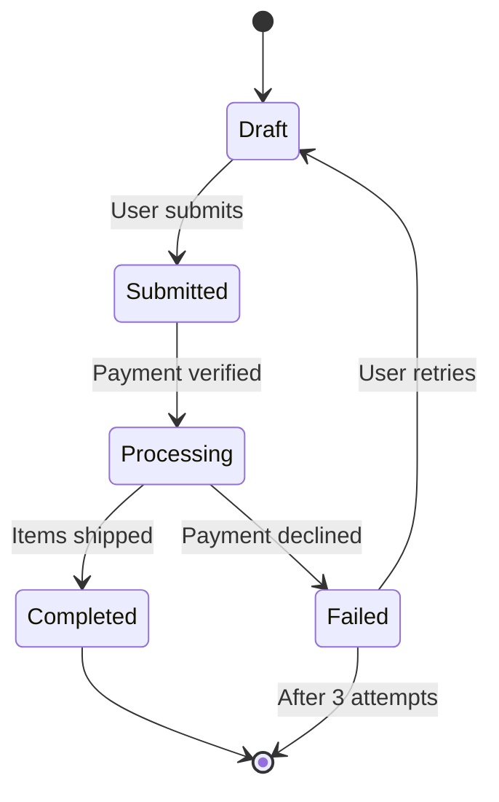
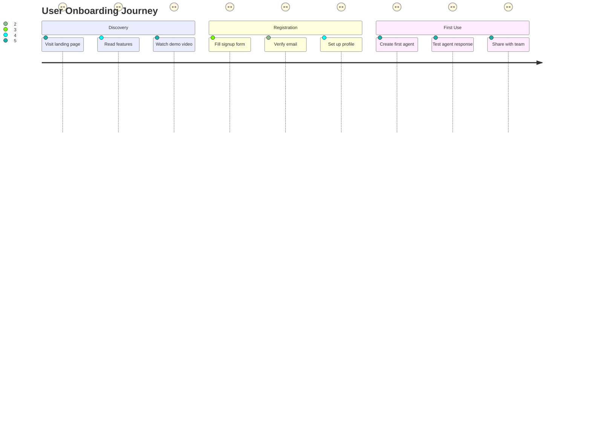
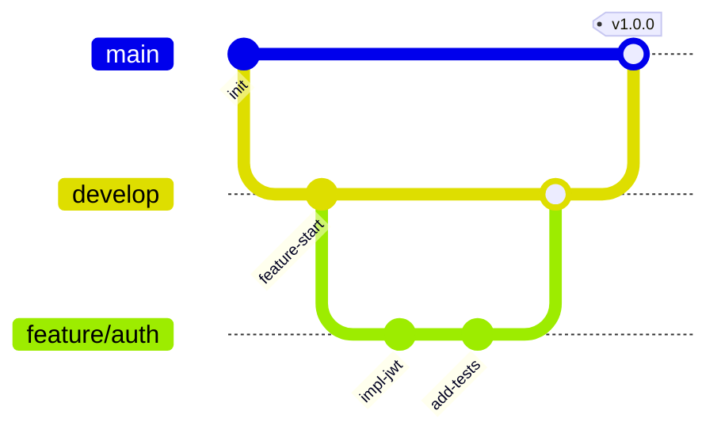
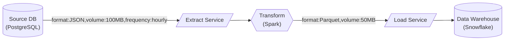
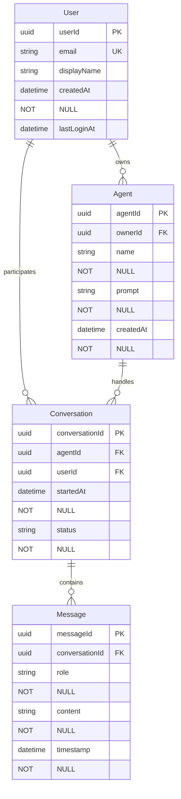
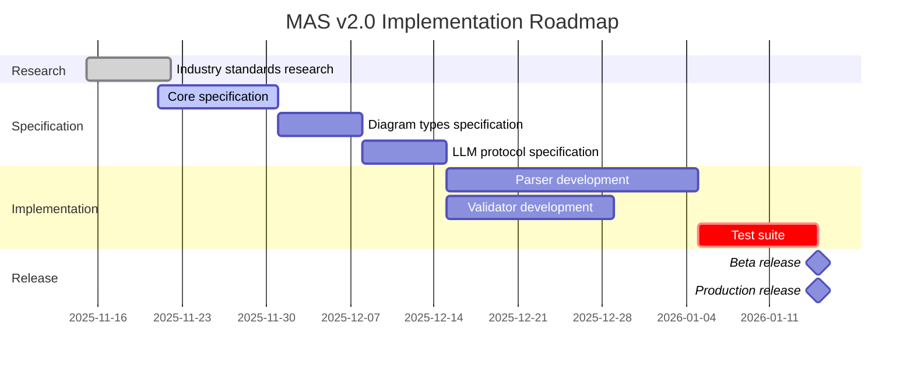
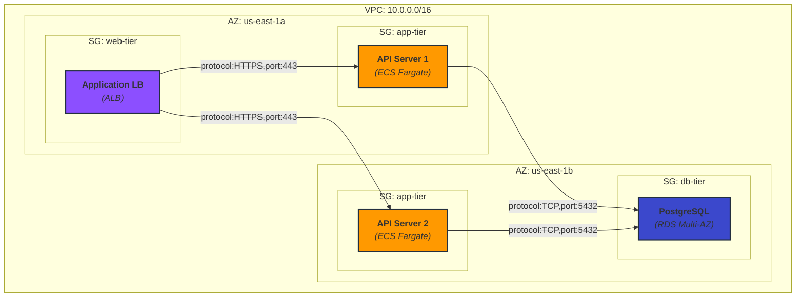

# MAS Part 2: Diagram Types v2.0

**Status:** Draft Specification  
**Version:** 2.0.0  
**Date:** 2025-11-21  
**Part:** 2 of 7

---

## Abstract

This document defines the extensible catalog of diagram types supported by MAS v2.0, including architecture diagrams, state machines, data flow diagrams, entity-relationship models, and the registration mechanism for custom diagram types. Each diagram type is specified with formal grammar, semantic rules, and validation requirements.

---

## Table of Contents

1. [Overview](#1-overview)
2. [Architecture Diagrams](#2-architecture-diagrams)
3. [State & Workflow Diagrams](#3-state--workflow-diagrams)
4. [Data Flow Diagrams](#4-data-flow-diagrams)
5. [Entity-Relationship Diagrams](#5-entity-relationship-diagrams)
6. [Timeline & Planning Diagrams](#6-timeline--planning-diagrams)
7. [Deployment Diagrams](#7-deployment-diagrams)
8. [Custom Diagram Registration](#8-custom-diagram-registration)
9. [References](#9-references)

---

## 1. Overview

### 1.1 Diagram Type Taxonomy

MAS v2.0 supports **three core categories** and **four extended categories**:

**Core Categories** (<em class="rfc2119">REQUIRED</em> for Standard Conformance):
1. **Architecture Diagrams:** System topology, component relationships
2. **Interaction Diagrams:** Message flows, API sequences
3. **Structure Diagrams:** Class hierarchies, data models

**Extended Categories** (<em class="rfc2119">OPTIONAL</em>):
4. **State & Workflow Diagrams:** State machines, user journeys, git flows
5. **Data Flow Diagrams:** Data pipelines, ETL processes
6. **Entity-Relationship Diagrams:** Database schemas, domain models
7. **Timeline & Planning Diagrams:** Gantt charts, project timelines

### 1.2 Selection Criteria

**When to use each diagram type:**

| Use Case | Recommended Diagram Type |
|----------|-------------------------|
| Microservices architecture | Topology (graph) + C4 Context |
| API integration flow | Interaction (sequenceDiagram) |
| Domain model design | Structure (classDiagram) + ER |
| User journey mapping | State (journey) |
| CI/CD pipeline | Data Flow (flowchart) + State (gitGraph) |
| Database schema | Entity-Relationship (erDiagram) |
| Project planning | Timeline (gantt) |
| Infrastructure deployment | Deployment (C4 + topology) |

### 1.3 Conformance Requirements

Implementations declaring diagram type support:
- <em class="rfc2119">MUST</em> parse formal grammar for that type
- <em class="rfc2119">MUST</em> validate semantic rules
- <em class="rfc2119">MUST</em> generate valid AST
- <em class="rfc2119">MAY</em> support subset of features with clear documentation

---

## 2. Architecture Diagrams

### 2.1 Topology Diagrams (graph)

**Already defined in Part 1, Section 6.1**

### 2.2 C4 Model Integration

**Purpose:** Multi-level architectural views following C4 Model pattern.

**Grammar Extension:**

```ebnf
C4Diagram :
  = C4ContextDiagram | C4ContainerDiagram | C4ComponentDiagram

C4ContextDiagram :
  = "C4Context"
    "title" StringLiteral
    SystemBoundary
    PersonDeclarations
    SystemDeclarations
    RelationshipDeclarations

SystemBoundary :
  = "System_Boundary" "(" Identifier "," StringLiteral ")" "{"
    ContainerDeclarations
    "}"

PersonDeclarations :
  = { "Person" "(" Identifier "," StringLiteral [ "," StringLiteral ] ")" }

SystemDeclarations :
  = { "System" "(" Identifier "," StringLiteral [ "," StringLiteral ] ")" }

ContainerDeclarations :
  = { "Container" "(" Identifier "," StringLiteral "," StringLiteral [ "," StringLiteral ] ")" }
```

**Example:**



**Semantic Rules:**
- <em class="rfc2119">MUST</em> declare diagram level (Context/Container/Component)
- <em class="rfc2119">MUST</em> include title
- <em class="rfc2119">SHOULD</em> use standard C4 element types (Person, System, Container, Component)
- <em class="rfc2119">MAY</em> include external systems with `_Ext` suffix

---

## 3. State & Workflow Diagrams

### 3.1 State Diagrams (stateDiagram-v2)

**Purpose:** Model entity lifecycle, workflow states, and transitions.

**Grammar:**

```ebnf
StateDiagram :
  = "stateDiagram-v2"
    [ DirectionDeclaration ]
    StateDeclarations
    TransitionDeclarations

DirectionDeclaration :
  = "direction" Direction

StateDeclarations :
  = { StateDeclaration }

StateDeclaration :
  = StateIdentifier [ ":" StateLabel ]
  | "state" StateIdentifier "{"
    StateDeclarations
    TransitionDeclarations
    "}"

StateIdentifier :
  = "[*]"  % Start/End state
  | Identifier

StateLabel :
  = StringLiteral

TransitionDeclarations :
  = { TransitionDeclaration }

TransitionDeclaration :
  = StateIdentifier "-->" StateIdentifier [ ":" TransitionLabel ]

TransitionLabel :
  = StringLiteral
```

**Example:**



**Semantic Rules:**
- <em class="rfc2119">MUST</em> have exactly one start state `[*]`
- <em class="rfc2119">SHOULD</em> have at least one end state
- <em class="rfc2119">MUST NOT</em> have unreachable states (except documented intentionally)
- <em class="rfc2119">MAY</em> nest states (composite states)

### 3.2 User Journey Diagrams (journey)

**Purpose:** Map user experience flows with emotional states.

**Grammar:**

```ebnf
JourneyDiagram :
  = "journey"
    "title" StringLiteral
    SectionDeclarations

SectionDeclarations :
  = { SectionDeclaration }

SectionDeclaration :
  = "section" StringLiteral
    TaskDeclarations

TaskDeclarations :
  = { TaskDeclaration }

TaskDeclaration :
  = TaskName ":" ActorList ":" Score

TaskName :
  = StringLiteral

ActorList :
  = Actor { "," Actor }

Actor :
  = Identifier

Score :
  = Digit  % 1-5, representing satisfaction
```

**Example:**



**Semantic Rules:**
- <em class="rfc2119">MUST</em> include title
- <em class="rfc2119">MUST</em> have at least one section
- Score <em class="rfc2119">MUST</em> be integer 1-5
- <em class="rfc2119">SHOULD</em> represent user satisfaction (1=frustrated, 5=delighted)

### 3.3 Git Graph (gitGraph)

**Purpose:** Visualize git branching strategies and workflows.

**Grammar:**

```ebnf
GitGraph :
  = "gitGraph"
    GitCommands

GitCommands :
  = { GitCommand }

GitCommand :
  = "commit" [ CommitOptions ]
  | "branch" BranchName
  | "checkout" BranchName
  | "merge" BranchName
  | "cherry-pick" CommitId

CommitOptions :
  = "id:" CommitId
  | "msg:" StringLiteral
  | "tag:" TagName

BranchName :
  = Identifier

CommitId :
  = Identifier

TagName :
  = StringLiteral
```

**Example:**



---

## 4. Data Flow Diagrams

### 4.1 Flowchart with Data Annotations

**Purpose:** Model data pipelines, ETL processes, decision trees.

**Grammar Extension:**

```ebnf
DataFlowDiagram :
  = "flowchart" Direction
    DataNodeDeclarations
    DataEdgeDeclarations

DataNodeDeclarations :
  = { DataNodeDeclaration }

DataNodeDeclaration :
  = NodeIdentifier DataNodeShape

DataNodeShape :
  = NodeShape  % From Part 1
  | "[(" Label ")]"      % Database cylinder
  | "[((" Label "))]"    % Multiple docs
  | "[/" Label "/]"      % Parallelogram (input/output)
  | "[\\" Label "\\]"    % Parallelogram alt

DataEdgeDeclarations :
  = { DataEdgeDeclaration }

DataEdgeDeclaration :
  = EdgeDeclaration
  | NodeIdentifier Arrow NodeIdentifier "|" DataAnnotation "|"

DataAnnotation :
  = DataFormat [ "," DataVolume ] [ "," DataFrequency ]

DataFormat :
  = "format:" ( "JSON" | "CSV" | "Parquet" | "Avro" | Identifier )

DataVolume :
  = "volume:" SizeValue ( "KB" | "MB" | "GB" | "TB" )

DataFrequency :
  = "frequency:" ( "realtime" | "batch" | "hourly" | "daily" | "weekly" )
```

**Example:**



**Semantic Rules:**
- <em class="rfc2119">SHOULD</em> use appropriate shapes (cylinder for databases, parallelogram for I/O)
- Data annotations <em class="rfc2119">MAY</em> include format, volume, frequency
- <em class="rfc2119">SHOULD</em> indicate data direction with arrows

---

## 5. Entity-Relationship Diagrams

### 5.1 ER Diagram (erDiagram)

**Purpose:** Model database schemas, domain entities, and relationships.

**Grammar:**

```ebnf
ERDiagram :
  = "erDiagram"
    EntityDeclarations
    RelationshipDeclarations

EntityDeclarations :
  = { EntityDeclaration }

EntityDeclaration :
  = EntityName "{"
    AttributeDeclarations
    "}"

EntityName :
  = [A-Z] { Letter | Digit }  % PascalCase

AttributeDeclarations :
  = { AttributeDeclaration }

AttributeDeclaration :
  = DataType AttributeName [ AttributeConstraints ]

DataType :
  = "string" | "int" | "float" | "boolean" | "date" | "datetime" | "uuid" | Identifier

AttributeName :
  = [a-z] { Letter | Digit }  % camelCase

AttributeConstraints :
  = PK | FK | UK | NN | AI

PK :
  = "PK"  % Primary Key

FK :
  = "FK"  % Foreign Key

UK :
  = "UK"  % Unique Key

NN :
  = "NOT NULL"

AI :
  = "AUTO_INCREMENT"

RelationshipDeclarations :
  = { RelationshipDeclaration }

RelationshipDeclaration :
  = EntityName Cardinality RelationshipType Cardinality EntityName ":" RelationshipLabel

Cardinality :
  = "||" | "|{" | "}|" | "}{"  % One-to-one, one-to-many, many-to-one, many-to-many

RelationshipType :
  = "--" | ".."  % Identifying, non-identifying

RelationshipLabel :
  = StringLiteral
```

**Example:**



**Semantic Rules:**
- <em class="rfc2119">MUST</em> declare at least one PK per entity
- FK references <em class="rfc2119">SHOULD</em> point to existing entities
- <em class="rfc2119">MUST</em> use standard cardinality notation
- <em class="rfc2119">SHOULD</em> include relationship labels

---

## 6. Timeline & Planning Diagrams

### 6.1 Gantt Charts (gantt)

**Purpose:** Project planning, milestone tracking, resource scheduling.

**Grammar:**

```ebnf
GanttDiagram :
  = "gantt"
    "title" StringLiteral
    [ DateFormatDeclaration ]
    [ AxisFormatDeclaration ]
    SectionDeclarations

DateFormatDeclaration :
  = "dateFormat" DateFormatString

DateFormatString :
  = "YYYY-MM-DD" | "DD-MM-YYYY" | "MM-DD-YYYY"

AxisFormatDeclaration :
  = "axisFormat" AxisFormatString

AxisFormatString :
  = "%Y-%m" | "%m/%d" | StringLiteral

SectionDeclarations :
  = { SectionDeclaration }

SectionDeclaration :
  = "section" StringLiteral
    TaskDeclarations

TaskDeclarations :
  = { TaskDeclaration }

TaskDeclaration :
  = TaskName ":" [ TaskStatus ] [ TaskDependency ] "," TaskStart "," TaskDuration

TaskName :
  = StringLiteral

TaskStatus :
  = "active" | "done" | "crit" | "milestone"

TaskDependency :
  = TaskId  % Reference to another task

TaskId :
  = Identifier

TaskStart :
  = Date | "after" TaskId

Date :
  = YYYY "-" MM "-" DD

TaskDuration :
  = Digit { Digit } ( "d" | "w" | "m" )  % days, weeks, months
```

**Example:**



**Semantic Rules:**
- <em class="rfc2119">MUST</em> declare title and dateFormat
- Task durations <em class="rfc2119">MUST</em> be positive integers
- Dependencies <em class="rfc2119">MUST</em> reference existing tasks
- Milestones <em class="rfc2119">SHOULD</em> have 0d duration

---

## 7. Deployment Diagrams

### 7.1 Infrastructure Topology

**Purpose:** Cloud infrastructure, network topology, deployment architecture.

**Grammar Extension:**

```ebnf
DeploymentDiagram :
  = "graph" Direction
    DeploymentAnnotations
    InfrastructureNodes
    NetworkEdges

DeploymentAnnotations :
  = { DeploymentAnnotation }

DeploymentAnnotation :
  = "%% @" DeploymentKey "=" DeploymentValue

DeploymentKey :
  = "cloud" | "region" | "environment" | "compliance"

DeploymentValue :
  = "aws" | "gcp" | "azure" | "on-prem" | Identifier

InfrastructureNodes :
  = { InfrastructureNode }

InfrastructureNode :
  = NodeDeclaration  % From Part 1
  | VPCBoundary
  | AvailabilityZoneBoundary
  | SecurityGroupBoundary

VPCBoundary :
  = "subgraph cluster_vpc_" Identifier "[" "VPC:" StringLiteral "]"
    AvailabilityZoneBoundaries
    "end"

AvailabilityZoneBoundary :
  = "subgraph cluster_az_" Identifier "[" "AZ:" StringLiteral "]"
    SecurityGroupBoundaries
    "end"

SecurityGroupBoundary :
  = "subgraph cluster_sg_" Identifier "[" "SG:" StringLiteral "]"
    NodeDeclarations
    "end"

NetworkEdges :
  = { NetworkEdge }

NetworkEdge :
  = EdgeDeclaration
  | NodeIdentifier Arrow NodeIdentifier "|" NetworkProtocol "|"

NetworkProtocol :
  = "protocol:" Protocol [ ",port:" Port ]

Protocol :
  = "HTTPS" | "HTTP" | "gRPC" | "WebSocket" | "TCP" | "UDP" | Identifier

Port :
  = Digit { Digit }
```

**Example:**



**Semantic Rules:**
- <em class="rfc2119">MUST</em> annotate cloud provider and region
- Network boundaries <em class="rfc2119">SHOULD</em> nest logically (VPC > AZ > SG)
- <em class="rfc2119">MUST</em> specify protocols for cross-boundary edges
- <em class="rfc2119">SHOULD</em> include security group rules

---

## 8. Custom Diagram Registration

### 8.1 Extension Mechanism

Implementations <em class="rfc2119">MAY</em> support custom diagram types via extension registry.

**Registration Schema:**

```typescript
interface CustomDiagramType {
  typeName: string;                    // Unique identifier (e.g., "customFlow")
  version: string;                     // Semantic version
  grammar: EBNFGrammar;               // Formal grammar definition
  semanticRules: ValidationRule[];    // Validation constraints
  renderHints?: RenderingHints;       // Optional styling guidance
  metadata: {
    author: string;
    description: string;
    examples: string[];
    documentation: string;            // URL to docs
  };
}

interface ValidationRule {
  ruleId: string;
  severity: "error" | "warning" | "info";
  condition: string;                  // JSONLogic or similar
  message: string;
}
```

**Registration Example:**

```typescript
{
  "typeName": "dataLineage",
  "version": "1.0.0",
  "grammar": "dataLineageDiagram := ...",
  "semanticRules": [
    {
      "ruleId": "dl-01",
      "severity": "error",
      "condition": "nodes.length >= 2",
      "message": "Data lineage must have at least 2 nodes"
    }
  ],
  "metadata": {
    "author": "MAS Contributors",
    "description": "Track data transformations across systems",
    "documentation": "https://github.com/WiiLearn/mas-spec/lineage"
  }
}
```

**Conformance:**
- Custom types <em class="rfc2119">MUST</em> not conflict with reserved names
- <em class="rfc2119">MUST</em> provide complete EBNF grammar
- <em class="rfc2119">MUST</em> define at least one validation rule
- <em class="rfc2119">SHOULD</em> include working examples

---

## 9. References

### 9.1 Normative References

**[MAS-Core]** MAS Part 1: Core Specification v2.0. 2025-11-21.

**[Mermaid]** "Mermaid Diagram Syntax." https://mermaid.js.org/intro/syntax-reference.html

### 9.2 Informative References

**[C4Model]** "C4 Model for Software Architecture." https://c4model.com/

**[UML]** "Unified Modeling Language." https://www.uml.org/

**[BPMN]** "Business Process Model and Notation." https://www.bpmn.org/

---

**Copyright © 2025 MAS Contributors. Licensed under CC BY 4.0.**

**Next:** [Part 3: LLM Integration Protocol](./MAS-LLMProtocol-v2.0.md)
