# MAS Part 9: Business Operations & Process Diagrams v2.5

**Status:** Draft Specification  
**Version:** 2.5.0  
**Date:** 2025-11-27  
**Part:** 9 of 9  
**Extends:** MAS v2.0 Core Specification

---

## Abstract

This document extends MAS v2.0 with formal specifications for business operations, process flows, and organizational diagrams. These diagram types enable product owners, business analysts, and AI agents to model business logic, decision workflows, value streams, and organizational structures as executable specifications. The specification bridges business requirements with technical implementation through semantic-rich process modeling.

**Target Users**: Product owners, business analysts, operations teams, process engineers, AI agents generating business documentation.

---

## Table of Contents

1. [Overview](#1-overview)
2. [Business Process Flow Diagrams](#2-business-process-flow-diagrams)
3. [Decision Tree Diagrams](#3-decision-tree-diagrams)
4. [Swimlane Diagrams](#4-swimlane-diagrams)
5. [Value Stream Mapping](#5-value-stream-mapping)
6. [Organizational Chart Diagrams](#6-organizational-chart-diagrams)
7. [Business Rule Diagrams](#7-business-rule-diagrams)
8. [Validation Rules](#8-validation-rules)
9. [Integration with MAS Compiler](#9-integration-with-mas-compiler)
10. [References](#10-references)

---

## 1. Overview

### 1.1 Purpose

Business operations diagrams enable:
- **Process Documentation**: Standardized business workflow representation
- **Decision Automation**: Machine-readable decision logic
- **Cross-Functional Alignment**: Clear responsibility boundaries
- **Value Stream Optimization**: Identify bottlenecks and waste
- **Organizational Modeling**: Team structures and reporting lines
- **Business-Tech Translation**: Bridge business requirements to technical specs

### 1.2 Diagram Type Taxonomy

| Diagram Type | Purpose | Mermaid Base | Use Case |
|--------------|---------|--------------|----------|
| **Business Process Flow** | End-to-end workflows | `flowchart` + BPMN notation | Order fulfillment, support escalation |
| **Decision Tree** | Conditional business logic | `flowchart` + decision nodes | Pricing rules, eligibility checks |
| **Swimlane** | Cross-functional processes | `graph` + subgraphs | Multi-team workflows, handoffs |
| **Value Stream Map** | Process efficiency analysis | `flowchart` + metrics | Lean optimization, cycle time reduction |
| **Organizational Chart** | Hierarchy & reporting | `graph TD` | Team structures, org design |
| **Business Rule** | Decision table logic | `flowchart` + annotations | Policy enforcement, compliance |

### 1.3 Conformance Requirements

Business operations diagram implementations:
- <em class="rfc2119">MUST</em> support MAS v2.0 Core Specification (Part 1)
- <em class="rfc2119">MUST</em> validate semantic correctness per business logic rules
- <em class="rfc2119">SHOULD</em> support BPMN 2.0 compatibility mapping
- <em class="rfc2119">MAY</em> integrate with workflow automation engines

---

## 2. Business Process Flow Diagrams

### 2.1 Formal Grammar

**Extends:** Mermaid `flowchart` with BPMN-inspired notation

```ebnf
BusinessProcessDiagram :
  = "flowchart" Direction
    StartEvent
    ProcessDeclarations
    EndEvent

ProcessDeclarations :
  = ProcessNode+

ProcessNode :
  = TaskNode | GatewayNode | SubprocessNode | EventNode

TaskNode :
  = Identifier "[\"" TaskIcon " " TaskName "<br/>" TaskMetadata "\"]"

TaskIcon :
  = "📋" (* Manual task *)
  | "🤖" (* Automated task *)
  | "📧" (* Send message task *)
  | "📞" (* User task *)

GatewayNode :
  = ExclusiveGateway | ParallelGateway | InclusiveGateway

ExclusiveGateway :
  = Identifier "{\"❓ " DecisionQuestion "\"}"

ParallelGateway :
  = Identifier "{{\"⚡ " ParallelSplit "\"}}}"

TaskMetadata :
  = "Owner: " RoleName "<br/>"
    "SLA: " Duration "<br/>"
    "Automation: " AutomationLevel
```

### 2.2 Semantic Rules

1. **Start Events** <em class="rfc2119">MUST</em> have zero incoming edges
2. **End Events** <em class="rfc2119">MUST</em> have zero outgoing edges
3. **Exclusive Gateways** <em class="rfc2119">MUST</em> have exactly one outgoing path activated
4. **Parallel Gateways** <em class="rfc2119">MUST</em> have all outgoing paths activated
5. **Task Nodes** <em class="rfc2119">SHOULD</em> specify owner role and SLA
6. **Process Flows** <em class="rfc2119">MUST NOT</em> contain deadlocks or orphaned nodes

### 2.3 Example: Order Fulfillment Process


### 2.4 Validation Rules

- <em class="rfc2119">MUST</em> have exactly one start event
- <em class="rfc2119">MAY</em> have multiple end events (success, failure, etc.)
- All tasks <em class="rfc2119">SHOULD</em> specify owner and SLA
- Automation level <em class="rfc2119">MUST</em> be one of: Manual, Semi-Auto, Automated
- SLA violations <em class="rfc2119">SHOULD</em> trigger alerts in process monitoring

---

## 3. Decision Tree Diagrams

### 3.1 Purpose

Model complex business decision logic with transparent, auditable rules.

### 3.2 Formal Grammar

```ebnf
DecisionTreeDiagram :
  = "flowchart TD"
    RootDecision
    DecisionBranches

DecisionNode :
  = Identifier "{\"🎯 " DecisionCriteria "<br/>" ContextInfo "\"}"

LeafNode :
  = Identifier "[\"✅ " Outcome "<br/>" Rationale "\"]"

DecisionCriteria :
  = "IF " Condition " THEN"

Condition :
  = ComparisonExpression (LogicalOperator ComparisonExpression)*

ComparisonExpression :
  = Variable Operator Value
```

### 3.3 Example: Loan Approval Decision Tree

```mermaid
flowchart TD
    Start([💰 Loan Application])
    
    CreditCheck{"🎯 Credit Score Check<br/>Threshold: 650"}
    
    IncomeCheck{"🎯 Income Verification<br/>Minimum: $50,000/year"}
    
    DebtRatio{"🎯 Debt-to-Income Ratio<br/>Maximum: 43%"}
    
    LoanAmount{"🎯 Loan Amount<br/>vs Property Value"}
    
    Approve["✅ Approve Loan<br/>Standard Rate: 4.5%<br/>30-year fixed"]
    
    ApproveHigh["✅ Approve Loan<br/>Premium Rate: 5.2%<br/>Higher risk tier"]
    
    RejectCredit["❌ Reject - Credit<br/>Reason: Credit score below 650<br/>Action: Suggest credit repair"]
    
    RejectIncome["❌ Reject - Income<br/>Reason: Insufficient income<br/>Action: Consider co-signer"]
    
    RejectDebt["❌ Reject - DTI<br/>Reason: High debt ratio<br/>Action: Debt consolidation advice"]
    
    Manual["⚠️ Manual Review<br/>Reason: LTV >80%<br/>Assigned to: Senior Underwriter"]
    
    Start --> CreditCheck
    
    CreditCheck -->|">= 650"| IncomeCheck
    CreditCheck -->|"< 650"| RejectCredit
    
    IncomeCheck -->|">= $50k"| DebtRatio
    IncomeCheck -->|"< $50k"| RejectIncome
    
    DebtRatio -->|"<= 43%"| LoanAmount
    DebtRatio -->|"> 43%"| RejectDebt
    
    LoanAmount -->|"LTV <= 80%"| Approve
    LoanAmount -->|"80% < LTV <= 90%"| ApproveHigh
    LoanAmount -->|"LTV > 90%"| Manual
    
    style Approve fill:#ccffcc
    style ApproveHigh fill:#ffffcc
    style RejectCredit fill:#ffcccc
    style RejectIncome fill:#ffcccc
    style RejectDebt fill:#ffcccc
    style Manual fill:#cce5ff
```



### 3.4 Validation Rules

- All decision paths <em class="rfc2119">MUST</em> lead to leaf nodes
- Decision criteria <em class="rfc2119">MUST</em> be mutually exclusive and exhaustive
- Leaf nodes <em class="rfc2119">MUST</em> specify outcome and rationale
- Decision logic <em class="rfc2119">SHOULD</em> be deterministic (no randomness)

---

## 4. Swimlane Diagrams

### 4.1 Purpose

Visualize cross-functional processes with clear responsibility boundaries.

### 4.2 Formal Grammar

```ebnf
SwimlanesDiagram :
  = "graph TB"
    SwimlaneBoundaries

SwimlaneBoundary :
  = "subgraph" LaneName "[\"" RoleIcon " " RoleName "\"]"
    ProcessNodes
    "end"

RoleIcon :
  = "👤" (* Individual *)
  | "👥" (* Team *)
  | "🏢" (* Department *)
  | "🤖" (* System *)
```

### 4.3 Example: Support Ticket Escalation


### 4.4 Validation Rules

- Each swimlane <em class="rfc2119">MUST</em> represent a distinct role/actor
- Cross-lane transitions <em class="rfc2119">MUST</em> be clearly labeled
- <em class="rfc2119">SHOULD NOT</em> exceed 5 swimlanes (complexity threshold)
- Handoffs <em class="rfc2119">SHOULD</em> minimize back-and-forth (reduce waste)

---

## 5. Value Stream Mapping

### 5.1 Purpose

Analyze process efficiency with cycle time, wait time, and value-add metrics.

### 5.2 Formal Grammar

```ebnf
ValueStreamDiagram :
  = "flowchart LR"
    ProcessSteps
    MetricsAnnotations

ProcessStep :
  = Identifier "[\"" StepName "<br/>" Metrics "\"]"

Metrics :
  = "Cycle Time: " Duration "<br/>"
    "Wait Time: " Duration "<br/>"
    "Value Add: " Percentage "<br/>"
    "Defect Rate: " Percentage
```

### 5.3 Example: Software Deployment Value Stream

```mermaid
flowchart LR
    Dev["💻 Development<br/>Cycle: 3 days<br/>Wait: 0<br/>Value: 80%<br/>Defects: 5%"]
    
    CodeReview["👥 Code Review<br/>Cycle: 4 hours<br/>Wait: 8 hours<br/>Value: 60%<br/>Defects: 2%"]
    
    AutoTest["🤖 Automated Tests<br/>Cycle: 15 min<br/>Wait: 0<br/>Value: 90%<br/>Defects: 1%"]
    
    QA["🧪 QA Testing<br/>Cycle: 1 day<br/>Wait: 12 hours<br/>Value: 70%<br/>Defects: 3%"]
    
    Approval["✅ Approval Gate<br/>Cycle: 10 min<br/>Wait: 24 hours<br/>Value: 20%<br/>Defects: 0%"]
    
    Deploy["🚀 Deployment<br/>Cycle: 30 min<br/>Wait: 0<br/>Value: 85%<br/>Defects: 1%"]
    
    Monitor["📊 Monitoring<br/>Cycle: Continuous<br/>Wait: 0<br/>Value: 75%<br/>Defects: 0%"]
    
    Dev -->|"3d"| CodeReview
    CodeReview -->|"12h"| AutoTest
    AutoTest -->|"15m"| QA
    QA -->|"36h"| Approval
    Approval -->|"24h"| Deploy
    Deploy -->|"30m"| Monitor
    
    style Dev fill:#e6f7ff
    style AutoTest fill:#ccffcc
    style Approval fill:#ffcccc
    style Deploy fill:#ccffcc
```



**Total Lead Time**: 5.5 days  
**Total Processing Time**: 4.5 days  
**Total Wait Time**: 1 day (18% waste)  
**Value-Add Ratio**: 68%

### 5.4 Validation Rules

- <em class="rfc2119">MUST</em> specify cycle time and wait time per step
- Value-add percentage <em class="rfc2119">SHOULD</em> be calculated consistently
- High wait times (>50% of cycle time) <em class="rfc2119">SHOULD</em> trigger optimization
- Defect rates <em class="rfc2119">MUST</em> be tracked for quality gates

---

## 6. Organizational Chart Diagrams

### 6.1 Purpose

Model team structures, reporting relationships, and organizational hierarchies.

### 6.2 Formal Grammar

```ebnf
OrgChartDiagram :
  = "graph TD"
    OrgDeclarations

OrgNode :
  = Identifier "[\"" RoleTitle "<br/>" PersonName "<br/>" TeamSize "\"]"

ReportingLine :
  = ManagerNode "-->|Reports to|" SubordinateNode
```

### 6.3 Example: Product Development Organization

```mermaid
graph TD
    CEO["🎯 CEO<br/>Sarah Chen<br/>Direct: 4"]
    
    CTO["💻 CTO<br/>Alex Kumar<br/>Team: 45"]
    CPO["📊 CPO<br/>Maria Garcia<br/>Team: 18"]
    
    VPEng["🔧 VP Engineering<br/>David Lee<br/>Team: 35"]
    VPDesign["🎨 VP Design<br/>Jordan Kim<br/>Team: 10"]
    
    DirFrontend["⚛️ Director Frontend<br/>Emily Zhang<br/>Team: 12"]
    DirBackend["🖥️ Director Backend<br/>Michael Brown<br/>Team: 15"]
    DirQA["✅ Director QA<br/>Lisa Wang<br/>Team: 8"]
    
    TechLeadFE["Tech Lead FE<br/>Chris Taylor<br/>Team: 5"]
    TechLeadBE["Tech Lead BE<br/>Amanda White<br/>Team: 6"]
    
    DesignLead["Design Lead<br/>Maya Rodriguez<br/>Team: 4"]
    ResearchLead["Research Lead<br/>Kevin Patel<br/>Team: 3"]
    
    ProductLead["Product Lead<br/>Nicole Johnson<br/>Team: 6"]
    
    CEO --> CTO
    CEO --> CPO
    
    CTO --> VPEng
    CTO --> VPDesign
    
    VPEng --> DirFrontend
    VPEng --> DirBackend
    VPEng --> DirQA
    
    DirFrontend --> TechLeadFE
    DirBackend --> TechLeadBE
    
    VPDesign --> DesignLead
    VPDesign --> ResearchLead
    
    CPO --> ProductLead
    
    style CEO fill:#fff4cc
    style CTO fill:#e6f7ff
    style CPO fill:#ffe6f7
```



### 6.4 Validation Rules

- <em class="rfc2119">MUST</em> have exactly one root node (CEO/Founder)
- Reporting lines <em class="rfc2119">MUST NOT</em> create cycles
- Span of control <em class="rfc2119">SHOULD</em> be 3-10 direct reports (management best practice)
- Team sizes <em class="rfc2119">SHOULD</em> sum correctly up the hierarchy

---

## 7. Business Rule Diagrams

### 7.1 Purpose

Document decision table logic for policy enforcement and compliance.

### 7.2 Formal Grammar

```ebnf
BusinessRuleDiagram :
  = "flowchart TD"
    RuleTable

RuleCondition :
  = Identifier "[\"🔍 " ConditionName "<br/>" ConditionLogic "\"]"

RuleAction :
  = Identifier "[\"⚡ " ActionName "<br/>" ActionDetails "\"]"
```

### 7.3 Example: Discount Eligibility Rules

```mermaid
flowchart TD
    Start([💼 Evaluate Discount])
    
    CustomerType{"🔍 Customer Type?"}
    
    OrderValue{"🔍 Order Value?"}
    
    LoyaltyTier{"🔍 Loyalty Tier?"}
    
    DiscountNone["⚡ No Discount<br/>Applied: 0%<br/>Reason: Threshold not met"]
    
    Discount10["⚡ Basic Discount<br/>Applied: 10%<br/>Code: BASIC10"]
    
    Discount20["⚡ Premium Discount<br/>Applied: 20%<br/>Code: PREMIUM20"]
    
    Discount30["⚡ VIP Discount<br/>Applied: 30%<br/>Code: VIP30<br/>Note: Stackable with promo"]
    
    Start --> CustomerType
    
    CustomerType -->|New| OrderValue
    CustomerType -->|Existing| LoyaltyTier
    
    OrderValue -->|"< $50"| DiscountNone
    OrderValue -->|">= $50"| Discount10
    
    LoyaltyTier -->|Bronze| Discount10
    LoyaltyTier -->|Silver| Discount20
    LoyaltyTier -->|Gold| Discount30
    
    style Discount30 fill:#ffd700
    style Discount20 fill:#c0c0c0
    style Discount10 fill:#cd7f32
    style DiscountNone fill:#ffcccc
```



### 7.4 Validation Rules

- Rules <em class="rfc2119">MUST</em> be deterministic and reproducible
- Conditions <em class="rfc2119">MUST</em> be mutually exclusive
- Actions <em class="rfc2119">MUST</em> specify exact outcome
- Rule changes <em class="rfc2119">MUST</em> be versioned and auditable

---

## 8. Validation Rules

### 8.1 Syntax Validation

All business operations diagrams <em class="rfc2119">MUST</em>:
1. Pass Mermaid.js parser validation
2. Include required metadata (process owner, version, last updated)
3. Use consistent emoji/icon conventions

### 8.2 Semantic Validation

Business-specific semantic checks:
- **Process Flows**: No deadlocks, all paths terminate
- **Decision Trees**: Complete coverage, mutually exclusive branches
- **Swimlanes**: Clear handoff points, minimize cross-lane transitions
- **Value Streams**: Cycle time + wait time = total time
- **Org Charts**: No circular reporting, valid span of control
- **Business Rules**: Deterministic logic, no ambiguity

### 8.3 Performance Validation

- Process diagrams <em class="rfc2119">SHOULD NOT</em> exceed 30 steps (complexity)
- Swimlanes <em class="rfc2119">SHOULD NOT</em> exceed 5 lanes (readability)
- Decision trees <em class="rfc2119">SHOULD NOT</em> exceed 7 levels (cognitive load)

---

## 9. Integration with MAS Compiler

### 9.1 API Endpoints

**Generate Business Process Diagram**:
```http
POST /api/v1/compile/business
Content-Type: application/json

{
  "diagram_type": "business_process",
  "description": "Model customer refund approval process with escalation to manager for amounts over $500",
  "business_requirements": {
    "sla_critical": true,
    "compliance_required": ["PCI-DSS", "GDPR"],
    "automation_level": "semi-automated"
  }
}
```

**Response**:
```json
{
  "status": "success",
  "diagram_code": "flowchart TD\n    Start([Refund Request])...",
  "conformance_report": {
    "level": "business_standard",
    "sla_compliance": true,
    "optimization_score": 75,
    "bottlenecks": [
      {
        "step": "Manual Approval",
        "wait_time": "24 hours",
        "recommendation": "Automate approvals under $500 to reduce cycle time by 80%"
      }
    ]
  }
}
```

### 9.2 Process Optimization Analysis

```http
POST /api/v1/analyze/process
Content-Type: application/json

{
  "diagram_code": "flowchart...",
  "optimization_goals": ["reduce_cycle_time", "minimize_handoffs", "increase_automation"]
}
```

**Response**:
```json
{
  "current_metrics": {
    "total_cycle_time": "5.5 days",
    "wait_time_percentage": 18,
    "automation_level": 45
  },
  "recommendations": [
    {
      "type": "parallel_execution",
      "steps": ["Code Review", "Automated Tests"],
      "impact": "Reduce cycle time by 8 hours"
    },
    {
      "type": "eliminate_wait",
      "step": "Approval Gate",
      "impact": "Reduce wait time from 24h to 1h with auto-approval rules"
    }
  ]
}
```

---

## 10. References

### Normative References

- **[MAS-Core]** MAS Part 1: Core Specification v2.0
- **[BPMN2]** Business Process Model and Notation 2.0. OMG. https://www.omg.org/spec/BPMN/2.0/
- **[DMN]** Decision Model and Notation 1.3. OMG. https://www.omg.org/spec/DMN/

### Informative References

- **[LeanVSM]** "Value Stream Mapping." Lean Enterprise Institute.
- **[SixSigma]** "Six Sigma Process Improvement." ASQ.
- **[APQC]** "Process Classification Framework." APQC.
- **[TOGAF]** "The Open Group Architecture Framework." The Open Group.

---

## Copyright & License

Copyright © 2025 MAS Contributors. Licensed under CC BY 4.0.

---

**Previous:** [Part 8: UX & User Experience Diagrams](./MAS-UXDiagrams-v2.5.md)  
**Index:** [MAS v2.5 Specification Index](./MAS-v2.5-INDEX.md)
