# MAS Part 8: UX & User Experience Diagrams v2.5

**Status:** Draft Specification  
**Version:** 2.5.0  
**Date:** 2025-11-27  
**Part:** 8 of 9  
**Extends:** MAS v2.0 Core Specification

---

## Abstract

This document extends MAS v2.0 with formal specifications for User Experience (UX) and user interaction diagrams. These diagram types enable AI agents, UX designers, and product teams to model user journeys, interaction flows, accessibility patterns, and design systems as executable specifications. The specification includes formal grammar, semantic validation rules, and integration with design tokens for pixel-perfect implementation.

**Target Users**: Frontend architects, UX designers, product owners, accessibility specialists, AI agents generating user-centric documentation.

---

## Table of Contents

1. [Overview](#1-overview)
2. [User Journey Diagrams](#2-user-journey-diagrams)
3. [User Flow Diagrams](#3-user-flow-diagrams)
4. [Wireframe Flow Diagrams](#4-wireframe-flow-diagrams)
5. [Interaction Pattern Diagrams](#5-interaction-pattern-diagrams)
6. [Accessibility Flow Diagrams](#6-accessibility-flow-diagrams)
7. [Design System Diagrams](#7-design-system-diagrams)
8. [Validation Rules](#8-validation-rules)
9. [Integration with MAS Compiler](#9-integration-with-mas-compiler)
10. [References](#10-references)

---

## 1. Overview

### 1.1 Purpose

UX diagrams bridge the gap between product requirements and implementation by:
- Visualizing user mental models and expectations
- Documenting interaction patterns and accessibility flows
- Enabling automated UX validation and testing
- Facilitating design-to-code handoff with semantic annotations

### 1.2 Diagram Type Taxonomy

| Diagram Type | Purpose | Mermaid Base | Use Case |
|--------------|---------|--------------|----------|
| **User Journey** | Emotional journey mapping | `journey` | Customer experience, satisfaction tracking |
| **User Flow** | Decision-based navigation | `flowchart` | Onboarding flows, conversion funnels |
| **Wireframe Flow** | Screen-to-screen transitions | `graph` + annotations | Design handoff, prototype documentation |
| **Interaction Pattern** | UI component behaviors | `stateDiagram-v2` | Component state management, design systems |
| **Accessibility Flow** | WCAG compliance paths | `flowchart` + ARIA annotations | A11y audits, screen reader navigation |
| **Design System** | Token hierarchy & relationships | `graph` + style metadata | Design token documentation, theming |

### 1.3 Conformance Requirements

UX diagram implementations:
- <em class="rfc2119">MUST</em> support MAS v2.0 Core Specification (Part 1)
- <em class="rfc2119">MUST</em> validate semantic correctness per diagram type
- <em class="rfc2119">SHOULD</em> integrate with design token systems (JSON/CSS)
- <em class="rfc2119">MAY</em> support visual rendering with UX metrics overlay

---

## 2. User Journey Diagrams

### 2.1 Formal Grammar

**Extends:** Mermaid `journey` diagram type

```ebnf
UserJourneyDiagram :
  = "journey"
    "title" StringLiteral
    SectionDeclarations
    
SectionDeclarations :
  = SectionDeclaration+

SectionDeclaration :
  = "section" SectionName
    TaskDeclarations

TaskDeclaration :
  = TaskName ":" SatisfactionScore ":" ActorList
  
SatisfactionScore :
  = Integer  (* Range: 1-5, where 1=frustrated, 5=delighted *)

ActorList :
  = Actor ("," Actor)*

Actor :
  = "User" | "System" | "Support" | Identifier
```

### 2.2 Semantic Rules

1. **Satisfaction Scores** <em class="rfc2119">MUST</em> be integers 1-5:
   - 1 = Highly frustrated
   - 2 = Frustrated
   - 3 = Neutral
   - 4 = Satisfied
   - 5 = Delighted

2. **Sections** <em class="rfc2119">SHOULD</em> represent distinct journey phases (Awareness, Consideration, Purchase, Retention, Advocacy)

3. **Tasks** <em class="rfc2119">MUST</em> be user-observable actions (not internal system processes)

### 2.3 Example: E-commerce Checkout Journey


### 2.4 Validation Rules

- <em class="rfc2119">MUST</em> have at least one section
- <em class="rfc2119">MUST</em> have at least one task per section
- Sections <em class="rfc2119">SHOULD</em> follow logical temporal order
- Low satisfaction scores (1-2) <em class="rfc2119">SHOULD</em> trigger UX improvement recommendations

### 2.5 MAS Compiler Integration

**Input (Natural Language)**:
```json
{
  "diagram_type": "user_journey",
  "description": "Create a journey for user signup with email verification, including frustration at verification step",
  "phases": ["Discovery", "Signup", "Verification", "Onboarding"],
  "pain_points": ["email verification delay"]
}
```

**Output**:


---

## 3. User Flow Diagrams

### 3.1 Formal Grammar

**Extends:** Mermaid `flowchart` with UX-specific annotations

```ebnf
UserFlowDiagram :
  = "flowchart" Direction
    StartNode
    FlowDeclarations
    EndNode

FlowDeclarations :
  = FlowNode+

FlowNode :
  = ScreenNode | DecisionNode | ActionNode | ErrorNode | ExitNode

ScreenNode :
  = Identifier "[\"📱 " ScreenName "\"]"

DecisionNode :
  = Identifier "{\"💭 " QuestionText "\"}"

ActionNode :
  = Identifier "[[\"⚡ " ActionText "\"]]"

ErrorNode :
  = Identifier "[\"❌ " ErrorMessage "\"]"

ExitNode :
  = Identifier "([\"✅ " ExitLabel "\"])"
```

### 3.2 Semantic Rules

1. **Screen Nodes** <em class="rfc2119">MUST</em> represent distinct UI states/pages
2. **Decision Nodes** <em class="rfc2119">MUST</em> have exactly 2+ outgoing edges (binary/multi-choice)
3. **Action Nodes** <em class="rfc2119">SHOULD</em> represent user actions (clicks, inputs, gestures)
4. **Error Nodes** <em class="rfc2119">MUST</em> lead to recovery paths
5. **Exit Nodes** <em class="rfc2119">MAY</em> be success or failure states

### 3.3 Example: Authentication Flow

```mermaid
flowchart TD
    Start([👤 User Lands])
    
    LoginScreen["📱 Login Screen"]
    
    HasAccount{"💭 Has Account?"}
    
    EnterCreds[["⚡ Enter Credentials"]]
    ValidCreds{"💭 Valid?"}
    Dashboard["📱 Dashboard"]
    ErrorInvalid["❌ Invalid Credentials"]
    
    SignupScreen["📱 Signup Screen"]
    CreateAccount[["⚡ Submit Signup Form"]]
    VerifyEmail["📱 Email Verification"]
    ClickVerify[["⚡ Click Verification Link"]]
    
    Success(["✅ Authenticated"])
    
    Start --> LoginScreen
    LoginScreen --> HasAccount
    
    HasAccount -->|Yes| EnterCreds
    HasAccount -->|No| SignupScreen
    
    EnterCreds --> ValidCreds
    ValidCreds -->|Yes| Dashboard
    ValidCreds -->|No| ErrorInvalid
    ErrorInvalid --> LoginScreen
    
    SignupScreen --> CreateAccount
    CreateAccount --> VerifyEmail
    VerifyEmail --> ClickVerify
    ClickVerify --> Dashboard
    
    Dashboard --> Success
    
    style ErrorInvalid fill:#ffcccc
    style Success fill:#ccffcc
```



### 3.4 Validation Rules

- All paths <em class="rfc2119">MUST</em> eventually reach an exit node (no infinite loops)
- Decision nodes <em class="rfc2119">MUST NOT</em> have unlabeled edges
- Error nodes <em class="rfc2119">SHOULD</em> provide recovery paths
- Maximum flow depth <em class="rfc2119">SHOULD NOT</em> exceed 10 levels (UX best practice)

---

## 4. Wireframe Flow Diagrams

### 4.1 Purpose

Wireframe flows document screen-to-screen transitions with component-level annotations for design handoff.

### 4.2 Formal Grammar

```ebnf
WireframeFlowDiagram :
  = "graph" Direction
    WireframeDeclarations

WireframeDeclaration :
  = Identifier "[\"" ScreenMetadata "\"]"

ScreenMetadata :
  = ScreenName "<br/>"
    "Route: " RoutePath "<br/>"
    "Components: " ComponentList
    
ComponentList :
  = ComponentName ("," ComponentName)*
```

### 4.3 Example: Blog Post Creation Flow

```mermaid
graph TD
    PostList["📄 Post List Screen<br/>Route: /posts<br/>Components: PostCard, Pagination, CreateButton"]
    
    CreateForm["✏️ Create Post Form<br/>Route: /posts/new<br/>Components: TitleInput, RichTextEditor, TagSelect, PublishButton"]
    
    Preview["👁️ Preview Screen<br/>Route: /posts/preview<br/>Components: PostPreview, EditButton, PublishButton"]
    
    Published["✅ Published Success<br/>Route: /posts/:id<br/>Components: PostView, ShareButtons, CommentSection"]
    
    PostList -->|Click Create| CreateForm
    CreateForm -->|Click Preview| Preview
    Preview -->|Click Edit| CreateForm
    Preview -->|Click Publish| Published
    Published -->|Back to List| PostList
    
    style CreateForm fill:#fff4e6
    style Preview fill:#e6f7ff
    style Published fill:#e6ffe6
```



### 4.4 Validation Rules

- <em class="rfc2119">MUST</em> include route paths for each screen
- <em class="rfc2119">SHOULD</em> list primary UI components
- Edge labels <em class="rfc2119">MUST</em> describe user action triggers
- Routes <em class="rfc2119">SHOULD</em> follow REST conventions

---

## 5. Interaction Pattern Diagrams

### 5.1 Purpose

Document UI component state machines and interaction behaviors for design systems.

### 5.2 Formal Grammar

**Extends:** `stateDiagram-v2` with ARIA and event annotations

```ebnf
InteractionPatternDiagram :
  = "stateDiagram-v2"
    StateDeclarations
    TransitionDeclarations

TransitionDeclaration :
  = SourceState "-->" TargetState ":" EventTrigger

EventTrigger :
  = "click" | "hover" | "focus" | "blur" | "keydown" | "change" | CustomEvent
```

### 5.3 Example: Dropdown Component States


### 5.4 Validation Rules

- <em class="rfc2119">MUST</em> document ARIA states for accessibility
- <em class="rfc2119">SHOULD</em> include keyboard event handlers
- <em class="rfc2119">MUST</em> define all reachable states
- Transitions <em class="rfc2119">SHOULD</em> specify event triggers

---

## 6. Accessibility Flow Diagrams

### 6.1 Purpose

Model WCAG-compliant navigation paths for screen readers and keyboard users.

### 6.2 Formal Grammar

```ebnf
AccessibilityFlowDiagram :
  = "flowchart" Direction
    A11yDeclarations

A11yNode :
  = Identifier "[\"" ARIALabel "<br/>" TabIndex "<br/>" Role "\"]"

ARIALabel :
  = "aria-label: " StringLiteral

TabIndex :
  = "tabindex: " Integer

Role :
  = "role: " ARIARole

ARIARole :
  = "button" | "link" | "navigation" | "main" | "complementary" | ...
```

### 6.3 Example: Keyboard Navigation Flow


### 6.4 Validation Rules

- All interactive elements <em class="rfc2119">MUST</em> have ARIA labels
- Tab order <em class="rfc2119">MUST</em> follow visual layout
- <em class="rfc2119">MUST</em> provide skip navigation links
- Focus indicators <em class="rfc2119">MUST</em> be visible (contrast ratio ≥3:1)

---

## 7. Design System Diagrams

### 7.1 Purpose

Visualize design token hierarchies and component relationships within design systems.

### 7.2 Formal Grammar

```ebnf
DesignSystemDiagram :
  = "graph" Direction
    TokenHierarchy
    ComponentRelationships

TokenDeclaration :
  = Identifier "[\"" TokenName "<br/>" TokenValue "\"]"

TokenValue :
  = ColorValue | SpacingValue | TypographyValue
```

### 7.3 Example: Design Token Hierarchy


### 7.4 Validation Rules

- Token names <em class="rfc2119">MUST</em> follow naming convention (kebab-case or camelCase)
- Semantic tokens <em class="rfc2119">MUST</em> reference primitive tokens
- Component tokens <em class="rfc2119">MUST</em> reference semantic or primitive tokens
- Circular references <em class="rfc2119">MUST NOT</em> exist

---

## 8. Validation Rules

### 8.1 Syntax Validation

All UX diagrams <em class="rfc2119">MUST</em>:
1. Pass Mermaid.js parser validation
2. Include required metadata (title, version, author)
3. Use emoji annotations consistently per diagram type

### 8.2 Semantic Validation

UX-specific semantic checks:
- **User Journeys**: Satisfaction scores in 1-5 range
- **User Flows**: No infinite loops, all paths terminate
- **Wireframes**: Valid route patterns
- **Interaction Patterns**: Complete state coverage
- **Accessibility**: WCAG 2.1 AA compliance
- **Design Systems**: No circular token references

### 8.3 Performance Validation

- Diagrams <em class="rfc2119">SHOULD NOT</em> exceed 50 nodes (readability threshold)
- Flow depth <em class="rfc2119">SHOULD NOT</em> exceed 10 levels
- Journey sections <em class="rfc2119">SHOULD</em> be 3-7 phases (cognitive load)

---

## 9. Integration with MAS Compiler

### 9.1 API Endpoints

**Generate UX Diagram**:
```http
POST /api/v1/compile/ux
Content-Type: application/json

{
  "diagram_type": "user_journey",
  "description": "Customer onboarding for SaaS product with trial signup",
  "ux_requirements": {
    "pain_points": ["payment information required upfront"],
    "success_metrics": ["time to first value <5 minutes"]
  }
}
```

**Response**:
```json
{
  "status": "success",
  "diagram_code": "journey\n    title SaaS Onboarding...",
  "conformance_report": {
    "level": "ux_standard",
    "accessibility_score": 95,
    "ux_issues": [
      {
        "severity": "warning",
        "message": "Low satisfaction score (2) detected at 'Enter payment info' task",
        "recommendation": "Consider moving payment to after trial period"
      }
    ]
  }
}
```

### 9.2 Validation Endpoint

```http
POST /api/v1/validate/ux
Content-Type: application/json

{
  "diagram_code": "flowchart TD...",
  "diagram_type": "user_flow",
  "validate_accessibility": true
}
```

---

## 10. References

### Normative References

- **[MAS-Core]** MAS Part 1: Core Specification v2.0
- **[WCAG21]** Web Content Accessibility Guidelines 2.1. W3C. https://www.w3.org/TR/WCAG21/
- **[WAI-ARIA]** Accessible Rich Internet Applications 1.2. W3C. https://www.w3.org/TR/wai-aria-1.2/

### Informative References

- **[UXMapping]** "UX Mapping Methods Compared." Nielsen Norman Group.
- **[DesignTokens]** "Design Tokens Format Module." W3C Community Group.
- **[MaterialDesign]** "Material Design System." Google.
- **[AppleHIG]** "Human Interface Guidelines." Apple.

---

## Copyright & License

Copyright © 2025 MAS Contributors. Licensed under CC BY 4.0.

---

**Next:** [Part 9: Business Operations & Process Diagrams](./MAS-BusinessOperations-v2.5.md)
