```mermaid
flowchart TD
    Start([📧 Ticket Received])
    
    L1["📋 L1 Triage<br/>Owner: Support<br/>SLA: 1 hour<br/>Automation: Manual"]
    
    Severity{"❓ Severity Level?"}
    
    Resolve["✅ Resolve Ticket<br/>Owner: L1 Support<br/>SLA: 4 hours<br/>Automation: Manual"]
    
    Escalate["⚡ Escalate to L2<br/>Owner: System<br/>SLA: 15 min<br/>Automation: Automated"]
    
    End([✅ Ticket Closed])
    
    Start --> L1
    L1 --> Severity
    Severity -->|Low/Medium| Resolve
    Severity -->|High/Critical| Escalate
    Resolve --> End
    Escalate --> End
```

# Mermaid Abstract Syntax (MAS) v2.5 Specification

**Status:** Draft Specification  
**Version:** 2.5.0  
**Date:** 2025-11-27  
**Editors:** MAS Specification Editors  
**Previous Version:** [MAS v2.0](../v2.0/MAS-v2.0-INDEX.md)

---

## Abstract

The Mermaid Abstract Syntax (MAS) v2.5 extends the v2.0 specification with **UX-first diagram types** and **business operations modeling capabilities**. This version enables product owners, UX designers, and business analysts to create executable specifications for user experiences and business processes alongside technical architecture diagrams.

**Key Enhancements in v2.5**:
- ✅ **Part 8**: UX & User Experience Diagrams
- ✅ **Part 9**: Business Operations & Process Diagrams
- ✅ Enhanced MAS Compiler integration for UX and business workflows
- ✅ WCAG 2.1 accessibility compliance validation
- ✅ BPMN 2.0 compatibility mapping for business processes

This specification maintains full backward compatibility with MAS v2.0 while adding semantic-rich modeling for user-centric and business-centric use cases.

---

## What's New in v2.5

### UX & User Experience Diagrams (Part 8)

**New Diagram Types**:
1. **User Journey Diagrams** - Emotional journey mapping with satisfaction scores
2. **User Flow Diagrams** - Screen-to-screen navigation with decision trees
3. **Wireframe Flow Diagrams** - Design handoff with component annotations
4. **Interaction Pattern Diagrams** - UI component state machines
5. **Accessibility Flow Diagrams** - WCAG-compliant keyboard navigation
6. **Design System Diagrams** - Design token hierarchy visualization

**Use Cases**:
- Frontend architects modeling component interactions
- UX designers documenting user flows
- Accessibility specialists validating WCAG compliance
- Product teams mapping customer journeys

### Business Operations & Process Diagrams (Part 9)

**New Diagram Types**:
1. **Business Process Flow Diagrams** - BPMN-inspired workflow modeling
2. **Decision Tree Diagrams** - Business logic and rule documentation
3. **Swimlane Diagrams** - Cross-functional process flows
4. **Value Stream Mapping** - Lean process optimization with metrics
5. **Organizational Chart Diagrams** - Team structures and reporting lines
6. **Business Rule Diagrams** - Decision table logic for compliance

**Use Cases**:
- Product owners documenting business requirements
- Operations teams optimizing workflows
- Business analysts modeling decision logic
- Leadership visualizing organizational structure

---

## Multi-Part Specification Structure

The MAS v2.5 specification consists of **nine complementary parts**:

### Core Specification (MAS v2.0)

#### [Part 1: Core Specification](../v2.0/MAS-Core-v2.0.md)
**Purpose:** Foundation protocol, formal grammar, conformance requirements  
**Audience:** Specification implementers, parser developers, standards bodies  
**Status:** ✅ Stable (v2.0)

#### [Part 2: Diagram Types](../v2.0/MAS-DiagramTypes-v2.0.md)
**Purpose:** Extensible catalog of technical diagram types  
**Audience:** Diagram authors, tool developers, architects  
**Status:** ✅ Stable (v2.0)

#### [Part 3: LLM Integration Protocol](./MAS-LLMProtocol-v2.0.md)
**Purpose:** Agent-diagram communication patterns  
**Audience:** LLM application developers, agent framework builders  
**Status:** ✅ Stable (v2.0)

#### [Part 4: Extensions & Plugins](./MAS-Extensions-v2.0.md)
**Purpose:** Plugin architecture for custom behaviors  
**Audience:** Extension developers, tool vendors  
**Status:** ✅ Stable (v2.0)

#### [Part 5: Security & Validation](./MAS-Security-v2.0.md)
**Purpose:** Security considerations and validation algorithms  
**Audience:** Security engineers, compliance teams  
**Status:** ✅ Stable (v2.0)

#### [Part 6: Reference Implementation](./MAS-Reference-v2.0.md)
**Purpose:** Implementation guidance and conformance testing  
**Audience:** Parser implementers, tool builders, QA engineers  
**Status:** ✅ Stable (v2.0)

#### [Part 7: Examples & Best Practices](./MAS-Examples-v2.0.md)
**Purpose:** Real-world usage patterns and migration guide  
**Audience:** Practitioners, solution architects, educators  
**Status:** ✅ Stable (v2.0)

---

### New in v2.5: UX & Business Modeling

#### [Part 8: UX & User Experience Diagrams](./MAS-UXDiagrams-v2.5.md) ⭐ NEW
**Purpose:** Formal specifications for UX and user interaction diagrams  
**Audience:** UX designers, frontend architects, accessibility specialists  
**Key Features**:
- User journey diagrams with satisfaction metrics
- User flow diagrams with screen annotations
- Wireframe flows for design handoff
- Interaction pattern state machines
- Accessibility flow validation (WCAG 2.1)
- Design system token hierarchies

**Use Cases**:
```
✅ Model user onboarding flows with friction points
✅ Document screen-to-screen navigation patterns
✅ Validate keyboard accessibility compliance
✅ Visualize design token relationships
✅ Generate component state machine specs
```

#### [Part 9: Business Operations & Process Diagrams](./MAS-BusinessOperations-v2.5.md) ⭐ NEW
**Purpose:** Business process modeling and organizational diagrams  
**Audience:** Product owners, business analysts, operations teams  
**Key Features**:
- BPMN-inspired process flows with SLA tracking
- Decision tree logic for business rules
- Swimlane diagrams for cross-functional workflows
- Value stream mapping with efficiency metrics
- Organizational charts with team sizing
- Business rule decision tables

**Use Cases**:
```
✅ Model order fulfillment workflows with SLAs
✅ Document loan approval decision logic
✅ Optimize support escalation processes
✅ Visualize organizational reporting structures
✅ Map value streams for lean optimization
```

---

## Conformance

### v2.5 Conformance Classes

**Class 2.5-UX: UX Conformance** (Frontend/Product Focus)
- <em class="rfc2119">MUST</em> implement MAS v2.0 Class 2 (Standard Conformance)
- <em class="rfc2119">MUST</em> implement Part 8 (UX Diagrams)
- <em class="rfc2119">SHOULD</em> support WCAG 2.1 validation
- <em class="rfc2119">MAY</em> integrate with design token systems

**Class 2.5-Business: Business Operations Conformance**
- <em class="rfc2119">MUST</em> implement MAS v2.0 Class 2 (Standard Conformance)
- <em class="rfc2119">MUST</em> implement Part 9 (Business Operations)
- <em class="rfc2119">SHOULD</em> support BPMN 2.0 compatibility
- <em class="rfc2119">MAY</em> integrate with workflow automation engines

**Class 2.5-Full: Complete Conformance**
- <em class="rfc2119">MUST</em> implement Class 2.5-UX
- <em class="rfc2119">MUST</em> implement Class 2.5-Business
- <em class="rfc2119">MUST</em> support all v2.0 diagram types (Parts 1-7)
- <em class="rfc2119">MUST</em> pass conformance tests for UX and Business diagrams

---

## Version History

| Version | Date | Changes |
|---------|------|---------|
| **2.5.0** | 2025-11-27 | **NEW**: Part 8 (UX Diagrams), Part 9 (Business Operations), enhanced MAS Compiler integration |
| 2.0.0 | 2025-11-21 | Major revision: Multi-part structure, formal EBNF grammar, LLM protocol, security framework |
| 1.0.0 | 2025-11-20 | Initial MAP-v1 specification |

---

## Compatibility Promise

**Backward Compatibility:**
- MAS v2.5 parsers <em class="rfc2119">MUST</em> accept valid MAS v2.0 and v1.0 documents
- No breaking changes to v2.0 syntax or semantics
- All v2.0 conformance tests <em class="rfc2119">MUST</em> pass on v2.5 implementations

**Forward Compatibility:**
- v2.0 parsers <em class="rfc2119">MAY</em> ignore v2.5-specific diagram types gracefully
- Unknown diagram types <em class="rfc2119">MUST</em> emit warnings, not errors
- Versioning follows semantic versioning: `2.5.x` for enhancements, `3.0.0` for breaking changes

---

## Design Principles (Extended for v2.5)

Building on v2.0 principles:

1. **User-Centricity** (UX First): Diagrams reflect user mental models and pain points
2. **Business Alignment** (Value Driven): Technical specs map to business requirements
3. **Accessibility by Default** (WCAG 2.1): All UX diagrams validate against accessibility standards
4. **Process Optimization** (Lean Inspired): Business diagrams enable efficiency analysis
5. **Design-Tech Bridge** (Handoff Ready): UX diagrams include component-level implementation details
6. **Determinism** (Inherited): Identical intent produces identical diagrams
7. **Standards-Based** (BPMN/WCAG): Compatibility with industry standards

---

## Implementation Status

| Feature | Status | Target Date |
|---------|--------|-------------|
| Part 1-7 (v2.0 Core) | ✅ Stable | 2025-11-21 |
| **Part 8: UX Diagrams** | ✅ Draft | 2025-11-27 |
| **Part 9: Business Operations** | ✅ Draft | 2025-11-27 |
| **MAS Compiler v2.5 Integration** | 🚧 In Progress | 2025-12-15 |
| **UX Validation Rules** | 📋 Planned | 2025-12-30 |
| **BPMN Compatibility Layer** | 📋 Planned | 2026-01-15 |
| **Design Token Integration** | 📋 Planned | 2026-01-30 |

---

## Quick Start: v2.5 Examples

### Example 1: User Journey (Part 8)

**Requirement**: "Model customer checkout journey with pain point at payment step"

**Generated Diagram**:


**Validation**:
- ✅ Satisfaction scores in 1-5 range
- ⚠️ Low score (2) at payment step → UX improvement needed
- ✅ Logical journey flow (temporal order)

---

### Example 2: Business Process Flow (Part 9)

**Requirement**: "Model support ticket escalation with SLA tracking"

**Generated Diagram**:


**Validation**:
- ✅ All tasks have owner and SLA
- ✅ Automation level specified
- ✅ No deadlocks, all paths terminate
- 📊 SLA compliance tracking enabled

---

## Migration Guide: v2.0 → v2.5

### For Existing v2.0 Users

**No changes required** - All v2.0 diagrams remain valid in v2.5.

**To adopt v2.5 features**:

1. **Add UX Diagrams** (Optional):
   ```json
   {
     "diagram_type": "user_journey",
     "description": "Model user signup flow",
     "conformance_level": "ux_standard"
   }
   ```

2. **Add Business Diagrams** (Optional):
   ```json
   {
     "diagram_type": "business_process",
     "description": "Model order fulfillment workflow",
     "conformance_level": "business_standard"
   }
   ```

3. **Update Parser** (if implementing):
   - Extend parser to recognize Part 8 and Part 9 diagram types
   - Implement UX and business validation rules
   - Pass v2.5 conformance tests

---

## MAS Compiler Integration

### v2.5 API Endpoints

#### Generate UX Diagram
```http
POST /api/v1/compile/ux
Content-Type: application/json

{
  "diagram_type": "user_flow",
  "description": "Authentication flow with social login",
  "accessibility_validation": true
}
```

#### Generate Business Process Diagram
```http
POST /api/v1/compile/business
Content-Type: application/json

{
  "diagram_type": "swimlane",
  "description": "Cross-team deployment approval process",
  "sla_tracking": true
}
```

#### Validate Diagram (All Types)
```http
POST /api/v1/validate
Content-Type: application/json

{
  "diagram_code": "journey\n    title...",
  "diagram_type": "user_journey",
  "validation_rules": ["syntax", "semantics", "ux_best_practices"]
}
```

---

## Use Case Matrix

| Persona | v2.0 Diagrams | v2.5 UX Diagrams | v2.5 Business Diagrams |
|---------|---------------|------------------|------------------------|
| **Backend Architect** | Sequence, Class, Topology | - | Process flows (API workflows) |
| **Frontend Architect** | Component diagrams | User flows, Interaction patterns | - |
| **UX Designer** | - | Journey maps, Wireframe flows, A11y flows | - |
| **Product Owner** | Timeline (Gantt) | User journeys | Process flows, Decision trees, Value streams |
| **Business Analyst** | - | - | Swimlanes, Business rules, Org charts |
| **AI Agent** | All v2.0 types | Context-aware UX generation | Automated process documentation |

---

## Community & Governance

**Discussion:** GitHub Discussions - [MAS v2.5 Enhancements](https://github.com/WiiLearn/mas-spec/discussions)  
**Issues:** GitHub Issues - [Report v2.5 Issues](https://github.com/WiiLearn/mas-spec/issues)  
**Pull Requests:** Follow SEP (Specification Enhancement Proposal) process  
**License:** CC BY 4.0 (specification), Apache 2.0 (reference implementation)

---

## References

### Normative References

All v2.0 references plus:

- **[WCAG21]** Web Content Accessibility Guidelines 2.1. W3C Recommendation. https://www.w3.org/TR/WCAG21/
- **[WAI-ARIA]** Accessible Rich Internet Applications 1.2. W3C. https://www.w3.org/TR/wai-aria-1.2/
- **[BPMN2]** Business Process Model and Notation 2.0. OMG. https://www.omg.org/spec/BPMN/2.0/
- **[DMN]** Decision Model and Notation 1.3. OMG. https://www.omg.org/spec/DMN/

### Informative References

- **[UXMapping]** "UX Mapping Methods Compared." Nielsen Norman Group.
- **[DesignTokens]** "Design Tokens Format Module." W3C Community Group.
- **[LeanVSM]** "Value Stream Mapping." Lean Enterprise Institute.
- **[MaterialDesign]** "Material Design System." Google.

---

## Copyright & License

Copyright © 2025 MAS Contributors. This specification is licensed under the Creative Commons Attribution 4.0 International License (CC BY 4.0).

Reference implementations are licensed under Apache License 2.0.

---

## Navigation

**Start Here:**
- [Part 1: Core Specification](../v2.0/MAS-Core-v2.0.md) - Foundation
- [Part 2: Diagram Types](../v2.0/MAS-DiagramTypes-v2.0.md) - Technical diagrams
- [Part 8: UX Diagrams](./MAS-UXDiagrams-v2.5.md) ⭐ NEW - User experience
- [Part 9: Business Operations](./MAS-BusinessOperations-v2.5.md) ⭐ NEW - Business processes

**For Implementers:**
- [Part 6: Reference Implementation](./MAS-Reference-v2.0.md)
- [Implementation Roadmap](./MAS-Implementation-Roadmap.md)

**For Users:**
- [Part 7: Examples & Best Practices](./MAS-Examples-v2.0.md)
- [v2.5 Quick Start Guide](./MAS-v2.5-QuickStart.md)

---

**Version:** 2.5.0 | **Status:** Draft Specification | **Last Updated:** 2025-11-27
