# MAS v2.5 Quick Start Guide

**Version:** 2.5.0  
**Date:** 2025-11-27  
**Audience:** Product Owners, UX Designers, Frontend Architects, Business Analysts

---

## 🎯 What is MAS v2.5?

MAS (Mermaid Abstract Syntax) v2.5 extends the formal specification language for architecture diagrams with **UX-first** and **business operations** modeling capabilities.

**Key Innovation**: Bridge the gap between product requirements, user experience design, and technical implementation through executable diagram specifications.

---

## ⭐ What's New in v2.5

### Part 8: UX & User Experience Diagrams

6 new diagram types for modeling user-centric workflows:

| Diagram Type | Best For | Example Use Case |
|--------------|----------|------------------|
| **User Journey** | Emotional journey mapping | "Map frustration points in checkout flow" |
| **User Flow** | Navigation & decision paths | "Document authentication flow with social login" |
| **Wireframe Flow** | Design handoff | "Screen-by-screen onboarding with components" |
| **Interaction Pattern** | Component state machines | "Dropdown menu keyboard navigation states" |
| **Accessibility Flow** | WCAG compliance | "Screen reader navigation path validation" |
| **Design System** | Token hierarchies | "Visualize color token inheritance tree" |

### Part 9: Business Operations & Process Diagrams

6 new diagram types for business workflow modeling:

| Diagram Type | Best For | Example Use Case |
|--------------|----------|------------------|
| **Business Process Flow** | End-to-end workflows | "Order fulfillment with SLA tracking" |
| **Decision Tree** | Business logic | "Loan approval eligibility rules" |
| **Swimlane** | Cross-functional processes | "Support ticket escalation across teams" |
| **Value Stream Map** | Lean optimization | "Deployment pipeline efficiency analysis" |
| **Organizational Chart** | Team structures | "Engineering org hierarchy with team sizes" |
| **Business Rule** | Decision tables | "Discount eligibility logic" |

---

## 🚀 Quick Examples

### Example 1: User Journey (UX)

**Scenario**: "Model SaaS onboarding with pain point at payment step"


**Insights**:
- 🔴 **Pain Point Detected**: Payment step scored 2/5 (frustrated)
- 💡 **Recommendation**: Consider moving payment to after trial period
- 📊 **Conversion Risk**: 40% drop-off probability at payment

---

### Example 2: User Flow (UX)

**Scenario**: "Authentication flow with email verification"

```mermaid
flowchart TD
    Start([👤 User Lands])
    
    Login["📱 Login Screen<br/>Route: /login<br/>Components: LoginForm, SocialButtons"]
    
    HasAccount{"💭 Has Account?"}
    
    Signup["📱 Signup Form<br/>Route: /signup<br/>Components: RegistrationForm"]
    
    VerifyEmail["📱 Email Sent<br/>Route: /verify-sent<br/>Components: VerificationMessage"]
    
    Dashboard["📱 Dashboard<br/>Route: /dashboard<br/>Components: WelcomeWidget, QuickActions"]
    
    Success(["✅ Authenticated"])
    
    Start --> Login
    Login --> HasAccount
    
    HasAccount -->|Yes| Dashboard
    HasAccount -->|No| Signup
    
    Signup --> VerifyEmail
    VerifyEmail -->|Click Email Link| Dashboard
    
    Dashboard --> Success
    
    style VerifyEmail fill:#fff4cc
    style Success fill:#ccffcc
```



**Implementation Details**:
- Routes mapped to Next.js app structure
- Components listed for design handoff
- Decision nodes show user choices
- Ready for Playwright E2E test generation

---

### Example 3: Business Process Flow (Business Ops)

**Scenario**: "Support ticket escalation with SLA compliance"

```mermaid
flowchart TD
    Start([📧 Ticket Created])
    
    AutoAssign["🤖 Auto-Assign<br/>Owner: System<br/>SLA: 1 minute<br/>Automation: Automated"]
    
    L1Triage["📋 L1 Triage<br/>Owner: Support<br/>SLA: 1 hour<br/>Automation: Manual"]
    
    Severity{"❓ Severity?"}
    
    L1Resolve["✅ L1 Resolution<br/>Owner: Support<br/>SLA: 4 hours<br/>Automation: Manual"]
    
    L2Escalate["⚡ Escalate to L2<br/>Owner: System<br/>SLA: 15 min<br/>Automation: Automated"]
    
    L2Investigate["🔍 Deep Investigation<br/>Owner: L2 Support<br/>SLA: 8 hours<br/>Automation: Manual"]
    
    EngEscalate["🚨 Engineering Escalation<br/>Owner: System<br/>SLA: 30 min<br/>Automation: Automated"]
    
    Resolved([✅ Ticket Closed])
    
    Start --> AutoAssign
    AutoAssign --> L1Triage
    L1Triage --> Severity
    
    Severity -->|Low/Medium| L1Resolve
    Severity -->|High| L2Escalate
    Severity -->|Critical| EngEscalate
    
    L1Resolve --> Resolved
    L2Escalate --> L2Investigate
    L2Investigate --> Resolved
    EngEscalate --> Resolved
    
    style Start fill:#ccffcc
    style Resolved fill:#ccffcc
    style EngEscalate fill:#ffcccc
```



**Business Metrics**:
- **Average SLA**: 5.5 hours
- **Automation Level**: 40% (2 of 5 manual steps)
- **Optimization Opportunity**: Automate L1 resolution for common issues

---

### Example 4: Swimlane Diagram (Business Ops)

**Scenario**: "Order approval process across departments"


**Process Analysis**:
- **Total Handoffs**: 6 cross-lane transitions
- **Bottleneck**: Finance credit check (1 day wait time)
- **Optimization**: Parallelize inventory check with credit check

---

### Example 5: Accessibility Flow (UX)

**Scenario**: "Keyboard navigation for main content"


**WCAG 2.1 Compliance**:
- ✅ Skip navigation provided
- ✅ All elements have ARIA labels
- ✅ Tab order follows visual layout
- ✅ Keyboard shortcuts documented

---

## 🎓 When to Use Each Diagram Type

### UX Diagrams Decision Tree

```
Are you documenting user experience?
│
├─ YES → Are you tracking emotional journey?
│         ├─ YES → Use User Journey Diagram
│         └─ NO → Are you modeling screen flows?
│                 ├─ YES → Use User Flow Diagram
│                 └─ NO → Are you documenting component behavior?
│                         ├─ YES → Use Interaction Pattern Diagram
│                         └─ NO → Use Accessibility Flow Diagram
│
└─ NO → See Business Operations Decision Tree
```

### Business Operations Decision Tree

```
Are you modeling business processes?
│
├─ YES → Does it involve multiple teams?
│         ├─ YES → Use Swimlane Diagram
│         └─ NO → Is it a decision logic?
│                 ├─ YES → Use Decision Tree Diagram
│                 └─ NO → Use Business Process Flow
│
└─ NO → Are you documenting organizational structure?
          ├─ YES → Use Organizational Chart
          └─ NO → Use Value Stream Map (for optimization)
```

---

## 🔧 Using the MAS Compiler

### Generate UX Diagram

**REST API**:
```bash
curl -X POST https://api.example.com/mas/v1/compile/ux \
  -H "Content-Type: application/json" \
  -d '{
    "diagram_type": "user_journey",
    "description": "Customer checkout journey with frustration at payment",
    "phases": ["Browse", "Cart", "Checkout", "Confirmation"],
    "pain_points": ["payment information required upfront"]
  }'
```

**Response**:
```json
{
  "status": "success",
  "diagram_code": "journey\n    title Checkout Journey...",
  "conformance_report": {
    "level": "ux_standard",
    "accessibility_score": 90,
    "ux_issues": [
      {
        "severity": "warning",
        "task": "Enter payment",
        "satisfaction_score": 2,
        "recommendation": "Consider guest checkout or save payment for later"
      }
    ]
  }
}
```

### Generate Business Process Diagram

**REST API**:
```bash
curl -X POST https://api.example.com/mas/v1/compile/business \
  -H "Content-Type: application/json" \
  -d '{
    "diagram_type": "business_process",
    "description": "Loan approval process with credit check and income verification",
    "sla_tracking": true,
    "automation_analysis": true
  }'
```

**Response**:
```json
{
  "status": "success",
  "diagram_code": "flowchart TD\n    Start([Loan Application])...",
  "conformance_report": {
    "level": "business_standard",
    "process_metrics": {
      "total_steps": 8,
      "manual_steps": 3,
      "automation_level": "62%",
      "average_sla": "2.5 hours",
      "bottlenecks": ["Credit check (1 day wait)"]
    },
    "recommendations": [
      {
        "type": "automation",
        "step": "Credit check",
        "impact": "Reduce cycle time by 80%"
      }
    ]
  }
}
```

---

## 📊 Integration Patterns

### Pattern 1: Product Requirements → UX Diagrams → Implementation

```
1. Product Owner writes user story
   ↓
2. MAS Compiler generates User Journey + User Flow
   ↓
3. UX Designer reviews satisfaction scores
   ↓
4. Frontend Architect implements from User Flow
   ↓
5. E2E tests generated from diagram
```

**Example**:
```json
// User Story
{
  "story": "As a user, I want to reset my password via email",
  "acceptance_criteria": [
    "User receives email within 2 minutes",
    "Link expires after 1 hour",
    "Success message shown after reset"
  ]
}

// MAS Compiler Output
{
  "user_flow_diagram": "flowchart TD...",
  "user_journey_diagram": "journey...",
  "e2e_test_spec": "test('password reset', async () => {...})"
}
```

---

### Pattern 2: Business Process → Optimization → Automation

```
1. Business Analyst documents current process
   ↓
2. MAS Compiler generates Value Stream Map
   ↓
3. Bottlenecks identified (wait times, manual steps)
   ↓
4. Optimization recommendations generated
   ↓
5. Automated workflow implemented
```

**Example**:
```json
// Current Process
{
  "total_cycle_time": "5.5 days",
  "manual_steps": 6,
  "automation_level": "30%"
}

// MAS Compiler Analysis
{
  "bottlenecks": [
    {
      "step": "Manual approval",
      "wait_time": "24 hours",
      "impact": "43% of total cycle time"
    }
  ],
  "recommendations": [
    {
      "action": "Automate approvals under $500",
      "savings": "4 hours per request",
      "roi": "80% reduction in cycle time"
    }
  ]
}
```

---

## ✅ Validation Checklist

### UX Diagram Validation

- [ ] **User Journey**
  - [ ] Satisfaction scores in 1-5 range
  - [ ] Sections follow temporal order
  - [ ] Low scores (<3) have improvement recommendations
  
- [ ] **User Flow**
  - [ ] All paths terminate (no infinite loops)
  - [ ] Decision nodes have labels
  - [ ] Routes follow naming conventions
  - [ ] Error states have recovery paths
  
- [ ] **Accessibility Flow**
  - [ ] All elements have ARIA labels
  - [ ] Tab order is logical
  - [ ] Keyboard shortcuts documented
  - [ ] WCAG 2.1 AA compliance validated

### Business Diagram Validation

- [ ] **Business Process Flow**
  - [ ] All tasks have owner and SLA
  - [ ] Automation level specified
  - [ ] No deadlocks or orphaned nodes
  - [ ] Gateways follow BPMN semantics
  
- [ ] **Swimlane**
  - [ ] ≤5 lanes (readability threshold)
  - [ ] Cross-lane transitions labeled
  - [ ] Minimize handoffs
  
- [ ] **Value Stream Map**
  - [ ] Cycle time + wait time = total time
  - [ ] Value-add percentage calculated
  - [ ] Bottlenecks identified

---

## 🎯 Success Metrics

### UX Diagrams

| Metric | Target | Measurement |
|--------|--------|-------------|
| User satisfaction average | >3.5/5 | Average of all journey scores |
| Flow depth | <10 levels | Maximum decision tree depth |
| Accessibility compliance | 100% | WCAG 2.1 AA pass rate |
| Design handoff clarity | >90% | % components documented |

### Business Diagrams

| Metric | Target | Measurement |
|--------|--------|-------------|
| Process automation | >60% | % automated steps |
| SLA compliance | >95% | % processes meeting SLA |
| Cycle time reduction | 50% | Before/after optimization |
| Handoff efficiency | <3 per flow | Cross-team transitions |

---

## 📚 Resources

**Specifications**:
- [Part 8: UX Diagrams Specification](./MAS-UXDiagrams-v2.5.md)
- [Part 9: Business Operations Specification](./MAS-BusinessOperations-v2.5.md)
- [MAS v2.5 Index](./MAS-v2.5-INDEX.md)

**References**:
- [WCAG 2.1 Guidelines](https://www.w3.org/TR/WCAG21/)
- [BPMN 2.0 Specification](https://www.omg.org/spec/BPMN/2.0/)
- [UX Mapping Methods](https://www.nngroup.com/articles/ux-mapping-cheat-sheet/)
- [Value Stream Mapping](https://www.lean.org/lexicon-terms/value-stream-mapping/)

**Tools**:
- [MAS Compiler API](https://api.example.com/mas)
- [Mermaid Live Editor](https://mermaid.live)
- [MAS Validator](https://validator.mas-spec.org)

---

## 🚀 Next Steps

1. **Explore Examples**: Review the 5 examples above
2. **Choose Your Diagram Type**: Use decision trees to select appropriate type
3. **Generate Your First Diagram**: Use MAS Compiler API or write Mermaid code directly
4. **Validate**: Check conformance with validation rules
5. **Integrate**: Connect to your workflow (PRD → Diagram → Implementation)

---

## 💬 Community

**Questions?** Open a discussion: https://github.com/WiiLearn/mas-spec/discussions  
**Found a bug?** Report an issue: https://github.com/WiiLearn/mas-spec/issues  
**Want to contribute?** Follow the SEP process: https://github.com/WiiLearn/mas-spec/blob/main/SEP.md

---

**Version:** 2.5.0 | **Last Updated:** 2025-11-27 | **License:** CC BY 4.0
