# MAS v3.0 Part 10: Bridge Core Specification

**Version**: 3.0.0  
**Status**: Draft  
**Date**: 2025-11-28

---

## 1. Overview

The Bridge Core specification defines the foundational elements for MAS v3.0 Business-Technical Bridge diagrams.

### 1.1 Purpose

Bridge diagrams solve the **alignment gap** between:
- **Business stakeholders** who think in requirements, journeys, and processes
- **Technical teams** who think in services, APIs, and code

```mermaid
flowchart LR
    subgraph Problem["❌ Without Bridge"]
        B1["Business Docs"]
        T1["Tech Docs"]
        B1 -.-|"Gap"| T1
    end
    
    subgraph Solution["✅ With MAS 3.0 Bridge"]
        B2["Business<br/>(MAS v2.5)"]
        BR["Bridge<br/>(MAS v3.0)"]
        T2["Technical<br/>(MAS v2.0)"]
        B2 --> BR --> T2
    end
```



---

## 2. Formal Grammar

### 2.1 Bridge Diagram Structure

```ebnf
(* Complete MAS v3.0 Bridge Grammar *)

bridge_diagram      ::= diagram_header layer_definitions relationship_definitions style_definitions?

diagram_header      ::= 'flowchart' direction NEWLINE
direction           ::= 'TB' | 'BT' | 'LR' | 'RL' | 'TD'

layer_definitions   ::= layer_block+
layer_block         ::= 'subgraph' layer_id '[' layer_label ']' NEWLINE
                        element_definition+
                        'end' NEWLINE

layer_id            ::= IDENTIFIER
layer_label         ::= layer_icon? layer_name layer_version?
layer_icon          ::= '📊' | '🔗' | '⚙️' | EMOJI
layer_name          ::= 'Business' | 'Bridge' | 'Technical' | STRING
layer_version       ::= '(' 'MAS v' VERSION ')' 

element_definition  ::= element_id element_shape element_content ']' NEWLINE
element_id          ::= IDENTIFIER
element_shape       ::= '[' | '["' | '[(' | '[[' | '[/' | '[\\'
element_content     ::= element_icon? element_label element_metadata?
element_icon        ::= '📋' | '📝' | '📐' | '🔧' | '✅' | '🔌' | EMOJI
element_label       ::= STRING
element_metadata    ::= '<br/>' metadata_pair (',' metadata_pair)*
metadata_pair       ::= key ':' value
key                 ::= 'Coverage' | 'Status' | 'Priority' | 'Owner' | 'SLA' | STRING
value               ::= STRING | NUMBER | PERCENT

relationship_definitions ::= relationship+
relationship        ::= source_id bridge_relation target_id edge_label? NEWLINE

bridge_relation     ::= serves_rel | realizes_rel | traces_rel | validates_rel | impacts_rel | decomposes_rel
serves_rel          ::= '==serves==>'
realizes_rel        ::= '==realizes==>'
traces_rel          ::= '==traces==>'
validates_rel       ::= '==validates==>'
impacts_rel         ::= '==impacts==>'
decomposes_rel      ::= '==decomposes==>'

edge_label          ::= '|' STRING '|'

style_definitions   ::= style_statement+
style_statement     ::= 'style' element_id style_properties NEWLINE
style_properties    ::= 'fill:' COLOR (',' 'stroke:' COLOR)? (',' 'stroke-width:' SIZE)?
```

### 2.2 Relationship Semantics

| Relationship | Symbol | Direction | Semantics |
|--------------|--------|-----------|-----------|
| **serves** | `==serves==>` | Lower → Upper | Technology SERVES Application, Application SERVES Business |
| **realizes** | `==realizes==>` | Lower → Upper | Code REALIZES Requirement, API REALIZES Capability |
| **traces** | `==traces==>` | Bidirectional | Requirement TRACES TO Test, Test TRACES TO Code |
| **validates** | `==validates==>` | Test → Implementation | Test VALIDATES Service, Acceptance VALIDATES Feature |
| **impacts** | `==impacts==>` | Change → Elements | Change IMPACTS BusinessProcess, Change IMPACTS Services |
| **decomposes** | `==decomposes==>` | Parent → Child | System DECOMPOSES Containers, Container DECOMPOSES Components |

---

## 3. Layer Definitions

### 3.1 Business Layer (MAS v2.5)

Contains business-focused elements:

| Element Type | Icon | Description |
|--------------|------|-------------|
| Requirement | 📋 | Business requirement with ID, priority |
| User Story | 📝 | User story with acceptance criteria |
| Journey | 🗺️ | User journey with satisfaction scores |
| Process | 📊 | Business process with SLA |
| Decision | 🎯 | Business rule or decision point |

**Example**:
```mermaid
subgraph Business["📊 Business Layer (MAS v2.5)"]
    REQ1["📋 REQ-001<br/>User Authentication<br/>Priority: High"]
    US1["📝 US-001<br/>As a user, I want to login<br/>Points: 5"]
end
```

### 3.2 Bridge Layer (MAS v3.0)

Contains bridge-specific elements:

| Element Type | Icon | Description |
|--------------|------|-------------|
| Trace Matrix | 📐 | Traceability matrix with coverage |
| Alignment Map | 🔄 | Business-technical alignment |
| Impact Node | 💥 | Change impact indicator |
| Contract | 📜 | API/data contract |
| Gap | ⚠️ | Identified gap in traceability |

**Example**:
```mermaid
subgraph Bridge["🔗 Bridge Layer (MAS v3.0)"]
    TRACE["📐 Traceability Matrix<br/>Coverage: 85%<br/>Gaps: 2"]
    ALIGN["🔄 API Alignment<br/>Endpoints: 12<br/>Mapped: 10"]
end
```

### 3.3 Technical Layer (MAS v2.0)

Contains technical implementation elements:

| Element Type | Icon | Description |
|--------------|------|-------------|
| Service | 🔧 | Backend service with methods |
| API | 🔌 | API endpoint with method, path |
| Class | 📦 | Class with attributes, methods |
| Test | ✅ | Test suite with coverage |
| Database | 🗄️ | Database table or schema |

**Example**:
```mermaid
subgraph Technical["⚙️ Technical Layer (MAS v2.0)"]
    SVC["🔧 AuthService<br/>Methods: 5<br/>Coverage: 95%"]
    API["🔌 POST /auth/login<br/>Status: 200<br/>Latency: 50ms"]
end
```

---

## 4. Coverage Metrics

### 4.1 Coverage Calculation

Coverage indicates how much of the upper layer is implemented in the lower layer:

```
Coverage = (Traced Elements / Total Elements) × 100%
```

### 4.2 Coverage Indicators

| Coverage | Status | Visual |
|----------|--------|--------|
| 90-100% | ✅ Complete | Green |
| 70-89% | 🔄 In Progress | Yellow |
| 50-69% | ⚠️ At Risk | Orange |
| 0-49% | ❌ Critical | Red |

### 4.3 Gap Detection

Gaps are automatically detected when:
- A Business element has no `traces` relationship
- A Technical element has no `realizes` relationship
- Coverage drops below threshold

---

## 5. Validation Rules

### 5.1 Structural Rules

| Rule ID | Rule | Severity |
|---------|------|----------|
| BR-001 | Bridge diagram MUST have at least 2 layers | Error |
| BR-002 | Each layer MUST have at least 1 element | Error |
| BR-003 | Cross-layer relationships MUST use bridge relations | Error |
| BR-004 | Element IDs MUST be unique across all layers | Error |

### 5.2 Semantic Rules

| Rule ID | Rule | Severity |
|---------|------|----------|
| BR-101 | `serves` MUST flow from lower to upper layer | Error |
| BR-102 | `realizes` MUST connect to implementation element | Error |
| BR-103 | `validates` source MUST be a test element | Warning |
| BR-104 | Coverage MUST be between 0-100 | Error |

### 5.3 Best Practice Rules

| Rule ID | Rule | Severity |
|---------|------|----------|
| BR-201 | Business elements SHOULD have traceability | Warning |
| BR-202 | Coverage below 80% SHOULD trigger gap analysis | Info |
| BR-203 | Impact relationships SHOULD include risk level | Info |

---

## 6. Examples

### 6.1 Minimal Bridge Diagram

```mermaid
flowchart TB
    subgraph Business["📊 Business"]
        REQ["📋 REQ-001<br/>Feature X"]
    end
    
    subgraph Technical["⚙️ Technical"]
        SVC["🔧 ServiceX"]
    end
    
    REQ ==realizes==> SVC
```



### 6.2 Full Traceability Bridge

```mermaid
flowchart TB
    subgraph Business["📊 Business Layer (MAS v2.5)"]
        REQ["📋 REQ-AUTH-001<br/>User Authentication<br/>Priority: Critical"]
        US1["📝 US-001: Login<br/>Points: 5"]
        US2["📝 US-002: Logout<br/>Points: 2"]
        AC["✓ Acceptance Criteria<br/>Given/When/Then"]
    end
    
    subgraph Bridge["🔗 Bridge Layer (MAS v3.0)"]
        TM["📐 Trace Matrix<br/>Coverage: 92%<br/>Requirements: 3/3<br/>Tests: 15/16"]
        GAP["⚠️ Gap Detected<br/>US-002 missing E2E test"]
    end
    
    subgraph Technical["⚙️ Technical Layer (MAS v2.0)"]
        AUTH["🔧 AuthService<br/>login(), logout(), verify()<br/>Lines: 450"]
        API1["🔌 POST /auth/login<br/>200 OK, 401 Unauthorized"]
        API2["🔌 POST /auth/logout<br/>200 OK"]
        TEST["✅ auth_test.py<br/>Tests: 15<br/>Passing: 15"]
    end
    
    REQ ==realizes==> US1
    REQ ==realizes==> US2
    US1 ==traces==> AC
    US2 ==traces==> AC
    AC ==traces==> TM
    TM ==serves==> AUTH
    TM ==serves==> API1
    TM ==serves==> API2
    AUTH ==validates==> TEST
    US2 ==impacts==> GAP
    
    style Bridge fill:#fff4e1,stroke:#ff9500,stroke-width:2px
    style GAP fill:#ffcccc,stroke:#ff0000
```



---

## 7. MAS Compiler Integration

### 7.1 Intent Detection Patterns

| Pattern | Detected Type |
|---------|---------------|
| "traceability", "trace matrix", "requirement coverage" | `traceability` |
| "c4", "context to code", "zoom" | `c4` |
| "alignment", "business api", "capability mapping" | `alignment` |
| "impact", "change analysis", "ripple effect" | `impact` |
| "contract", "acceptance criteria", "given when then" | `contract` |

### 7.2 Generation Templates

Templates available at:
- `templates/bridge/traceability.j2`
- `templates/bridge/c4_bridge.j2`
- `templates/bridge/alignment.j2`
- `templates/bridge/impact.j2`
- `templates/bridge/contract.j2`

---

## 8. References

1. MAS v2.0 Core Specification
2. MAS v2.5 UX Diagrams Specification
3. MAS v2.5 Business Operations Specification
4. C4 Model - https://c4model.com/
5. ArchiMate 3.2 Specification

---

*MAS v3.0 Part 10 - Bridge Core Specification*
