# MAS v3.0 Part 19: Cross-Version Traceability Specification

## Bidirectional Tracking Between MAS 2.0 (Technical) and MAS 2.5 (Business/UX)

**Version**: 3.0.0  
**Status**: Draft  
**Date**: 2025-11-28  
**Author**: Backend Architect  
**Industry Foundation**: ArchiMate 3.2, C4 Model, TOGAF ADM

---

## Executive Summary

MAS 3.0 Bridge provides **bidirectional traceability** between:
- **MAS 2.0 Technical Artifacts**: Topology, Sequence, Class, State, ER diagrams
- **MAS 2.5 Business/UX Artifacts**: User Journey, User Flow, Wireframe, Business Process, Decision Tree, Swimlane, Value Stream

```mermaid
flowchart LR
    subgraph MAS25["📊 MAS 2.5 Business/UX"]
        B["User Journey<br/>Business Process<br/>User Flow"]
    end
    
    subgraph Bridge["🔗 MAS 3.0 Bridge"]
        direction TB
        LR["L→R: derives_from<br/>traces_to"]
        RL["R→L: serves<br/>realizes<br/>impacts"]
    end
    
    subgraph MAS20["🏗️ MAS 2.0 Technical"]
        T["Topology<br/>Sequence<br/>Class"]
    end
    
    B -->|"L→R Query"| Bridge
    Bridge -->|"Find Implementations"| T
    T -->|"R→L Query"| Bridge
    Bridge -->|"Find Requirements"| B
    
    style Bridge fill:#fff4cc
```



---

## 1. Industry Standards Alignment

### 1.1 ArchiMate 3.2 Cross-Layer Relationships

| ArchiMate Relationship | MAS Mapping | Direction |
|------------------------|-------------|-----------|
| **Serving** | Technical → Business | R→L |
| **Realization** | Technical → Business | R→L |
| **Assignment** | Bidirectional | ↔ |
| **Aggregation** | Technical → Technical | - |

**Key Insight**: ArchiMate's "Serving" and "Realization" relationships map directly to how MAS 2.0 technical artifacts support MAS 2.5 business artifacts.

### 1.2 C4 Model Zoom Levels

| C4 Level | MAS Equivalent |
|----------|----------------|
| Context | MAS 2.5 Business Process |
| Container | MAS 3.0 Bridge |
| Component | MAS 2.0 Topology/Class |
| Code | MAS 2.0 Sequence/State |

---

## 2. Artifact Classification

### 2.1 MAS 2.0 Technical Artifacts (Layer: `technical`)

| Diagram Type | Purpose | Example |
|--------------|---------|---------|
| `topology` | System architecture | Microservices layout |
| `sequence` | Interaction flows | API call sequences |
| `class` | Object models | Domain entities |
| `state` | State machines | Order lifecycle |
| `er` | Data models | Database schema |

### 2.2 MAS 2.5 Business/UX Artifacts (Layer: `business`)

| Diagram Type | Purpose | Example |
|--------------|---------|---------|
| `user_journey` | Customer experience | Onboarding flow |
| `user_flow` | Screen navigation | Checkout steps |
| `wireframe` | UI design | Dashboard layout |
| `business_process` | BPMN workflows | Order approval |
| `decision_tree` | Business logic | Pricing rules |
| `swimlane` | Cross-team processes | Support escalation |
| `value_stream` | Lean processes | Feature delivery |

---

## 3. Relationship Types

### 3.1 L→R: Business to Technical (Forward Trace)


| Relationship | Meaning | Use Case |
|-------------|---------|----------|
| `derives_from` | Business requirement generates technical need | "User Journey requires AuthService" |
| `traces_to` | Direct traceability link | "Business Process maps to Sequence" |
| `decomposes` | Business breaks into technical components | "Workflow decomposes to Services" |

### 3.2 R→L: Technical to Business (Reverse Trace)


| Relationship | Meaning | Use Case |
|-------------|---------|----------|
| `serves` | Technical supports business function | "API serves User Flow" |
| `realizes` | Technical implements business requirement | "Class realizes Business Process" |
| `validates` | Test validates business rule | "Unit test validates Decision Tree" |
| `impacts` | Change propagation | "Service change impacts Journey" |

### 3.3 Bidirectional Relationships

| Relationship | Direction | Meaning |
|-------------|-----------|---------|
| `traces_to` | ↔ | General traceability |
| `impacts` | ↔ | Change impact propagation |
| `conflicts` | ↔ | Conflicting requirements |

---

## 4. Data Model

### 4.1 Artifact Link

```python
@dataclass
class ArtifactLink:
    """Cross-version artifact link"""
    id: str
    source_artifact_id: str
    source_version: str       # "2.0" or "2.5"
    source_type: str          # Diagram type
    source_layer: str         # "technical" or "business"
    target_artifact_id: str
    target_version: str
    target_type: str
    target_layer: str
    relationship_type: str    # serves, realizes, traces_to, etc.
    direction: str            # "L_to_R", "R_to_L", "bidirectional"
    confidence: float         # 0.0 - 1.0
    evidence: str             # Why this link exists
    created_by: str
    created_at: datetime
```

### 4.2 Graph Schema

```cypher
// Nodes
(:Artifact {
    id: str,
    version: "2.0" | "2.5",
    layer: "technical" | "business",
    type: str,
    name: str,
    content_hash: str
})

// Cross-Version Edges
(:Artifact {version: "2.5"})-[:TRACES_TO]->(:Artifact {version: "2.0"})
(:Artifact {version: "2.5"})-[:DERIVES_FROM]->(:Artifact {version: "2.0"})
(:Artifact {version: "2.0"})-[:SERVES]->(:Artifact {version: "2.5"})
(:Artifact {version: "2.0"})-[:REALIZES]->(:Artifact {version: "2.5"})
(:Artifact)-[:IMPACTS]->(:Artifact)
```

---

## 5. Query Patterns

### 5.1 L→R Query: Find Technical Implementations

```python
# Query: What technical artifacts implement this business process?
result = await query_implementations(
    business_artifact_id="BP-ORDER-001",
    relationship_types=["traces_to", "derives_from"],
    max_depth=3
)
# Returns: [
#   {id: "CLS-ORDERSERVICE", type: "class", distance: 1},
#   {id: "SEQ-APPROVE", type: "sequence", distance: 1},
#   {id: "ST-ORDERSTATE", type: "state", distance: 2}
# ]
```

**Graph Query**:
```cypher
MATCH (biz:Artifact {layer: 'business', id: $id})
      -[r:TRACES_TO|DERIVES_FROM|DECOMPOSES*1..3]->
      (tech:Artifact {layer: 'technical'})
RETURN tech, type(r), length(path) as distance
ORDER BY distance
```

### 5.2 R→L Query: Find Business Requirements

```python
# Query: What business requirements does this service implement?
result = await query_requirements(
    technical_artifact_id="CLS-ORDERSERVICE",
    relationship_types=["serves", "realizes"],
    max_depth=3
)
# Returns: [
#   {id: "BP-ORDER-001", type: "business_process", distance: 1},
#   {id: "DT-PRICING", type: "decision_tree", distance: 2}
# ]
```

**Graph Query**:
```cypher
MATCH (tech:Artifact {layer: 'technical', id: $id})
      -[r:SERVES|REALIZES|VALIDATES*1..3]->
      (biz:Artifact {layer: 'business'})
RETURN biz, type(r), length(path) as distance
ORDER BY distance
```

---

## 6. Coverage Metrics

### 6.1 Cross-Version Coverage

```python
@dataclass
class CrossVersionCoverage:
    """Coverage metrics between MAS versions"""
    business_to_technical: float  # % of 2.5 artifacts traced to 2.0
    technical_to_business: float  # % of 2.0 artifacts traced to 2.5
    bidirectional: float          # Average of both
    
    business_orphans: List[str]   # 2.5 artifacts with no 2.0 links
    technical_orphans: List[str]  # 2.0 artifacts with no 2.5 links
    
    gaps: List[Dict]              # Missing expected links
```

### 6.2 Coverage Visualization

```mermaid
flowchart TB
    subgraph Coverage["📊 Cross-Version Coverage"]
        subgraph LR["L→R Coverage: 85%"]
            B1["✅ Journey A"]
            B2["✅ Process B"]
            B3["❌ Flow C (orphan)"]
        end
        
        subgraph RL["R→L Coverage: 78%"]
            T1["✅ Class X"]
            T2["✅ Sequence Y"]
            T3["❌ State Z (orphan)"]
        end
        
        subgraph Overall["Bidirectional: 82%"]
            O1["Total Links: 45"]
            O2["Orphans: 8"]
            O3["Gaps: 3"]
        end
    end
    
    LR --> Overall
    RL --> Overall
```



---

## 7. MCP Tools

### 7.1 Write Operations

| Tool | Description |
|------|-------------|
| `link_artifacts` | Create cross-version link |
| `unlink_artifacts` | Remove cross-version link |
| `bulk_link_artifacts` | Batch link creation |

### 7.2 Read Operations

| Tool | Description |
|------|-------------|
| `query_implementations` | L→R: Business → Technical |
| `query_requirements` | R→L: Technical → Business |
| `compute_cross_coverage` | Coverage metrics |
| `find_orphans` | Unlinked artifacts by version |
| `visualize_trace_matrix` | Full trace diagram |

---

## 8. Example Workflow

```mermaid
sequenceDiagram
    participant PO as Product Owner
    participant DEV as Developer
    participant MAS as MAS 3.0 Bridge
    
    Note over PO,MAS: Phase 1: Create Business Artifact
    PO->>MAS: compile_business_diagram("Order Approval Process")
    MAS-->>PO: BP-ORDER-001 (MAS 2.5)
    
    Note over DEV,MAS: Phase 2: Create Technical Artifact
    DEV->>MAS: compile_diagram_v2("OrderService class diagram")
    MAS-->>DEV: CLS-ORDERSERVICE (MAS 2.0)
    
    Note over PO,MAS: Phase 3: Create Cross-Version Link
    DEV->>MAS: link_artifacts(BP-ORDER-001, CLS-ORDERSERVICE, "realizes")
    MAS-->>DEV: Link created ✅
    
    Note over PO,MAS: Phase 4: Query Bidirectionally
    PO->>MAS: query_implementations("BP-ORDER-001")
    MAS-->>PO: [CLS-ORDERSERVICE] (L→R)
    
    DEV->>MAS: query_requirements("CLS-ORDERSERVICE")
    MAS-->>DEV: [BP-ORDER-001] (R→L)
    
    Note over PO,MAS: Phase 5: Impact Analysis
    DEV->>MAS: analyze_impact("Refactor OrderService")
    MAS-->>DEV: Impacts: [BP-ORDER-001] ⚠️
```



---

## 9. References

1. ArchiMate 3.2 Specification - Cross-Layer Relationships
2. C4 Model - Zoom Levels
3. TOGAF ADM - Requirements Traceability
4. MAS-BridgeCore-v3.0.md

---

*MAS v3.0 Part 19 - Cross-Version Traceability Specification*
