# MAS v3.0 Part 15-17: Governance Specification

# Bidirectional Change Impact Management

**Version**: 3.0.0  
**Status**: Draft  
**Date**: 2025-11-28  
**Author**: Mermaid Guru (Alex Chen)

---

## Executive Summary

MAS Governance provides **bidirectional change impact management** across the MAS stack:
- **Left→Right**: Business changes → Technical impact analysis
- **Right→Left**: Technical changes → Business impact analysis
- **ADRs**: Architecture Decision Records for governance trail
- **Validation**: Cross-layer consistency enforcement

```mermaid
flowchart TB
    subgraph Stack["📊 MAS Stack"]
        v25["MAS v2.5<br/>Business"]
        v30["MAS v3.0<br/>Bridge"]
        v20["MAS v2.0<br/>Technical"]
    end
    
    subgraph Governance["🏛️ MAS Governance"]
        L2R["➡️ L→R Impact"]
        R2L["⬅️ R→L Impact"]
        ADR["📝 ADRs"]
        VAL["✓ Validation"]
    end
    
    v25 <--> Governance
    v30 <--> Governance
    v20 <--> Governance
    
    style Governance fill:#f5e1ff,stroke:#9500ff,stroke-width:3px
```



---

## Part 15: Governance Core

### 15.1 Change Request (CR)

```ebnf
change_request      ::= 'CR-' id_number change_type NEWLINE
                        description metadata
                        
change_type         ::= 'BUSINESS' | 'TECHNICAL' | 'COMPLIANCE'
id_number           ::= DIGIT+
description         ::= STRING
metadata            ::= ('Requester:' STRING)?
                        ('Priority:' priority_level)?
                        ('Affected-Layers:' layer_list)?
                        
priority_level      ::= 'Critical' | 'High' | 'Medium' | 'Low'
layer_list          ::= layer (',' layer)*
layer               ::= 'Business' | 'Bridge' | 'Technical'
```

**Example**:
```yaml
CR-001: BUSINESS
Description: Add multi-factor authentication to login flow
Requester: Product Owner
Priority: High
Affected-Layers: Business, Bridge, Technical
```

### 15.2 Impact Assessment (IA)

```mermaid
flowchart TB
    subgraph Input["📥 Change Request"]
        CR["CR-001: Add MFA"]
    end
    
    subgraph Analysis["📊 Impact Analysis"]
        BIA["💼 Business Impact<br/>• Login process updated<br/>• User journey modified<br/>• Training required"]
        TIA["⚙️ Technical Impact<br/>• AuthService: +3 methods<br/>• New API endpoint<br/>• DB schema change"]
        CIA["📋 Coverage Impact<br/>• +5 new requirements<br/>• +15 test cases<br/>• Coverage: 95%→92%"]
    end
    
    subgraph Risk["⚠️ Risk Assessment"]
        RISK["Risk Level: MEDIUM<br/>• Auth complexity increase<br/>• User friction possible<br/>• Rollback plan needed"]
    end
    
    CR --> BIA
    CR --> TIA
    BIA --> CIA
    TIA --> CIA
    CIA --> RISK
```



### 15.3 Architecture Decision Record (ADR)

**MADR Format** (Markdown ADR):

```markdown
# ADR-001: Implement Multi-Factor Authentication

## Status
Accepted

## Context
Security audit identified single-factor auth as vulnerability.
Compliance requires MFA for financial operations.

## Decision
Implement TOTP-based MFA using RFC 6238.
Store secrets in encrypted vault.
Provide SMS fallback for accessibility.

## Consequences
### Positive
- Security: Meets compliance requirements
- Trust: Increases user confidence

### Negative
- UX: Additional login step
- Support: More recovery scenarios

### Neutral
- Technical debt: Legacy session handling remains

## Related
- CR-001: Business request
- REQ-SEC-005: Security requirement
- US-AUTH-003: User story
```

---

## Part 16: Bidirectional Impact Analysis

### 16.1 Left-to-Right (Business → Technical)

```mermaid
flowchart LR
    subgraph Business["💼 Business Change"]
        REQ["📋 New Requirement<br/>REQ-MFA-001"]
    end
    
    subgraph Bridge["🔗 Bridge Query"]
        TRACE["📐 Trace Matrix<br/>Find linked elements"]
    end
    
    subgraph Technical["⚙️ Technical Impact"]
        SVC["🔧 AuthService<br/>+verifyMFA()<br/>+generateTOTP()<br/>+validateBackup()"]
        API["🔌 APIs<br/>POST /auth/mfa/setup<br/>POST /auth/mfa/verify<br/>POST /auth/mfa/backup"]
        DB["🗄️ Database<br/>+mfa_secrets table<br/>+backup_codes table"]
        TEST["✅ Tests<br/>+15 unit tests<br/>+5 integration tests<br/>+3 E2E tests"]
    end
    
    REQ -->|traces to| TRACE
    TRACE -->|impacts| SVC
    TRACE -->|impacts| API
    TRACE -->|impacts| DB
    SVC --> TEST
    API --> TEST
    DB --> TEST
    
    style Business fill:#e1f5ff
    style Technical fill:#ffe1e1
```



**Impact Report Structure**:
```json
{
  "change": "REQ-MFA-001",
  "direction": "business_to_technical",
  "impact_summary": {
    "services_affected": 2,
    "apis_affected": 5,
    "db_changes": 2,
    "test_changes": 23,
    "documentation_changes": 4
  },
  "risk_level": "Medium",
  "effort_estimate": "2 sprints",
  "stakeholders": ["Tech Lead", "DBA", "QA Lead"]
}
```

### 16.2 Right-to-Left (Technical → Business)

```mermaid
flowchart RL
    subgraph Technical["⚙️ Technical Change"]
        TECH["🔧 Deprecate Legacy API<br/>/v1/auth → /v2/auth"]
    end
    
    subgraph Bridge["🔗 Reverse Trace"]
        TRACE["📐 Find Business Dependencies"]
    end
    
    subgraph Business["💼 Business Impact"]
        PROC["📊 Affected Processes<br/>• Login flow<br/>• Session management<br/>• API integrations"]
        UX["🗺️ User Experience<br/>• Mobile app update<br/>• Web app update<br/>• SDK updates"]
        OPS["📋 Operations<br/>• Deployment window<br/>• Rollback plan<br/>• Support training"]
        COMM["📣 Communications<br/>• Customer notification<br/>• Partner notification<br/>• Documentation"]
    end
    
    TECH -->|reverse traces| TRACE
    TRACE -->|affects| PROC
    TRACE -->|affects| UX
    TRACE -->|affects| OPS
    TRACE -->|affects| COMM
    
    style Technical fill:#ffe1e1
    style Business fill:#e1f5ff
```



**Reverse Impact Report**:
```json
{
  "change": "Deprecate /v1/auth API",
  "direction": "technical_to_business",
  "impact_summary": {
    "processes_affected": 3,
    "journeys_affected": 2,
    "integrations_affected": 5,
    "sla_impact": "4hr maintenance window",
    "training_required": true
  },
  "business_stakeholders": ["Product Owner", "Customer Success", "Partners"],
  "communication_plan_required": true,
  "rollback_plan_required": true
}
```

---

## Part 17: Governance Workflows

### 17.1 Change Governance Workflow


### 17.2 Approval Matrix

| Change Type | Risk Level | Required Approvers |
|-------------|------------|-------------------|
| Business | Low | Product Owner |
| Business | Medium | Product Owner, Tech Lead |
| Business | High | Product Owner, Tech Lead, Architect |
| Business | Critical | Above + CTO |
| Technical | Low | Tech Lead |
| Technical | Medium | Tech Lead, Architect |
| Technical | High | Tech Lead, Architect, Product Owner |
| Technical | Critical | Above + CTO |
| Compliance | Any | Compliance Officer + Above |

### 17.3 Governance Dashboard

```mermaid
flowchart TB
    subgraph Metrics["📊 Governance Metrics"]
        M1["📝 Open CRs: 5"]
        M2["✅ Approved ADRs: 12"]
        M3["📐 Coverage: 94%"]
        M4["⚠️ Open Risks: 3"]
    end
    
    subgraph Trend["📈 Trends (30 days)"]
        T1["CRs Closed: 8"]
        T2["Avg Review Time: 2.5d"]
        T3["Coverage Δ: +2%"]
        T4["Risks Mitigated: 5"]
    end
    
    subgraph Alerts["🔔 Alerts"]
        A1["⚠️ CR-012 pending 5 days"]
        A2["❌ Coverage dropped below 90%"]
        A3["📋 ADR-015 needs revision"]
    end
```



---

## MAS Compiler Integration

### New MCP Tools

| Tool | Description | Direction |
|------|-------------|-----------|
| `analyze_business_to_technical_impact` | Analyze L→R impact | Business → Technical |
| `analyze_technical_to_business_impact` | Analyze R→L impact | Technical → Business |
| `create_adr` | Generate Architecture Decision Record | Governance |
| `generate_governance_report` | Create governance dashboard | Reporting |
| `validate_cross_layer_consistency` | Check layer alignment | Validation |

### API Endpoints

```
POST /api/v1/governance/impact/business-to-technical
POST /api/v1/governance/impact/technical-to-business
POST /api/v1/governance/adr
GET  /api/v1/governance/report
POST /api/v1/governance/validate
```

---

## Industry Alignment

| Standard | Alignment |
|----------|-----------|
| **TOGAF Phase H** | Change management lifecycle |
| **MADR** | Architecture Decision Record format |
| **ITIL** | Change request workflow |
| **IEEE 42010** | Architecture description governance |

---

## References

1. TOGAF Phase H - Architecture Change Management
2. MADR - Markdown Architecture Decision Records
3. ITIL Change Management
4. IEEE 42010 - Systems and Software Engineering

---

*MAS v3.0 Governance - Managing Change Across Business-Technical Boundaries*
