# MAS v3.0 Part 18: Governance Storage Specification

# Event Sourcing & Versioning for Change Tracking

**Version**: 3.0.0  
**Status**: Draft  
**Date**: 2025-11-28  
**Author**: Backend Architect

---

## Executive Summary

MAS Governance Storage provides a **persistent, queryable audit trail** for all governance activities using **Event Sourcing** pattern with **Graph-based impact analysis**.

```mermaid
flowchart TB
    subgraph EventStore["📜 Event Store"]
        E1["Events (Append-Only)"]
    end
    
    subgraph Graph["🕸️ Impact Graph"]
        G1["Nodes & Edges<br/>(In-Memory)"]
    end
    
    subgraph Views["📊 Materialized Views"]
        V1["Timeline"]
        V2["Coverage"]
        V3["Analytics"]
    end
    
    EventStore --> Graph
    EventStore --> Views
    
    Graph -->|impact queries| API
    Views -->|analytics| API
```



---

## 1. Event Sourcing Model

### 1.1 Core Event Structure

```python
@dataclass
class GovernanceEvent:
    id: str                 # UUID
    event_type: str         # Event type name
    entity_type: str        # change_request, adr, diagram, etc.
    entity_id: str          # Unique entity identifier
    actor: str              # Who triggered the event
    data: Dict[str, Any]    # Event-specific payload
    metadata: Dict[str, Any] # Additional context
    created_at: datetime    # Timestamp (immutable)
```

### 1.2 Event Types

| Event Type | Entity | Description |
|------------|--------|-------------|
| `ChangeRequestCreated` | change_request | New CR submitted |
| `ChangeRequestUpdated` | change_request | CR fields modified |
| `ChangeRequestStatusChanged` | change_request | Status transition |
| `ImpactAssessmentCreated` | impact_assessment | Impact analysis completed |
| `ImpactMitigationAdded` | mitigation | Risk mitigation added |
| `ADRCreated` | adr | Architecture Decision created |
| `ADRStatusChanged` | adr | ADR approved/rejected/superseded |
| `DiagramVersionCreated` | diagram | New diagram version |
| `TraceabilityLinkAdded` | trace | Cross-layer link added |
| `TraceabilityLinkRemoved` | trace | Cross-layer link removed |
| `ValidationPerformed` | validation | Coverage validation run |
| `CoverageChanged` | coverage | Coverage metric changed |

### 1.3 Event Store Schema

```sql
CREATE TABLE governance_events (
    id UUID PRIMARY KEY DEFAULT gen_random_uuid(),
    event_type VARCHAR(100) NOT NULL,
    entity_type VARCHAR(50) NOT NULL,
    entity_id VARCHAR(100) NOT NULL,
    actor VARCHAR(100),
    data JSONB NOT NULL,
    metadata JSONB DEFAULT '{}',
    created_at TIMESTAMPTZ DEFAULT NOW()
);

-- Append-only constraint (no updates/deletes)
CREATE RULE governance_events_no_update AS
    ON UPDATE TO governance_events DO INSTEAD NOTHING;
CREATE RULE governance_events_no_delete AS
    ON DELETE TO governance_events DO INSTEAD NOTHING;

-- Indexes
CREATE INDEX idx_events_entity ON governance_events(entity_type, entity_id);
CREATE INDEX idx_events_type ON governance_events(event_type);
CREATE INDEX idx_events_time ON governance_events(created_at DESC);
CREATE INDEX idx_events_data ON governance_events USING GIN(data);
CREATE INDEX idx_events_actor ON governance_events(actor);
```

---

## 2. Graph Model for Impact Analysis

### 2.1 Node Types

```cypher
(:ChangeRequest {id, type, description, status, priority})
(:ImpactAssessment {id, direction, risk_level, effort})
(:ADR {id, title, status, decision})
(:Element {id, name, type, layer})  // Business or Technical element
(:DiagramVersion {id, diagram_id, version, layer})
(:Mitigation {id, action, status, owner})
```

### 2.2 Relationship Types

```cypher
// Change flow
(:ChangeRequest)-[:TRIGGERS]->(:ImpactAssessment)
(:ChangeRequest)-[:CREATES]->(:ADR)
(:ChangeRequest)-[:REQUIRES]->(:Mitigation)
(:ChangeRequest)-[:UPDATES]->(:DiagramVersion)

// Traceability (cross-layer)
(:Element)-[:TRACES_TO]->(:Element)
(:Element)-[:REALIZES]->(:Element)
(:Element)-[:VALIDATES]->(:Element)
(:Element)-[:SERVES]->(:Element)

// Impact
(:ImpactAssessment)-[:AFFECTS]->(:Element)
(:ChangeRequest)-[:IMPACTS]->(:Element)

// Versioning
(:DiagramVersion)-[:PREVIOUS]->(:DiagramVersion)
(:ADR)-[:SUPERSEDES]->(:ADR)
```

### 2.3 Impact Chain Query

```cypher
// Find all elements impacted by a change request
MATCH (cr:ChangeRequest {id: $cr_id})
      -[:TRIGGERS]->(ia:ImpactAssessment)
      -[:AFFECTS]->(e:Element)
      -[:TRACES_TO*0..5]->(related:Element)
RETURN cr, ia, e, related

// Find business impact of technical change
MATCH (tech:Element {layer: 'technical', id: $element_id})
      <-[:TRACES_TO*1..5]-(business:Element {layer: 'business'})
RETURN business, length(path) as distance
ORDER BY distance
```

---

## 3. Materialized Views

### 3.1 Timeline View

```sql
CREATE MATERIALIZED VIEW governance_timeline AS
SELECT 
    id,
    event_type,
    entity_type,
    entity_id,
    actor,
    data->>'description' as description,
    data->>'status' as status,
    data->>'risk_level' as risk_level,
    created_at
FROM governance_events
WHERE created_at > NOW() - INTERVAL '90 days'
ORDER BY created_at DESC;

-- Refresh strategy: every 5 minutes or on-demand
```

### 3.2 Coverage View

```sql
CREATE MATERIALIZED VIEW coverage_metrics AS
WITH element_stats AS (
    SELECT 
        data->>'layer' as layer,
        COUNT(DISTINCT entity_id) as total_elements,
        COUNT(DISTINCT CASE 
            WHEN EXISTS (
                SELECT 1 FROM governance_events e2 
                WHERE e2.event_type = 'TraceabilityLinkAdded'
                AND (e2.data->>'from_element' = e1.entity_id 
                     OR e2.data->>'to_element' = e1.entity_id)
            ) THEN entity_id 
        END) as traced_elements
    FROM governance_events e1
    WHERE event_type = 'DiagramVersionCreated'
    GROUP BY data->>'layer'
)
SELECT 
    layer,
    total_elements,
    traced_elements,
    ROUND(traced_elements::numeric / NULLIF(total_elements, 0) * 100, 1) as coverage_pct,
    total_elements - traced_elements as orphan_count
FROM element_stats;
```

### 3.3 Analytics View

```sql
CREATE MATERIALIZED VIEW governance_analytics AS
SELECT 
    DATE_TRUNC('week', created_at) as week,
    COUNT(*) FILTER (WHERE event_type = 'ChangeRequestCreated') as crs_created,
    COUNT(*) FILTER (WHERE event_type = 'ChangeRequestStatusChanged' 
                     AND data->>'new_status' = 'completed') as crs_completed,
    COUNT(*) FILTER (WHERE event_type = 'ADRCreated') as adrs_created,
    COUNT(*) FILTER (WHERE event_type = 'ADRStatusChanged' 
                     AND data->>'new_status' = 'accepted') as adrs_accepted,
    AVG((data->>'risk_level')::int) FILTER (
        WHERE event_type = 'ImpactAssessmentCreated'
    ) as avg_risk_level
FROM governance_events
WHERE created_at > NOW() - INTERVAL '1 year'
GROUP BY DATE_TRUNC('week', created_at)
ORDER BY week DESC;
```

---

## 4. Query Patterns

### 4.1 Timeline Queries

```python
# What changed in the last 7 days?
GET /governance/timeline?from=7d

# All changes for a specific change request
GET /governance/change-requests/{id}/history

# Changes by actor
GET /governance/timeline?actor=tech_lead
```

### 4.2 Impact Queries

```python
# What is impacted by this change?
GET /governance/impact/{element_id}?direction=downstream&depth=5

# What depends on this service?
GET /governance/impact/{service_id}?direction=upstream&depth=3

# Full impact chain visualization
GET /governance/impact-chain/{cr_id}
```

### 4.3 Coverage Queries

```python
# Current coverage by layer
GET /governance/coverage

# Find orphans (elements without traces)
GET /governance/coverage/orphans?layer=technical

# Coverage trend over time
GET /governance/coverage/trend?period=30d
```

### 4.4 Time Travel Queries

```python
# State of element at specific point in time
GET /governance/time-travel/{entity_id}?at=2025-11-15T10:00:00Z

# Compare two versions
GET /governance/diff?from={version1}&to={version2}

# Replay all events for an entity
GET /governance/replay/{entity_id}
```

---

## 5. MCP Tools

### 5.1 Write Operations

| Tool | Description |
|------|-------------|
| `store_governance_event` | Append event to store |
| `create_change_request` | Create CR (emits event) |
| `update_change_request` | Update CR (emits event) |
| `create_diagram_version` | Version diagram (emits event) |
| `add_traceability_link` | Add cross-layer link (emits event) |

### 5.2 Read Operations

| Tool | Description |
|------|-------------|
| `query_timeline` | Query change timeline with filters |
| `query_impact_chain` | Traverse impact graph |
| `query_coverage` | Get coverage metrics |
| `query_entity_history` | Full event replay |
| `time_travel` | State at point in time |
| `compare_versions` | Diff between versions |

---

## 6. Implementation

### 6.1 Technology Stack

| Component | Technology | Rationale |
|-----------|------------|-----------|
| Event Store | PostgreSQL + JSONB | Example of flexible schema |
| Graph | In-memory (NetworkX) | Fast queries, rebuild from events |
| Views | PostgreSQL Materialized | Native, indexed, fast refresh |
| Search | PostgreSQL Full-Text | Already available |

### 6.2 Architecture


---

## 7. Performance Targets

| Operation | Target | Notes |
|-----------|--------|-------|
| Event append | < 50ms | Single insert |
| Timeline query | < 100ms | Indexed view |
| Impact chain (5 hops) | < 500ms | In-memory graph |
| Coverage calculation | < 1s | Materialized view |
| Time travel | < 2s | Event replay |
| Full graph rebuild | < 10s | 10K nodes |

---

## 8. References

1. Event Sourcing - Microsoft Azure Architecture
2. Neo4j Requirements Traceability
3. GitOps - Architecture as Code
4. TOGAF Phase H - Change Management

---

*MAS v3.0 Part 18 - Governance Storage Specification*
