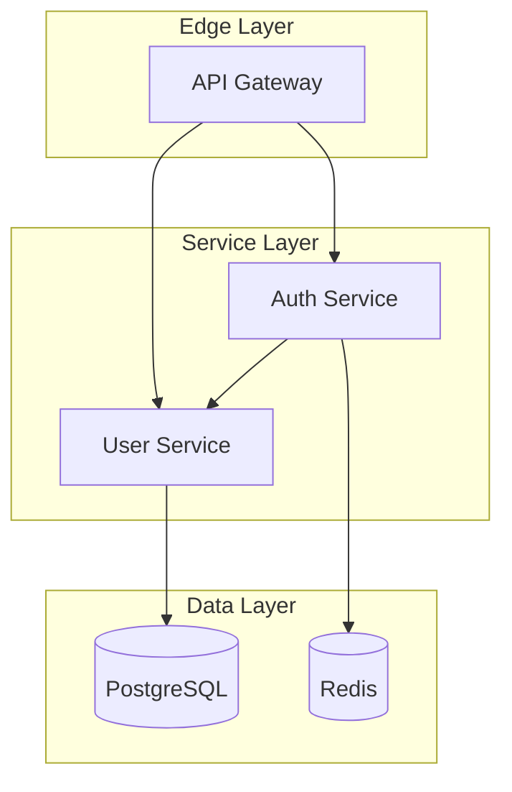
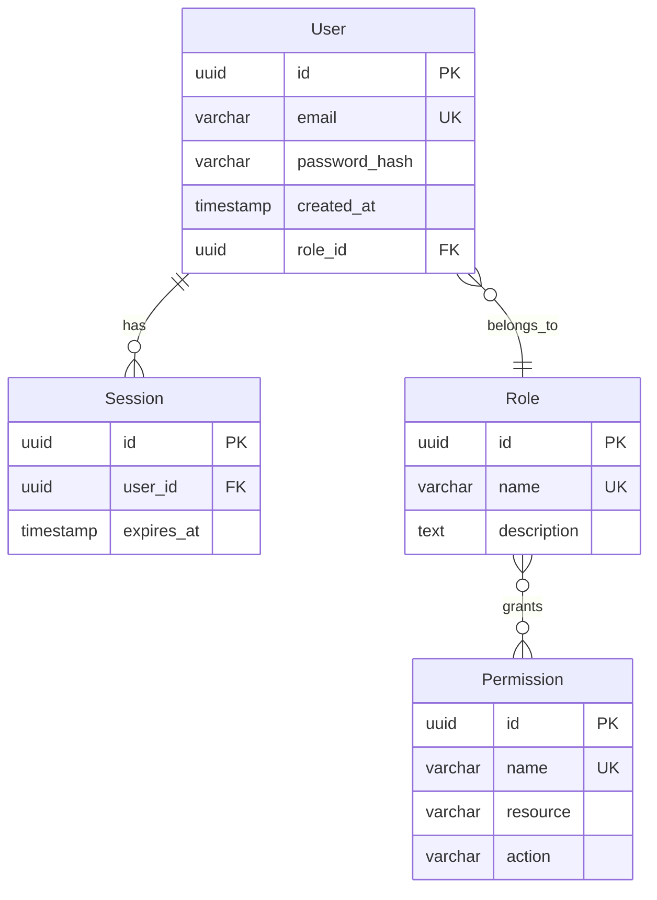
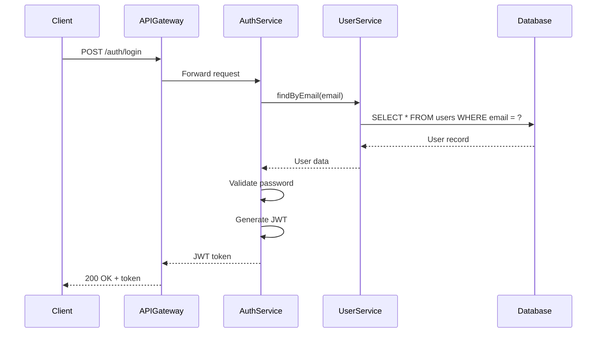
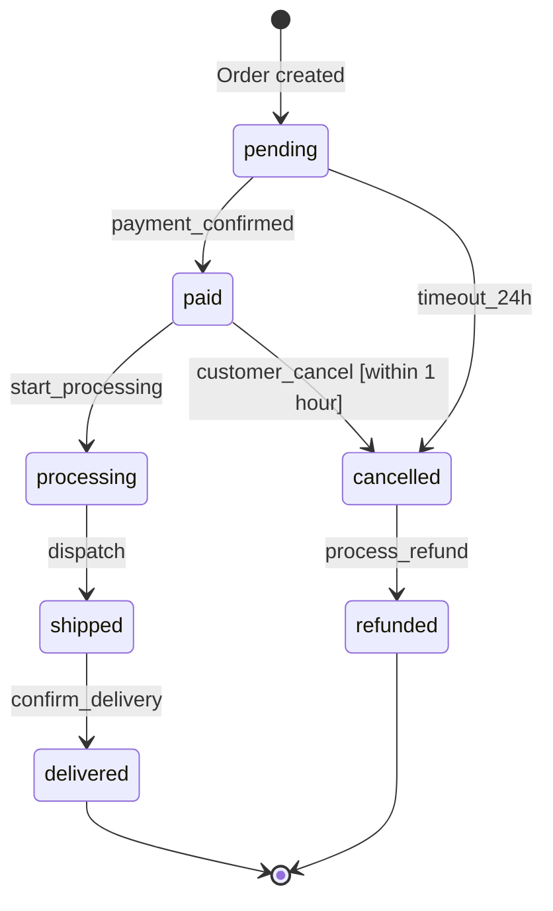

# MAS v3.0 Part 11: Spec-Driven Artifact Generation

**Status:** Draft Specification  
**Version:** 3.1.0  
**Date:** 2025-12-04  
**Parent:** [MAS v3.0 Index](./MAS-v3.0-INDEX.md)  
**Industry References:**
- [Kiro Specs](https://kiro.dev/docs/specs/) - Primary spec structure (first-class citizen)
- [OpenSpec](https://github.com/Fission-AI/OpenSpec) - Delta management & brownfield patterns
- [AGENTS.md](https://agents.md/) - Universal agent instructions convention
- [Spec Kit](https://github.com/github/spec-kit) - GitHub's spec-driven toolkit

---

## 1. Introduction

### 1.1 Purpose

This specification defines a **Spec-Driven Artifact Generation** system that bridges structured specification documents with MAS visual artifacts. It enables:

- **Coding agents** (Kiro, Windsurf, Cursor, Claude) to consume specs and request visual diagrams
- **Product owners** to write structured requirements that automatically generate user journeys
- **Engineers** to create design docs that produce architecture diagrams
- **Teams** to maintain living documentation that stays in sync with code

### 1.2 Background

#### The Vibe Coding Problem

"Vibe coding" (rapid AI-assisted prototyping) produces code but lacks:
- Structured requirements documentation
- Visual architecture diagrams
- Traceable acceptance criteria
- Maintainable test specifications

#### Industry Solution: Spec-Driven Development

**Kiro IDE** (Amazon) introduced spec-driven development with three phases:
1. **Requirements** → User stories with EARS acceptance criteria
2. **Design** → Technical architecture with diagrams
3. **Tasks** → Implementation plan with tracking

**OpenSpec** (Fission-AI) added brownfield-first patterns:
1. **Delta Management** → ADDED/MODIFIED/REMOVED change tracking
2. **Two-Folder Model** → specs/ (truth) + changes/ (proposals)
3. **Archive Workflow** → Merge approved changes back to specs
4. **Universal Agent Support** → AGENTS.md convention for 20+ tools

**Spec Kit** (GitHub) provides:
1. **4-Phase Process** → Specify → Plan → Tasks → Implement
2. **Living Specifications** → Specs evolve with the project
3. **Checkpoint Validation** → Verify at each phase before proceeding

#### MAS Enhancement: Visual Artifact Generation

MAS Compiler extends spec-driven development by **automatically generating visual artifacts** from specification documents:

| Spec Phase | MAS Artifacts Generated |
|------------|------------------------|
| Requirements | user_journey, swimlane, decision_tree |
| Design | sequence, class, topology, er, state |
| Tasks | business_process, wireframe, value_stream |

### 1.3 Scope

This specification covers:
- Spec file format and structure
- MAS annotation syntax
- Diagram generation rules
- Entity extraction patterns
- Coding agent integration
- Validation and conformance

---

## 2. Formal Grammar (EBNF)

```ebnf
(* MAS v3.0 Spec-Driven Grammar *)

spec_project     = ".kiro/specs/" spec_name "/" { spec_file } ;
spec_name        = identifier ;
spec_file        = requirements_file | design_file | tasks_file ;

(* Requirements File *)
requirements_file = "requirements.md" ;
requirements_doc  = { mas_annotation }
                    { requirement_block } ;

requirement_block = "##" "Requirement" number NEWLINE
                    user_story
                    acceptance_criteria ;

user_story        = "**User Story:**" text NEWLINE ;

acceptance_criteria = "####" "Acceptance Criteria" NEWLINE
                      { ears_statement } ;

ears_statement    = ubiquitous_req | event_driven_req | state_driven_req 
                  | optional_feature_req | unwanted_behavior_req ;

(* EARS Notation - Easy Approach to Requirements Syntax *)
ubiquitous_req    = "THE SYSTEM SHALL" behavior ;
event_driven_req  = "WHEN" event "THE SYSTEM SHALL" behavior ;
state_driven_req  = "WHILE" state "THE SYSTEM SHALL" behavior ;
optional_feature_req = "IF" condition "THEN THE SYSTEM SHALL" behavior ;
unwanted_behavior_req = "IF" condition "THEN THE SYSTEM SHALL NOT" behavior ;

(* Design File *)
design_file       = "design.md" ;
design_doc        = { mas_annotation }
                    { design_section } ;

design_section    = component_section | data_model_section 
                  | api_section | state_section ;

component_section = "##" "Components" NEWLINE { component_def } ;
component_def     = "###" component_name NEWLINE
                    component_description
                    [ mermaid_block ] ;

data_model_section = "##" "Data Models" NEWLINE { entity_def } ;
entity_def        = "###" entity_name NEWLINE
                    { attribute_def }
                    { relationship_def } ;

api_section       = "##" "API Flows" NEWLINE { api_flow } ;
api_flow          = "###" flow_name NEWLINE
                    { step_def }
                    [ mermaid_block ] ;

state_section     = "##" "State Machines" NEWLINE { state_machine } ;
state_machine     = "###" machine_name NEWLINE
                    { state_def }
                    { transition_def } ;

mermaid_block     = "```mermaid" NEWLINE diagram_code "```" ;

(* Tasks File *)
tasks_file        = "tasks.md" ;
tasks_doc         = { mas_annotation }
                    { task_group } ;

task_group        = "##" group_name NEWLINE
                    { task_def } ;

task_def          = "- [" status "]" task_id ":" task_description NEWLINE
                    [ task_details ]
                    [ subtasks ] ;

status            = " " | "x" | "~" ;  (* pending | done | in-progress *)
task_id           = number "." number ;
subtasks          = { "  -" subtask_description NEWLINE } ;

(* MAS Annotations *)
mas_annotation    = "@mas-" annotation_type ":" annotation_value NEWLINE ;
annotation_type   = "diagram" | "entities" | "actors" | "screens" 
                  | "flow" | "generate" | "cross-ref" | "priority" ;

(* Terminals *)
identifier        = letter { letter | digit | "_" | "-" } ;
text              = { printable_char } ;
number            = digit { digit } ;
NEWLINE           = ? newline character ? ;
```

---

## 3. Spec File Structure

MAS supports **two compatible directory layouts**: Kiro-style (primary) and OpenSpec-style (brownfield).

### 3.1 Kiro Directory Layout (Primary - Greenfield)

Best for new features (0→1 development):

```
project-root/
├── .kiro/
│   └── specs/
│       ├── user-authentication/
│       │   ├── requirements.md    # EARS notation
│       │   ├── design.md          # Architecture
│       │   └── tasks.md           # Implementation
│       ├── payment-processing/
│       │   ├── requirements.md
│       │   ├── design.md
│       │   └── tasks.md
│       └── admin-dashboard/
│           ├── requirements.md
│           ├── design.md
│           └── tasks.md
├── AGENTS.md                      # Universal agent instructions
└── src/
```

### 3.2 OpenSpec Directory Layout (Brownfield)

Best for modifying existing features (1→N development):

```
project-root/
├── openspec/
│   ├── specs/                     # Source of truth (current state)
│   │   ├── auth/
│   │   │   └── spec.md
│   │   └── profile/
│   │       └── spec.md
│   ├── changes/                   # Proposed changes (deltas)
│   │   └── add-2fa/               # Feature change folder
│   │       ├── proposal.md        # Why and what changes
│   │       ├── tasks.md           # Implementation checklist
│   │       ├── design.md          # Technical decisions (optional)
│   │       └── specs/
│   │           └── auth/
│   │               └── spec.md    # Delta: ADDED/MODIFIED/REMOVED
│   ├── archive/                   # Completed changes
│   └── project.md                 # Project context & conventions
├── AGENTS.md                      # Universal agent instructions
└── src/
```

### 3.3 AGENTS.md Convention

MAS supports the [AGENTS.md](https://agents.md/) convention for universal agent instructions:

```markdown
# AGENTS.md

## Project Overview
Example collaborative workspace with AI-powered features.

## Setup Commands
- Install deps: `pnpm install`
- Start dev server: `pnpm dev`
- Run tests: `pnpm test`

## Code Style
- TypeScript strict mode
- Single quotes, no semicolons
- Use functional patterns where possible

## MAS Compiler Integration
Use MAS Compiler MCP tools for diagram generation:
- `compile_diagram_v2` for technical diagrams
- `compile_ux_diagram` for UX diagrams
- `compile_business_diagram` for business diagrams
- `compile_wireframe` for UI wireframes

## Spec Workflow
Follow the MAS spec-driven workflow:
1. Draft requirements with EARS notation
2. Generate diagrams with @mas-diagram annotations
3. Implement tasks with status tracking
4. Archive completed changes
```

### 3.4 Cross-Repository Specs

For shared specifications across multiple projects:

```
specs-repository/
├── shared-specs/
│   ├── authentication/
│   ├── authorization/
│   └── notification/
└── README.md

# In consuming projects (Kiro style):
git submodule add specs-repository .kiro/shared-specs

# Or (OpenSpec style):
git submodule add specs-repository openspec/shared-specs
```

---

## 4. Requirements Specification

### 4.1 EARS Notation

EARS (Easy Approach to Requirements Syntax) provides structured, testable requirements.

#### 4.1.1 Ubiquitous Requirements

Always-on system behaviors:

```markdown
1. THE SYSTEM SHALL encrypt all data at rest using AES-256
2. THE SYSTEM SHALL log all API requests with timestamp and user ID
3. THE SYSTEM SHALL maintain 99.9% uptime during business hours
```

**MAS Mapping:** → `topology` diagram showing security/logging components

#### 4.1.2 Event-Driven Requirements

Triggered by specific events:

```markdown
1. WHEN a user submits a login form THE SYSTEM SHALL validate credentials
2. WHEN payment is confirmed THE SYSTEM SHALL send confirmation email
3. WHEN session expires THE SYSTEM SHALL redirect to login page
```

**MAS Mapping:** → `sequence` diagram showing event flow

#### 4.1.3 State-Driven Requirements

Active while system is in a specific state:

```markdown
1. WHILE the user is authenticated THE SYSTEM SHALL display logout button
2. WHILE processing payment THE SYSTEM SHALL show loading indicator
3. WHILE in maintenance mode THE SYSTEM SHALL reject new connections
```

**MAS Mapping:** → `state` diagram showing state transitions

#### 4.1.4 Optional Feature Requirements

Conditional features:

```markdown
1. IF the user has premium subscription THEN THE SYSTEM SHALL enable AI features
2. IF two-factor authentication is enabled THEN THE SYSTEM SHALL require OTP
3. IF file size exceeds 10MB THEN THE SYSTEM SHALL compress before upload
```

**MAS Mapping:** → `decision_tree` diagram showing conditions

#### 4.1.5 Unwanted Behavior Requirements

Prohibited behaviors:

```markdown
1. IF rate limit is exceeded THEN THE SYSTEM SHALL NOT process additional requests
2. IF authentication fails 3 times THEN THE SYSTEM SHALL NOT allow retry for 15 minutes
3. IF user is suspended THEN THE SYSTEM SHALL NOT grant access to any resources
```

**MAS Mapping:** → `business_process` diagram with error handling

### 4.2 User Stories with MAS Extensions

```markdown
@mas-diagram: user_journey
@mas-actors: Customer, Support Agent
@mas-screens: LoginPage, DashboardPage, TicketPage

## Requirement 1

**User Story:** As a Customer, I want to submit a support ticket, so that I can get help with my issue quickly.

#### Acceptance Criteria

1. WHEN the customer navigates to support page THE SYSTEM SHALL display ticket submission form
   @mas-screen: TicketPage
   @mas-emotion: neutral

2. WHEN the customer submits a valid ticket THE SYSTEM SHALL create a ticket record
   @mas-flow: Customer → TicketService → Database
   @mas-emotion: satisfied

3. WHEN the ticket is created THE SYSTEM SHALL send confirmation email
   @mas-flow: TicketService → EmailService → Customer
   @mas-emotion: happy

4. IF the ticket form is incomplete THEN THE SYSTEM SHALL highlight missing fields
   @mas-emotion: frustrated
   @mas-pain-point: form-validation
```

### 4.3 Scenario Blocks (OpenSpec-Compatible)

For more structured acceptance criteria, use scenario blocks:

```markdown
### Requirement: User Authentication
The system SHALL issue a JWT on successful login.

#### Scenario: Valid credentials
- WHEN a user submits valid credentials
- THEN a JWT is returned
- AND the user is redirected to dashboard
@mas-emotion: satisfied

#### Scenario: Invalid credentials  
- WHEN a user submits invalid credentials
- THEN an error message is displayed
- AND the login attempt is logged
@mas-emotion: frustrated
@mas-pain-point: unclear-error-message

#### Scenario: Account locked
- WHEN a user fails authentication 3 times
- THEN the account is locked for 15 minutes
- AND a notification email is sent
@mas-emotion: frustrated
```

**MAS Mapping:** → `decision_tree` diagram showing scenario branches

### 4.4 Delta Management (OpenSpec-Style)

For brownfield development, use delta annotations to track changes:

```markdown
@mas-diagram: decision_tree
@mas-change-type: delta

## ADDED Requirements

### Requirement: Two-Factor Authentication
The system MUST require a second factor during login.

#### Scenario: OTP required
- WHEN a user submits valid credentials
- THEN an OTP challenge is required

@mas-flow: User → AuthService → OTPService → User

## MODIFIED Requirements

### Requirement: Session Management (UPDATED)
The system SHALL extend session timeout from 30 to 60 minutes.
@mas-previous: "session timeout of 30 minutes"

## REMOVED Requirements

### Requirement: Legacy Password Reset (DEPRECATED)
@mas-reason: Replaced by email-based password reset
@mas-migration: Use Requirement 2.3 instead
```

**Delta Format Rules:**
- Use `## ADDED Requirements` for new capabilities
- Use `## MODIFIED Requirements` for changed behavior (include complete updated text)
- Use `## REMOVED Requirements` for deprecated features
- Every requirement needs at least one `#### Scenario:` block
- Use `SHALL`/`MUST` in requirement text

### 4.5 Requirements → Diagram Generation

| Requirement Pattern | Generated Diagram | MAS Tool |
|--------------------|-------------------|----------|
| User Story with actors | `user_journey` | `compile_ux_diagram` |
| Cross-team acceptance criteria | `swimlane` | `compile_business_diagram` |
| IF/THEN conditions | `decision_tree` | `compile_business_diagram` |
| Screen navigation | `user_flow` | `compile_ux_diagram` |
| Error handling flows | `business_process` | `compile_business_diagram` |
| Scenario branches | `decision_tree` | `compile_business_diagram` |
| Delta changes | `business_process` | `compile_business_diagram` |

---

## 5. Design Specification

### 5.1 Component Definitions

```markdown
@mas-diagram: topology
@mas-entities: APIGateway, AuthService, UserService, PostgreSQL, Redis

## Components

### API Gateway
- **Type:** Edge service
- **Technology:** Kong / AWS API Gateway
- **Purpose:** Request routing, rate limiting, authentication

### AuthService
- **Type:** Microservice
- **Technology:** Python FastAPI
- **Purpose:** JWT token generation, OAuth2 flows
- **Dependencies:** UserService, Redis

### UserService
- **Type:** Microservice
- **Technology:** Python FastAPI
- **Purpose:** User CRUD, profile management
- **Dependencies:** PostgreSQL

### PostgreSQL
- **Type:** Database
- **Technology:** PostgreSQL 15
- **Purpose:** Persistent user data storage

### Redis
- **Type:** Cache
- **Technology:** Redis 7
- **Purpose:** Session storage, token blacklist
```

**Generated Artifact:**



### 5.2 Data Model Definitions

```markdown
@mas-diagram: er
@mas-entities: User, Role, Permission, Session

## Data Models

### User
| Field | Type | Constraints |
|-------|------|-------------|
| id | UUID | PRIMARY KEY |
| email | VARCHAR(255) | UNIQUE, NOT NULL |
| password_hash | VARCHAR(255) | NOT NULL |
| created_at | TIMESTAMP | DEFAULT NOW() |
| role_id | UUID | FOREIGN KEY → Role.id |

### Role
| Field | Type | Constraints |
|-------|------|-------------|
| id | UUID | PRIMARY KEY |
| name | VARCHAR(50) | UNIQUE |
| description | TEXT | |

### Permission
| Field | Type | Constraints |
|-------|------|-------------|
| id | UUID | PRIMARY KEY |
| name | VARCHAR(100) | UNIQUE |
| resource | VARCHAR(100) | |
| action | VARCHAR(50) | |

### Relationships
- User `N:1` Role (user belongs to one role)
- Role `M:N` Permission (roles have many permissions)
- User `1:N` Session (user has many sessions)
```

**Generated Artifact:**



### 5.3 API Flow Definitions

```markdown
@mas-diagram: sequence
@mas-entities: Client, APIGateway, AuthService, UserService, Database

## API Flows

### Login Flow

1. Client sends POST /auth/login with credentials
2. APIGateway validates request format
3. APIGateway forwards to AuthService
4. AuthService calls UserService.findByEmail(email)
5. UserService queries Database
6. Database returns user record
7. UserService returns user to AuthService
8. AuthService validates password hash
9. AuthService generates JWT token
10. AuthService returns token to Client

@mas-flow: Client → APIGateway → AuthService → UserService → Database
@mas-return-flow: Database → UserService → AuthService → APIGateway → Client
```

**Generated Artifact:**



### 5.4 State Machine Definitions

```markdown
@mas-diagram: state
@mas-entities: Order

## State Machines

### Order Lifecycle

#### States
- **pending**: Order created, awaiting payment
- **paid**: Payment confirmed
- **processing**: Order being prepared
- **shipped**: Order dispatched
- **delivered**: Order received by customer
- **cancelled**: Order cancelled
- **refunded**: Payment refunded

#### Transitions
| From | Event | To | Condition |
|------|-------|-----|-----------|
| pending | payment_confirmed | paid | - |
| pending | timeout_24h | cancelled | - |
| paid | start_processing | processing | - |
| processing | dispatch | shipped | - |
| shipped | confirm_delivery | delivered | - |
| paid | customer_cancel | cancelled | within 1 hour |
| cancelled | process_refund | refunded | - |
```

**Generated Artifact:**



---

## 6. Tasks Specification

### 6.1 Task Structure

```markdown
@mas-diagram: business_process
@mas-priority: P0

## Authentication Tasks

- [ ] 1.1: Set up authentication service project structure
  - Create FastAPI project with poetry
  - Configure pytest and coverage
  - Set up Docker development environment

- [ ] 1.2: Implement user registration endpoint
  - Create POST /auth/register endpoint
  - Implement email validation
  - Add password strength requirements
  - Store hashed password in database
  @mas-flow: Client → AuthService → Database

- [ ] 1.3: Implement login endpoint
  - Create POST /auth/login endpoint
  - Validate credentials against database
  - Generate JWT access and refresh tokens
  - Return tokens to client
  @mas-flow: Client → AuthService → UserService → Database

- [x] 1.4: Implement token refresh endpoint
  - Create POST /auth/refresh endpoint
  - Validate refresh token
  - Generate new access token
  @mas-status: completed

- [ ] 1.5: Implement logout endpoint
  - Create POST /auth/logout endpoint
  - Add token to blacklist in Redis
  - Clear client-side tokens
  @mas-flow: Client → AuthService → Redis
```

### 6.2 Task Dependencies

```markdown
@mas-diagram: decision_tree

## Task Dependencies

### Phase 1: Foundation (Week 1)
- 1.1: Project setup (no dependencies)
- 1.2: Registration (depends on 1.1)
- 1.3: Login (depends on 1.1, 1.2)

### Phase 2: Security (Week 2)
- 1.4: Token refresh (depends on 1.3)
- 1.5: Logout (depends on 1.3, 1.4)

### Dependency Graph
```
1.1 ─┬─► 1.2 ─┬─► 1.3 ─┬─► 1.4 ─► 1.5
     │        │        │
     └────────┘        │
                       └─────────────►
```

### 6.3 UI Tasks with Wireframes

```markdown
@mas-diagram: wireframe
@mas-screen: LoginPage

## UI Tasks

- [ ] 2.1: Design login page wireframe
  @mas-wireframe: login-form
  
```wireframe
@title: Login Page
@screen: LoginPage
@actor: Guest User

+----------------------------------+
|  🧠 Example App                     |
+----------------------------------+
|                                  |
|  {^"Login to your account"       |
|                                  |
|    Email:                        |
|    "your@email.com            "  |
|                                  |
|    Password:                     |
|    "********************      "  |
|                                  |
|    [x] Remember me               |
|                                  |
|    [Login]                       |
|                                  |
|    [[Forgot password?]]          |
|  ^}                              |
|                                  |
|  ─────────────────────────────── |
|  Don't have an account?          |
|  [[Create account]]              |
|                                  |
+----------------------------------+
```

- [ ] 2.2: Implement login page component
  - Create LoginPage.tsx
  - Add form validation
  - Integrate with AuthService
  @mas-screen: LoginPage
```

### 6.4 Tasks → Diagram Generation

| Task Pattern | Generated Diagram | MAS Tool |
|--------------|-------------------|----------|
| Task dependencies | `business_process` | `compile_business_diagram` |
| Decision points | `decision_tree` | `compile_business_diagram` |
| UI tasks | `wireframe` | `compile_wireframe` |
| Value delivery | `value_stream` | `compile_business_diagram` |

---

## 7. MAS Annotation Reference

### 7.1 Document-Level Annotations

| Annotation | Purpose | Example |
|------------|---------|---------|
| `@mas-diagram` | Primary diagram type to generate | `@mas-diagram: sequence` |
| `@mas-entities` | Key entities for diagram | `@mas-entities: User, Order, Payment` |
| `@mas-actors` | Actors/personas involved | `@mas-actors: Customer, Admin` |
| `@mas-screens` | UI screens referenced | `@mas-screens: LoginPage, Dashboard` |
| `@mas-version` | Spec version | `@mas-version: 1.2.0` |

### 7.2 Section-Level Annotations

| Annotation | Purpose | Example |
|------------|---------|---------|
| `@mas-flow` | Message flow direction | `@mas-flow: Client → API → DB` |
| `@mas-priority` | Task priority | `@mas-priority: P0` |
| `@mas-status` | Implementation status | `@mas-status: completed` |
| `@mas-depends-on` | Task dependency | `@mas-depends-on: 1.1, 1.2` |

### 7.3 Element-Level Annotations

| Annotation | Purpose | Example |
|------------|---------|---------|
| `@mas-screen` | Screen reference | `@mas-screen: CheckoutPage` |
| `@mas-emotion` | User emotion for journey | `@mas-emotion: frustrated` |
| `@mas-pain-point` | UX pain point | `@mas-pain-point: slow-loading` |
| `@mas-wireframe` | Embedded wireframe ID | `@mas-wireframe: login-form` |

### 7.4 Cross-Reference Annotations

| Annotation | Purpose | Example |
|------------|---------|---------|
| `@mas-cross-ref` | Reference to another spec | `@mas-cross-ref: user-auth/design.md` |
| `@mas-journey-section` | User journey section | `@mas-journey-section: Onboarding` |
| `@mas-process-task` | Business process task | `@mas-process-task: validate-payment` |

### 7.5 Delta Management Annotations (OpenSpec-Compatible)

| Annotation | Purpose | Example |
|------------|---------|---------|
| `@mas-change-type` | Mark document as delta | `@mas-change-type: delta` |
| `@mas-previous` | Previous value before change | `@mas-previous: "timeout of 30 minutes"` |
| `@mas-reason` | Reason for removal | `@mas-reason: Replaced by email reset` |
| `@mas-migration` | Migration path | `@mas-migration: Use Requirement 2.3` |
| `@mas-proposal` | Link to change proposal | `@mas-proposal: add-2fa` |
| `@mas-archived` | Archived change reference | `@mas-archived: 2025-12-04` |

### 7.6 Scenario Annotations

| Annotation | Purpose | Example |
|------------|---------|---------|
| `@mas-scenario` | Scenario identifier | `@mas-scenario: valid-login` |
| `@mas-given` | Precondition | `@mas-given: user is authenticated` |
| `@mas-when` | Trigger event | `@mas-when: user clicks submit` |
| `@mas-then` | Expected outcome | `@mas-then: form is validated` |
| `@mas-and` | Additional condition | `@mas-and: user is redirected` |

---

## 8. Coding Agent Integration

### 8.1 MCP Tool Invocations

Coding agents can request diagrams using MAS Compiler MCP tools:

```python
# From requirements.md, generate user journey
result = await compile_ux_diagram(
    content="""
    @mas-diagram: user_journey
    @mas-actors: Customer
    
    User Story: As a Customer, I want to track my order...
    1. Customer opens app (excited)
    2. Customer views order status (neutral)
    3. Customer sees delivery date (satisfied)
    """,
    diagram_type="user_journey"
)

# From design.md, generate sequence diagram
result = await compile_diagram_v2(
    content="""
    @mas-diagram: sequence
    @mas-entities: Client, AuthService, Database
    
    Login Flow:
    1. Client sends credentials to AuthService
    2. AuthService queries Database
    3. Database returns user
    4. AuthService generates token
    5. AuthService returns token to Client
    """,
    mode="simple"
)

# From tasks.md, generate business process
result = await compile_business_diagram(
    content="""
    @mas-diagram: business_process
    
    Authentication Implementation:
    1. Setup project structure
    2. Implement registration
    3. Implement login
    4. Add token refresh
    5. Deploy to staging
    """,
    diagram_type="business_process"
)
```

### 8.2 Kiro Integration

Kiro can use MAS Compiler as an MCP server:

```json
// .kiro/settings/mcp.json
{
  "mcpServers": {
    "mas-compiler": {
      "command": "python",
      "args": ["-m", "quivr_api.apps.mas_compiler.mcp_server.run_mcp"],
      "env": {
        "OPENROUTER_API_KEY": "${OPENROUTER_API_KEY}"
      }
    }
  }
}
```

**Usage in Kiro:**
```
@mas-compiler Generate a sequence diagram for the login flow in #spec:user-authentication
```

### 8.3 Windsurf/Cascade Integration

MAS Compiler is available as an MCP server in Windsurf:

```
# In Windsurf chat
Use @mas-compiler to generate a topology diagram showing:
- API Gateway
- AuthService
- UserService
- PostgreSQL
- Redis

Show the connections between components.
```

### 8.4 Universal Spec Parser

MAS Compiler can parse any spec document and auto-detect diagram types:

```python
# Auto-detect and generate all diagrams from spec
result = await generate_diagram(
    intent="Generate all diagrams from spec",
    content=spec_document_content
)

# Returns:
{
    "diagrams": [
        {"type": "user_journey", "mermaid_code": "..."},
        {"type": "sequence", "mermaid_code": "..."},
        {"type": "topology", "mermaid_code": "..."},
        {"type": "er", "mermaid_code": "..."}
    ],
    "entities_extracted": [...],
    "relationships_extracted": [...]
}
```

### 8.5 Multi-Tool Slash Commands (OpenSpec-Compatible)

MAS supports slash commands across 20+ AI coding tools:

| Tool | Slash Commands | Config Location |
|------|----------------|-----------------|
| **Kiro** | `@mas-compiler generate` | `.kiro/settings/mcp.json` |
| **Windsurf** | `/mas-proposal`, `/mas-apply`, `/mas-archive` | `.windsurf/workflows/` |
| **Cursor** | `/mas-proposal`, `/mas-apply`, `/mas-archive` | `.cursor/commands/` |
| **Claude Code** | `@mas-proposal`, `@mas-apply`, `@mas-archive` | `.amazonq/prompts/` |
| **GitHub Copilot** | `/mas-proposal`, `/mas-apply`, `/mas-archive` | `.github/prompts/` |
| **RooCode** | `/mas-proposal`, `/mas-apply`, `/mas-archive` | `.roo/commands/` |
| **Gemini CLI** | `/mas-proposal`, `/mas-apply`, `/mas-archive` | `.gemini/commands/` |
| **VS Code** | Via MCP extension | `settings.json` |

**Workflow Commands:**

```bash
# Draft a change proposal with MAS diagrams
/mas-proposal Add user profile search filters
# AI generates: proposal.md, tasks.md, spec deltas, AND MAS diagrams

# Apply the change (implement tasks)
/mas-apply add-profile-filters
# AI implements tasks and generates updated diagrams

# Archive completed change
/mas-archive add-profile-filters
# Merges deltas back to source specs
```

### 8.6 Archive Workflow

After implementation, archive changes to merge them back to source specs:

```bash
# CLI command (OpenSpec-compatible)
openspec archive add-2fa --yes

# Or via MAS MCP tool
result = await mas_archive_change(
    change_name="add-2fa",
    generate_diagrams=True  # Generate final state diagrams
)

# Returns:
{
    "archived": True,
    "specs_updated": ["auth/spec.md", "profile/spec.md"],
    "diagrams_generated": [
        {"type": "sequence", "file": "auth-flow.mmd"},
        {"type": "topology", "file": "system-architecture.mmd"}
    ]
}
```

---

## 9. Validation Rules

### 9.1 Syntax Validation

| Rule ID | Description | Severity |
|---------|-------------|----------|
| SPEC-SYN-001 | EARS statements must follow WHEN/THEN pattern | ERROR |
| SPEC-SYN-002 | MAS annotations must use `@mas-` prefix | ERROR |
| SPEC-SYN-003 | Task IDs must follow N.N format | WARNING |
| SPEC-SYN-004 | Status must be `[ ]`, `[x]`, or `[~]` | ERROR |

### 9.2 Semantic Validation

| Rule ID | Description | Severity |
|---------|-------------|----------|
| SPEC-SEM-001 | Referenced entities must be defined | WARNING |
| SPEC-SEM-002 | Flow participants must match entities | WARNING |
| SPEC-SEM-003 | Screen references must exist | WARNING |
| SPEC-SEM-004 | Task dependencies must reference valid IDs | ERROR |

### 9.3 Cross-Reference Validation

| Rule ID | Description | Severity |
|---------|-------------|----------|
| SPEC-REF-001 | Cross-ref paths must resolve | ERROR |
| SPEC-REF-002 | Journey sections must exist in user_journey | WARNING |
| SPEC-REF-003 | Process tasks must exist in business_process | WARNING |

### 9.4 MAS Diagram Validation

| Rule ID | Description | Severity |
|---------|-------------|----------|
| SPEC-MAS-001 | Diagram type must be valid MAS type | ERROR |
| SPEC-MAS-002 | Entity count should be 3-15 for readability | WARNING |
| SPEC-MAS-003 | Nested flows should use subgraphs | WARNING |

---

## 10. Best Practices

### 10.1 Requirements Best Practices

1. **One user story per requirement block**
   ```markdown
   ## Requirement 1
   **User Story:** As a Customer, I want to...
   ```

2. **Use EARS notation consistently**
   ```markdown
   WHEN user clicks submit THE SYSTEM SHALL validate form
   ```

3. **Include emotion annotations for UX**
   ```markdown
   @mas-emotion: frustrated
   ```

4. **Cross-reference related specs**
   ```markdown
   @mas-cross-ref: payment/requirements.md#requirement-3
   ```

### 10.2 Design Best Practices

1. **Define all entities upfront**
   ```markdown
   @mas-entities: APIGateway, AuthService, UserService
   ```

2. **Include technology choices**
   ```markdown
   - **Technology:** Python FastAPI
   ```

3. **Document dependencies explicitly**
   ```markdown
   - **Dependencies:** UserService, Redis
   ```

4. **Embed Mermaid diagrams inline**
   ```markdown
   ```mermaid
   sequenceDiagram
       ...
   ```

### 10.3 Tasks Best Practices

1. **Keep tasks atomic (2-4 hours)**
   ```markdown
   - [ ] 1.1: Create user registration endpoint
   ```

2. **Include subtasks for complex items**
   ```markdown
   - [ ] 1.1: Implement login
     - Create endpoint
     - Add validation
     - Write tests
   ```

3. **Mark dependencies clearly**
   ```markdown
   @mas-depends-on: 1.1, 1.2
   ```

4. **Update status as work progresses**
   ```markdown
   - [x] 1.1: Project setup
   - [~] 1.2: Registration (in progress)
   - [ ] 1.3: Login (pending)
   ```

### 10.4 Diagram Generation Best Practices

1. **Request specific diagram types**
   ```markdown
   @mas-diagram: sequence
   ```

2. **Limit entities to 15 or fewer**

3. **Use subgraphs for complex systems**

4. **Validate generated diagrams**
   ```python
   result = await validate_diagram(diagram_code)
   ```

---

## 11. Conformance

An implementation conforms to MAS v3.0 Part 11 if it:

### 11.1 MUST Requirements

1. **MUST** parse spec files (requirements.md, design.md, tasks.md)
2. **MUST** recognize all MAS annotations
3. **MUST** generate valid Mermaid diagrams
4. **MUST** validate EARS syntax
5. **MUST** extract entities from specs

### 11.2 SHOULD Requirements

1. **SHOULD** auto-detect diagram types from content
2. **SHOULD** cross-reference entities across spec files
3. **SHOULD** validate entity consistency
4. **SHOULD** generate multiple diagram types per spec

### 11.3 MAY Requirements

1. **MAY** integrate with external requirement tools (JIRA, Confluence)
2. **MAY** generate HTML/PDF documentation
3. **MAY** track spec changes over time
4. **MAY** provide diff visualization

---

## 12. Examples

### 12.1 Complete Spec Example

**`.kiro/specs/user-authentication/requirements.md`**

```markdown
@mas-diagram: user_journey, swimlane
@mas-actors: User, AuthService, Database
@mas-screens: LoginPage, DashboardPage, PasswordResetPage
@mas-version: 1.0.0

# User Authentication Requirements

## Requirement 1: User Login

**User Story:** As a registered user, I want to log in to my account, so that I can access my personalized dashboard.

#### Acceptance Criteria

1. WHEN the user navigates to /login THE SYSTEM SHALL display the login form
   @mas-screen: LoginPage
   @mas-emotion: neutral

2. WHEN the user submits valid credentials THE SYSTEM SHALL authenticate and redirect to dashboard
   @mas-screen: DashboardPage
   @mas-emotion: satisfied
   @mas-flow: User → AuthService → Database

3. IF the credentials are invalid THEN THE SYSTEM SHALL display error message
   @mas-emotion: frustrated
   @mas-pain-point: unclear-error

4. IF the user fails 3 times THEN THE SYSTEM SHALL lock account for 15 minutes
   @mas-emotion: frustrated

## Requirement 2: Password Reset

**User Story:** As a user who forgot my password, I want to reset it via email, so that I can regain access.

#### Acceptance Criteria

1. WHEN the user clicks "Forgot Password" THE SYSTEM SHALL display reset form
   @mas-screen: PasswordResetPage

2. WHEN valid email is submitted THE SYSTEM SHALL send reset link
   @mas-flow: User → AuthService → EmailService

3. WHEN user clicks reset link THE SYSTEM SHALL allow new password entry
```

### 12.2 Generated Artifacts

From the above spec, MAS Compiler generates:

1. **User Journey Diagram** (from emotions/touchpoints)
2. **Swimlane Diagram** (from cross-team flows)
3. **Sequence Diagram** (from @mas-flow annotations)
4. **Decision Tree** (from IF/THEN conditions)

---

## 13. References

### Primary Industry References
- [Kiro Specs Documentation](https://kiro.dev/docs/specs/) - Amazon's spec-driven IDE (first-class citizen)
- [OpenSpec](https://github.com/Fission-AI/OpenSpec) - Fission-AI's brownfield-first spec toolkit (11k+ stars)
- [Spec Kit](https://github.com/github/spec-kit) - GitHub's open-source spec-driven toolkit
- [AGENTS.md Convention](https://agents.md/) - Universal agent instructions (20k+ projects)

### Standards & Specifications
- [EARS: Easy Approach to Requirements Syntax](https://www.iaria.org/conferences2010/filesICCGI10/Tutorial%20Mavin.pdf)
- [Mermaid.js Documentation](https://mermaid.js.org/)
- [BPMN 2.0 Specification](https://www.omg.org/spec/BPMN/2.0/)
- [WCAG 2.1 Guidelines](https://www.w3.org/TR/WCAG21/)

### MAS Specification Series
- [MAS v2.6 Index](../v2.6/MAS-v2.6-INDEX.md)
- [MAS v3.0 Index](./MAS-v3.0-INDEX.md)
- [MAS ASCII Wireframe v2.6](../v2.6/MAS-ASCIIWireframe-v2.6.md)
- [MAS UX Diagrams v2.5](../v2.5/MAS-UXDiagrams-v2.5.md)
- [MAS Business Operations v2.5](../v2.5/MAS-BusinessOperations-v2.5.md)

### Industry Analysis
- [Beyond Vibe Coding: Kiro Spec-Driven IDE](https://www.infoq.com/news/2025/08/aws-kiro-spec-driven-agent/) - InfoQ
- [Spec-Driven Development with AI](https://github.blog/ai-and-ml/generative-ai/spec-driven-development-with-ai-get-started-with-a-new-open-source-toolkit/) - GitHub Blog

---

## 14. Appendix: Feature Comparison Matrix

| Feature | Kiro | OpenSpec | Spec Kit | MAS v3.1 |
|---------|------|----------|----------|----------|
| **File Structure** | .kiro/specs/ | openspec/specs/ + changes/ | .spec-kit/ | Both supported |
| **Requirements Format** | EARS | Scenario blocks | Free-form | EARS + Scenarios |
| **Change Tracking** | Single spec | Delta folders | Living specs | Delta annotations |
| **Greenfield (0→1)** | ✅ Excellent | ✅ Good | ✅ Excellent | ✅ Excellent |
| **Brownfield (1→N)** | ⚠️ Basic | ✅ Excellent | ✅ Good | ✅ Excellent |
| **Visual Diagrams** | ❌ Text only | ❌ Text only | ❌ Text only | ✅ 11 types |
| **Multi-Agent Support** | Kiro only | 20+ tools | 3+ tools | Universal + MCP |
| **Archive Workflow** | ❌ No | ✅ Yes | ❌ No | ✅ Yes |
| **MCP Integration** | ✅ Yes | ❌ No | ❌ No | ✅ Native |
| **CLI Tools** | ❌ IDE only | ✅ openspec CLI | ✅ specify CLI | ✅ MAS MCP |
| **License** | Proprietary | MIT | MIT | Apache 2.0 |

---

**Version:** 3.1.0 | **Status:** Draft Specification | **Last Updated:** 2025-12-04

**Changelog:**
- **3.1.0** (2025-12-04): Added OpenSpec compatibility (delta management, scenario blocks, AGENTS.md, multi-tool support)
- **3.0.0** (2025-12-04): Initial Kiro-compatible spec-driven artifact generation
