# MAS v3.0 Specification Index

# Business-Technical Bridge Specification

**Version**: 3.0.0  
**Status**: Draft  
**Date**: 2025-11-28  
**Author**: Alex Chen (Mermaid Guru)

---

## Executive Summary

MAS v3.0 introduces the **Business-Technical Bridge Layer** - a specification for diagrams that connect business requirements (MAS v2.5) with technical implementations (MAS v2.0).

```mermaid
flowchart TB
    subgraph v25["MAS v2.5 - Business Layer"]
        UJ[User Journey]
        UF[User Flow]
        BP[Business Process]
        DT[Decision Tree]
    end
    
    subgraph v30["MAS v3.0 - Bridge Layer"]
        TR[📋 Traceability]
        C4[🏗️ C4 Integration]
        AL[🔄 Alignment]
        IM[📐 Impact Matrix]
        CT[📜 Contract Bridge]
    end
    
    subgraph v20["MAS v2.0 - Technical Layer"]
        SEQ[Sequence]
        CLASS[Class]
        TOPO[Topology]
        STATE[State]
    end
    
    v25 --> v30
    v30 --> v20
    
    style v30 fill:#fff4e1,stroke:#ff9500,stroke-width:3px
```



---

## Part Structure

| Part | Title | Description | Status |
|------|-------|-------------|--------|
| **Part 10** | [Bridge Core](./MAS-BridgeCore-v3.0.md) | Core grammar, relationship types, layer definitions | Draft |
| **Part 11** | [Traceability](./MAS-Traceability-v3.0.md) | Requirements-code links, coverage mapping, gap analysis | Draft |
| **Part 12** | [C4 Integration](./MAS-C4Integration-v3.0.md) | Multi-level zoom (Context→Container→Component→Code) | Draft |
| **Part 13** | [Alignment](./MAS-Alignment-v3.0.md) | Business-API mapping, domain boundaries, contracts | Draft |
| **Part 14** | [Impact Analysis](./MAS-ImpactAnalysis-v3.0.md) | Change propagation, risk assessment, dependency graphs | Draft |

---

## Key Concepts

### 1. Cross-Layer Relationships

MAS 3.0 introduces **typed relationships** for connecting elements across layers:

```mermaid
flowchart LR
    subgraph RelTypes["🔗 Relationship Types"]
        R1["==serves==><br/>Lower serves upper"]
        R2["==realizes==><br/>Code realizes requirement"]
        R3["==traces==><br/>Bidirectional link"]
        R4["==validates==><br/>Test validates code"]
        R5["==impacts==><br/>Change impacts layers"]
        R6["==decomposes==><br/>Zoom-in hierarchy"]
    end
```



| Relationship | Direction | Meaning | Example |
|--------------|-----------|---------|---------|
| `serves` | Lower → Upper | Support relationship | Technology serves Application |
| `realizes` | Lower → Upper | Implementation relationship | Code realizes Requirement |
| `traces` | Bidirectional | Traceability link | Requirement ↔ Test Case |
| `validates` | Test → Code | Verification relationship | TestSuite validates Service |
| `impacts` | Change → Layers | Ripple effect | BusinessChange impacts TechComponents |
| `decomposes` | Parent → Child | Zoom relationship | System decomposes Containers |

### 2. Layer Types

```mermaid
flowchart TB
    subgraph Layers["📊 MAS Layer Hierarchy"]
        L1["🏢 Business Layer<br/>(MAS v2.5)<br/>Requirements, Journeys, Processes"]
        L2["🔗 Bridge Layer<br/>(MAS v3.0)<br/>Traceability, Alignment, Impact"]
        L3["⚙️ Technical Layer<br/>(MAS v2.0)<br/>Sequences, Classes, Architecture"]
    end
    
    L1 --> L2
    L2 --> L3
```



### 3. Coverage Metrics

MAS 3.0 supports **coverage indicators** to show implementation completeness:

```
element_id["📋 Requirement<br/>Coverage: 85%<br/>Status: In Progress"]
```

---

## Diagram Types

### Part 10: Bridge Diagram Types

| Type | Purpose | Elements |
|------|---------|----------|
| **Traceability** | Link requirements to code | Requirements, Stories, Tests, Code |
| **C4 Bridge** | Multi-level architecture zoom | Context, Container, Component, Code |
| **Alignment** | Business-API mapping | Capabilities, Domains, APIs, Services |
| **Impact** | Change propagation analysis | Changes, Affected Elements, Risks |
| **Contract** | Acceptance to implementation | Criteria, Contracts, Implementations |

---

## Formal Grammar (EBNF)

```ebnf
(* MAS v3.0 Bridge Diagram Grammar *)

bridge_diagram    ::= 'bridge' bridge_type? NEWLINE
                     layer_block+
                     relationship+

bridge_type       ::= 'traceability' | 'c4' | 'alignment' | 'impact' | 'contract'

layer_block       ::= 'subgraph' layer_id '[' layer_label ']' NEWLINE
                     element+
                     'end' NEWLINE

layer_id          ::= IDENTIFIER
layer_label       ::= icon? layer_name '(' version ')'
layer_name        ::= 'Business' | 'Bridge' | 'Technical' | STRING
version           ::= 'MAS v' VERSION_NUMBER

element           ::= element_id '[' element_content ']' NEWLINE
element_id        ::= IDENTIFIER
element_content   ::= icon? label metadata?
icon              ::= EMOJI
label             ::= STRING
metadata          ::= '<br/>' key ':' value (',' key ':' value)*

relationship      ::= source_id bridge_rel target_id edge_label? NEWLINE
bridge_rel        ::= '==serves==>' | '==realizes==>' | '==traces==>' 
                    | '==validates==>' | '==impacts==>' | '==decomposes==>'
edge_label        ::= '|' STRING '|'

(* Coverage indicators *)
coverage          ::= 'Coverage:' PERCENT
status            ::= 'Status:' ('Pending' | 'In Progress' | 'Complete' | 'Blocked')
```

---

## Examples

### Example 1: Feature Traceability

```mermaid
flowchart TB
    subgraph Business["📊 Business (MAS v2.5)"]
        REQ["📋 REQ-AUTH-001<br/>User Authentication<br/>Priority: High"]
        STORY["📝 US-001<br/>As a user, I want to login<br/>Status: Complete"]
    end
    
    subgraph Bridge["🔗 Bridge (MAS v3.0)"]
        TRACE["📐 Traceability Matrix<br/>Coverage: 95%<br/>Tests: 12/12 passing"]
    end
    
    subgraph Technical["⚙️ Technical (MAS v2.0)"]
        SERVICE["🔧 AuthService<br/>Methods: login(), verify()<br/>Lines: 450"]
        TESTS["✅ auth_test.py<br/>Tests: 12<br/>Coverage: 95%"]
    end
    
    REQ ==realizes==> STORY
    STORY ==traces==> TRACE
    TRACE ==serves==> SERVICE
    SERVICE ==validates==> TESTS
    
    style Bridge fill:#fff4e1,stroke:#ff9500,stroke-width:2px
```



### Example 2: C4 Multi-Level Bridge

```mermaid
flowchart TB
    subgraph Context["🌐 C4 Context"]
        USER["👤 User"]
        SYSTEM["📦 Example System"]
    end
    
    subgraph Container["📦 C4 Container"]
        WEB["🌐 Frontend"]
        API["🔌 API"]
        BRAIN["🧠 Brain"]
    end
    
    subgraph Component["🧩 C4 Component"]
        CHAT["💬 ChatService"]
        RAG["📚 RAGService"]
    end
    
    subgraph Code["💻 C4 Code"]
        CHAT_PY["📄 chat_service.py"]
        RAG_PY["📄 rag_service.py"]
    end
    
    USER ==uses==> SYSTEM
    SYSTEM ==decomposes==> API
    SYSTEM ==decomposes==> BRAIN
    API ==decomposes==> CHAT
    BRAIN ==decomposes==> RAG
    CHAT ==realizes==> CHAT_PY
    RAG ==realizes==> RAG_PY
```



---

## MAS Compiler Integration

### New MCP Tools

| Tool | Description |
|------|-------------|
| `compile_bridge_diagram` | Compile business-technical bridge diagrams |
| `analyze_traceability` | Analyze requirement-code traceability gaps |
| `generate_c4_bridge` | Generate C4 multi-level diagram set |
| `analyze_alignment` | Check business-API alignment |
| `compute_impact` | Compute change impact across layers |

### API Endpoints

```
POST /api/v1/compile/bridge      - Compile bridge diagrams
POST /api/v1/analyze/traceability - Analyze traceability
POST /api/v1/analyze/alignment   - Analyze alignment
POST /api/v1/analyze/impact      - Compute impact
GET  /api/v1/templates/bridge    - Get bridge templates
```

---

## Conformance Classes

| Class | Requirements |
|-------|--------------|
| **Minimal** | Support `traceability` type, basic cross-layer links |
| **Standard** | Support all 5 diagram types, coverage metrics |
| **Full** | Support impact analysis, alignment validation, gap detection |

---

## Industry Alignment

MAS 3.0 aligns with:

| Standard | Alignment |
|----------|-----------|
| **C4 Model** | Multi-level zoom pattern (Context→Container→Component→Code) |
| **ArchiMate** | Serving/Realization relationship semantics |
| **IEEE 29148** | Requirements traceability matrix structure |
| **TOGAF ADM** | Architecture layer separation |

---

## Version History

| Version | Date | Changes |
|---------|------|---------|
| 3.0.0 | 2025-11-28 | Initial draft - Bridge specification |

---

## References

1. **MAS v2.0 Specification**: Core technical diagrams
2. **MAS v2.5 Specification**: UX and Business diagrams
3. **C4 Model**: https://c4model.com/
4. **ArchiMate 3.2**: https://pubs.opengroup.org/architecture/archimate3-doc/
5. **IEEE 29148**: Requirements engineering standard

---

*MAS v3.0 - Bridging Business Vision to Technical Reality*
